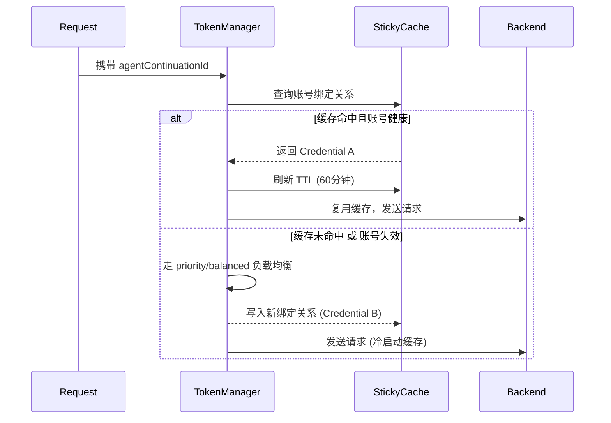

# Kiro 缓存与状态管理全景解析

本文档集中梳理了 `kiro2cc-proxy` 中与 Kiro API 缓存、会话路由以及底层状态管理相关的所有机制和技术实现细节。在反向代理中，**缓存是降低 API 成本和提高响应速度的绝对核心**。

---

## 目录
1. [Prompt Caching（前缀缓存）机制](#1-prompt-caching前缀缓存机制)
2. [跨轮次状态冻结（PREV_H0 & PREV_TOOLS）](#2-跨轮次状态冻结prev_h0--prev_tools)
3. [会话粘性路由（Sticky Cache）](#3-会话粘性路由sticky-cache)
4. [缓存命中验证与 Token 反推](#4-缓存命中验证与-token-反推)
5. [底层性能优化实现（O(1) 淘汰与异步写）](#5-底层性能优化实现o1-淘汰与异步写)
6. [Usage 终值合成（四层降级链 + ephemeral 拆分）](#6-usage-终值合成四层降级链--ephemeral-拆分)

---

## 1. Prompt Caching（前缀缓存）机制

**大白话**：Kiro 后端（基于 AWS Q）会自动对历史消息进行 KV Cache（键值缓存）。如果相邻两次请求的消息前缀完全一致，能极大提升首字响应速度（TTFT）并享受 **50% 的 input token 计费折扣**（缓存命中按全价 50% 计费，跨会话生效）。

### 1.1 计费模型与缓存折扣（重要）
**结论**：Kiro 具有跨会话生效的前缀缓存机制，缓存命中部分按全价 50% 计费（代理实测 2026-06-20 确认，不同于 Anthropic 的 10%）。

- `meteringEvent` 帧在部分上游已直接返回 `cache_read_input_tokens` / `cache_creation_input_tokens` 字段（`src/kiro/model/events/metering.rs::MeteringEvent`）；当该字段缺失时，代理不再反推 credits，而是改用本地前缀字符估算（见 §4.2）。
- **缓存前缀含 system + tools**：Kiro 将 current_message 中的 tools 定义也纳入缓存前缀，后续 turn 命中率达 89-97%。
- 保持 `agentContinuationId` + 冻结 history[0]/history[2] 的收益：**降低首字延迟（TTFT）+ 节省约 50% 的 input credits**。
- 降低 credits 消耗的手段：① 稳定前缀以提高缓存命中率（冻结 system prompt、tools 定义）；② 缩短非缓存部分（新增对话消息）。

**上下文窗口映射**：`context_window_for_model()`（`src/anthropic/stream.rs:548`）已统一对所有模型返回 **1,000,000**，不再按模型分档。

**参考费率（k_ref = credits per $1 USD，`src/model/usage.rs::get_k_ref`）**：
| 模型 | k_ref | input_price ($/M) | cache_read 折扣 |
|------|-------|-------------------|----------------|
| sonnet 系列 / sonnet-5 / haiku（默认档） | 1.43 | $3.0 | 50% 全价 |
| opus-4.5 / opus-4.6 | 1.90 | $15.0 | 50% 全价 |
| opus-4.7 / opus-4.8（及未知 opus/fable 兜底） | 2.36 | $15.0 | 50% 全价 |

### 1.2 核心标识符：`agentContinuationId`
Kiro 识别“同一会话连续请求”的唯一凭证是 `agentContinuationId`。如果每次请求这个 ID 都发生变化，Kiro 后端就会将其视为全新会话，前缀缓存将完全失效。

代理层针对不同客户端的派生逻辑：
1. **标准 Claude Code 客户端**：Claude Code 会在请求中附带 `metadata.user_id`（如 `user_xxx_account__session_0b4445...`）。代理提取出 `session_UUID` 作为 `conversationId`。
2. **第三方客户端（Fallback 降级机制）**：对于无 `metadata` 的客户端（如 Cursor、Zed、Open WebUI），若按默认生成随机 UUID，会导致每一轮都是新会话。因此引入了 Fallback 逻辑：
   - 将**截断的 System Prompt + 排序后的工具名列表**进行 `SHA-256` 计算。
   - 由此派生出稳定的 UUID，使得无状态客户端在不改变系统设定时也能享受连续缓存。
3. **最终格式化**：`agentContinuationId` 由 `SHA-256("agent-continuation:" + conversationId)` 格式化得出，确保即使同一会话也能对外部保持哈希安全性。

### 1.2 Tools 注入 `history` 结构
Claude Code 通常携带大量工具定义（例如默认携带 bash、edit 等工具，JSON Schema 占用可达 30K+ tokens）。若将全量工具定义存放在本轮的 `currentMessage` 中，Kiro 会将其视为“新内容”而拒绝缓存。

**代理的“偷梁换柱”方案**：
- **完整 Schema 注入历史**：将全量 `tools` 数组转换为历史消息，固定放置在 `history[2]` (User 角色) 和 `history[3]` (Assistant 角色：仅回复 "OK")。因为历史消息是按顺序缓存的，这使得庞大的工具定义被前缀缓存完美覆盖。
- **Slim Tools 触发器**：为了让 Kiro 知道本轮需要使用工具（激活 `toolUseEvent`），在 `currentMessage.userInputMessageContext.tools` 中仅放入极简的 `slim_tools`。
  - `slim_tools` 仅保留工具的 `name` 和截断为 **1 个字符** 的 `description`，同时清空 `inputSchema`。
  - 这使得原本 30K+ 的 Token 开销缩减至约 1680 tokens，成功欺骗 Kiro 激活工具调用模式，同时不破坏前缀缓存。

---

## 2. 跨轮次状态冻结（PREV_H0 & PREV_TOOLS）

要命中 Kiro 的前缀缓存，不仅会话 ID 要一致，**历史内容本身必须逐字节（Byte-by-byte）完全一致**。Claude Code 每次请求都会变动系统提示中的某些元数据，导致哈希漂移，代理必须强行“冻结”它们。

### 2.1 冻结 `history[0]` (System Prompt)
**问题根源**：
Claude Code 在系统提示的首行会动态注入以下字段：
- `cch`（计费哈希，每次请求随机改变）。
- `cc_version`（版本更新后改变）。
- `gitStatus` 和 `currentDate`（随代码修改和时间推移改变）。
这些易变字段会导致 `history[0]` 内容哈希每次请求都不同，引发缓存穿透。

**双重解决方案**：
1. **字符串洗白**：`normalize_billing_header()` 通过正则定位 `cch=xxx;`，强制将其替换为固定的 `cch=0;`。
2. **全局缓存冻结 (`PREV_H0`)**：代理在内存中维护 `PREV_H0`。首轮请求到达时，将清理后的 `history[0]` 内容绑定到 `session_id` 冻结存入内存。后续同一会话的所有请求，直接忽略客户端发来的系统提示，强制复用首轮内容，实现哈希绝对稳定。

### 2.2 冻结 `history[2]` (Tools)
虽然工具定义列表变化不频繁，但有时（如动态注册 MCP 工具）会发生微小变动。代理同样引入 `PREV_TOOLS` 全局缓存，只要工具定义的 JSON 未发生大变动，就强制复用上一轮的工具序列化结果。

### 2.3 $O(1)$ 伪随机 LRU 淘汰机制
为防止 `PREV_H0` 和 `PREV_TOOLS` 在长期运行中引发内存泄漏，代理设置了全局 `SESSION_CACHE_CAPACITY = 1024` 的容量上限。
- **放弃时间排序**：在早期的实现中，采用的是遍历对比最后访问时间的 $O(N)$ 淘汰策略。在互斥锁 (`Mutex`) 保护下，高并发会导致严重的锁阻塞。
- **$O(1)$ 伪随机驱逐**：重构后，当容量满时，直接通过 `HashMap::keys().next()` 获取伪随机键进行删除。由于系统侧重高吞吐，随机牺牲掉 1/1024 的会话（下次请求大不了重新缓存）远比阻塞整个代理线程要划算得多。

---

## 3. 会话粘性路由（Sticky Cache）

**核心矛盾**：`kiro2cc-proxy` 支持多 Kiro 账号（Credential）轮询与故障转移。但是，Kiro 的 Prompt Cache 是在物理层面**按账号隔离**的。如果一个会话第一轮请求落在账号 A，第二轮被负载均衡分配到账号 B，那么该会话的前缀缓存将彻底作废，导致 Token 成本暴增。

### 3.1 粘性路由流转机制
为解决此问题，代理实现了基于 `agentContinuationId` 的 Sticky Cache 路由机制。



### 3.2 埋点指标与跨账号预热
- **无锁指标监控**：在路由过程中，代理利用 `AtomicU64` 精准打点 `sticky_hits` 和 `sticky_misses`，并通过 `/api/admin/rpm` 接口实时暴露，供管理员监控粘性路由健康度。
- **缓存隔离预热**：两个不同的 credential 各自被选中并预热后，缓存各自在 Kiro 服务端独立保留。中途若因 `429 限流` 等不可抗力被逼轮换，切回原账号后将直接命中缓存，无需重新预热。

---

## 4. 缓存命中验证与 Token 反推

AWS Q / Kiro 的流式响应中，`meteringEvent` 不直接返回 `cache_read_input_tokens` 字段，但缓存折扣体现在 `usage` credits 数值中。代理层通过数学反推，从实际扣费中精确还原缓存命中量。

### 4.1 `effective_rate`（有效费率标定）
代理在日志中记录了去噪后的有效费率：
`effective_rate = metering_credits / (input_tokens + 5 × output_tokens) × 1000`
*(注：公式中的 `5` 是消除 Output token 价格比差异的乘数)*

- **首轮（跨会话缓存命中 system+tools）**：sonnet-4.6 约 `0.0044`（已享受 ~88% 缓存折扣）
- **后续 turn（高缓存命中）**：降至 `0.0022-0.0025`（~97-99% 命中率）
- **理论无缓存全价 (sonnet)**：`k_ref × input_price / 1M = 1.43 × 3.0 / 1,000,000 = 0.00000429` credits/token
- **理论无缓存全价 (opus-4.7/4.8)**：`k_ref × input_price / 1M = 2.36 × 15.0 / 1,000,000 = 0.0000354` credits/token

### 4.2 cache_read 派生：前缀字符估算（`token::count_prefix_tokens`）
> 替换时间：2026-06-25。旧的 `infer_cache_read_tokens(credits 反推)` 已废弃 ——
> 反推路径在大请求上会因 `baseline - input_credits` 接近 0 或单价跌破 50% 折扣价被
> clamp 触顶（恒显示 100% 命中），掩盖真实命中梯度。

新算法直接按 Anthropic prompt cache 协议语义估算：

```
new_input  = estimate(messages.last())                       # 当前 user turn
cache_read = estimate(system) + estimate(tools) + Σ estimate(messages[0..n-1])
total      = cache_read + new_input
cache_creation = 0                                           # 简化，不再模拟
```

要点：
- **tools 永远不计入 new_input**：跨请求基本稳定，恒视为前缀（即使首条请求 messages.len()==1 也只把 system+tools 计入 cache_read，messages[0] 计入 new_input）
- **估算口径**：与 `count_all_tokens_local` 完全一致（四分类加权 `count_tokens`），保证 `prefix.min(input_total)` 不溢出
- **优先级**：在 `select_final_usage` 四层降级链中替代了原 credits 反推位（第 2 层），仍排在 metering 真值（第 1 层）之后

**与 Anthropic 协议的偏差**：
- Anthropic 真值由服务端 token tokenizer 算出，这里是本地字符估算，差异 ±15-30%
- Kiro 内部前缀缓存按 hash 分块，理论命中可能小于消息边界；估算只能给出"理论上界"

精度与平均值上展示的"反推"接近，但永不再 clamp 至 100%。

历史日志中的 `effective_rate` / `credits_per_ktok` 仍由 metering credits 计算，保留作为账单核对参考。

---

## 5. 底层性能优化实现（O(1) 淘汰与异步写）

为保障缓存操作与统计追踪在高并发下不会成为系统瓶颈，底层实施了核心重构（阶段 1 P0 级优化）：

### 5.1 RPM 监控：无锁环形桶 (Ring Buffer)
- **旧方案缺陷**：使用 `Vec<Instant>` 无脑追加请求时间戳，仅在调用后台 API 时才执行 `.retain()` 剔除过期数据。长期运行会导致 OOM 和数组扫描的高昂 CPU 开销。
- **重构方案**：采用定长环形数组 `[Bucket; 60]`（对应 60 秒时间窗）。
  ```rust
  let index = (now_secs as usize) % 60;
  // 直接覆盖或累加对应秒数的槽位，实现 O(1) 复杂度的更新与统计
  ```
- **收益**：天然支持滑动时间窗的数据过期与覆盖，内存消耗永远恒定，彻底消除了 OOM 隐患。

### 5.2 统计落盘：异步 MPSC 与防抖写 (Write-Behind)
- **旧方案缺陷**：对涉及磁盘写操作的 `UsageTracker`、`ThrottleLog` 和 `FailureLog`，每次请求结束都在 HTTP 处理线程同步调用 `fs::write`，当磁盘 IO 抖动时直接卡死 Tokio Worker。
- **重构方案**：
  - 引入 `tokio::sync::mpsc::unbounded_channel` 以无锁方式传递日志事件脏信号。
  - 后台衍生出专门的 `tokio::spawn` 异步任务，设定每 5 秒定期利用 `spawn_blocking` 进行批量防抖写盘（Debounce）。
  - **Graceful Shutdown**：接管应用退出信号，确保进程被关闭时，后台通道能被清空并执行最后一次强制落盘，确保财务级计费数据的绝对安全。

---

## 6. Usage 终值合成（四层降级链 + ephemeral 拆分）

> 引入时间：v2.6.12（2026-06-24）
> 关联模块：`src/cache/mod.rs::select_final_usage` · `src/cache/simulation.rs::{scale_to, clamp_to_total}` · `src/anthropic/handlers.rs`

回包给客户端的 `usage` 字段并非由单一来源直接产出，而是经过一条**四层降级链**统一裁决，并由 `clamp_to_total` 保证多个 token 字段之间的算术不变性。该模块由 `select_final_usage` 纯函数承担，便于单元测试覆盖所有分支。

### 6.1 四层降级链优先级

| 层级 | 信号来源 | 触发条件 | 数据特征 |
|------|---------|----------|---------|
| ① metering 真值 | `meteringEvent.cache_read` / `cache_creation` | Kiro 上游直接返回 metering 字段 | 最权威；Kiro 不区分 5m/1h，默认全部归为 5m |
| ② prefix 估算 | `token::count_prefix_tokens` 的结果 | metering 缺失但可估算 system+tools+history[0..n-1] | 调用方在 `handlers.rs` 中**预先估算**后再传入；本层仅消费已估算的 `cache_read`（饱和裁剪到 `final_input_tokens`），`cache_creation`/`cache_creation_5m`/`cache_creation_1h` 全部置 0 |
| ③ fingerprint 命中 | 账号级前缀指纹追踪输出 | 上述两层均无，但本账号此前已观测到同一前缀 | 携带账号维度的真实命中历史 |
| ④ ratio 兜底 | `from_ratio_config().scale_to(final_input_tokens)` | 完全无观测数据 | 按配置比例模拟，由 `scale_to` 保留 5m/1h 原始比例 |

> 旧的 `infer_cache_read_tokens`（credits 反推）已于 2026-06-25 移除，替换为本层的前缀字符估算（详见 §4.2）。

四层依次降级，**任一层命中则短路返回**，并统一经过 `clamp_to_total(final_input_tokens)` 做边界裁剪。

### 6.2 纯函数签名与不变性

```rust
/// 四层降级链选择终值 usage：
///
/// 优先级（高→低）：
/// 1. metering 真值        —— 上游 Kiro 返回的 cache_read / cache_creation 原始值
/// 2. prefix 估算结果      —— 调用方提前用 token::count_prefix_tokens 估算的 cache_read
/// 3. fingerprint 命中     —— 账号级前缀指纹追踪输出
/// 4. ratio 兜底           —— 比例模拟（from_ratio_config）的产出
///
/// 所有分支输出均经 clamp_to_total(final_input_tokens) 截断，保证 5m/1h 不变性。
pub fn select_final_usage(
    final_input_tokens: i32,
    metering: Option<(i32, i32)>,          // (cache_read, cache_creation)
    prefix_estimated_read: Option<i32>,
    fingerprint_usage: Option<PromptCacheUsage>,
    ratio_fallback: PromptCacheUsage,
) -> PromptCacheUsage;
```

**三条强不变性**（由 `clamp_to_total` 保证，单元测试通过 `assert_invariant` 校验）：

1. `input_tokens ≥ 0` —— 非缓存 input 永不为负
2. `cache_creation_5m + cache_creation_1h == cache_creation_input_tokens` —— ephemeral 层级拆分守恒
3. `input_tokens + cache_creation + cache_read == final_input_tokens` —— **三段守恒恒等式**：clamp 优先保留 `cache_read`，再以 `remaining = total - cache_read` 为预算依次填充 `cache_creation` 和 `input_tokens`，三者之和严格等于传入的总输入。该恒等式同时蕴含 `cache_read + cache_creation ≤ final_input_tokens`

### 6.3 ephemeral 5m / 1h 拆分语义

Anthropic 2025-12 起的 ephemeral cache 区分 **5 分钟** 与 **1 小时** 两个 TTL 层，对应 `cache_creation_5m_input_tokens` 与 `cache_creation_1h_input_tokens`。代理在不同信号源下采用如下处理策略：

| 信号源 | 5m / 1h 拆分策略 |
|--------|-----------------|
| metering（Kiro 上游） | Kiro 协议**不区分 TTL**，默认全部归为 5m，1h 置 0 |
| prefix 估算 | 只能得到 `cache_read`，creation 类字段为 0（无需拆分） |
| fingerprint | 直接沿用账号历史观测到的 5m / 1h 比例 |
| ratio 兜底 | `from_ratio_config` 按配置初始比例产出，`scale_to` 缩放时**保持原始 5m:1h 比例**不变 |

`scale_to` 的比例守恒由 `scale_to_keeps_5m_1h_ratio_when_scaling_up` 单元测试覆盖（如 100→200 缩放后 30:70 → 60:140，仍为 30%:70%）。

### 6.3.1 fingerprint 层机制细节（`src/cache/fingerprint.rs`）

`FingerprintTracker` 是第 ③ 层的实现，按账号维度追踪跨请求共享前缀：

1. **切段**：每个请求按「系统段 + 各 message 段」切成有序 `ContentSegment`，切段前对文本做 canonicalize（trim、`tool_use.input` 排序 JSON、图片 `source.data` 取短 hash），避免无意义差异打断前缀匹配。
2. **累积哈希**：`hash[k] = SHA-256(seg[0] || seg[1] || ... || seg[k])`，保证前缀单调性——若第 k 段命中，则 0..k 必定命中。
3. **命中比对**：与账号历史表（`FingerprintTable::breakpoints`）顺序比对，命中的 `Breakpoint` 刷新 `last_hit_at`；`cache_read = min(matched_cumulative_tokens, CACHE_READ_CAP_RATIO × total_input)`，`CACHE_READ_CAP_RATIO = 0.85`（`fingerprint.rs:63`）防止小样本下命中量虚高。
4. **淘汰策略**：
   - **容量淘汰**：`breakpoints.len() > max_bp` 时**只截断末尾长尾段**（不能按 `last_hit_at` 重排，否则会打乱累积链导致整表命中率归零）。
   - **TTL 淘汰**：`evict_expired()` 按 `EphemeralTier::FiveM`/`OneH` 分别用 `fingerprint_ttl_5m`/`fingerprint_ttl_1h`（`CacheSimulationConfig` 配置项）判断 `now - last_hit_at`，超时的 `Breakpoint` 整条丢弃。

该机制与 `docs/Sub2API缓存机制.md` 中提及的 `sub2api` 的 `fingerprintUnification`（HTTP 请求头指纹统一化，用于反检测/伪装客户端）是完全不同的概念，两者仅字面相似。

### 6.4 重构收益

| 维度 | 重构前 | 重构后 |
|------|--------|--------|
| `handlers.rs` 终值合成代码 | ~40 行内联 if/else 链 | ~22 行调用纯函数 |
| 单元测试覆盖 | 0（依赖整链 mock） | 7 个分支测试（覆盖 4 层 + 边界） |
| 不变性校验 | 散落在调用点 | 集中由 `clamp_to_total` + `assert_invariant` 兜底 |
| 5m/1h 拆分语义 | 隐式、易遗漏 | 显式守恒，缩放/截断均保持比例 |

> 配套测试：`src/cache/mod.rs` 内 `mod tests`（7 例）+ `src/cache/simulation.rs` 内 `mod tests`（10 例，含 `scale_to_keeps_5m_1h_ratio_when_scaling_up`、`clamp_to_total_*` 等）。
