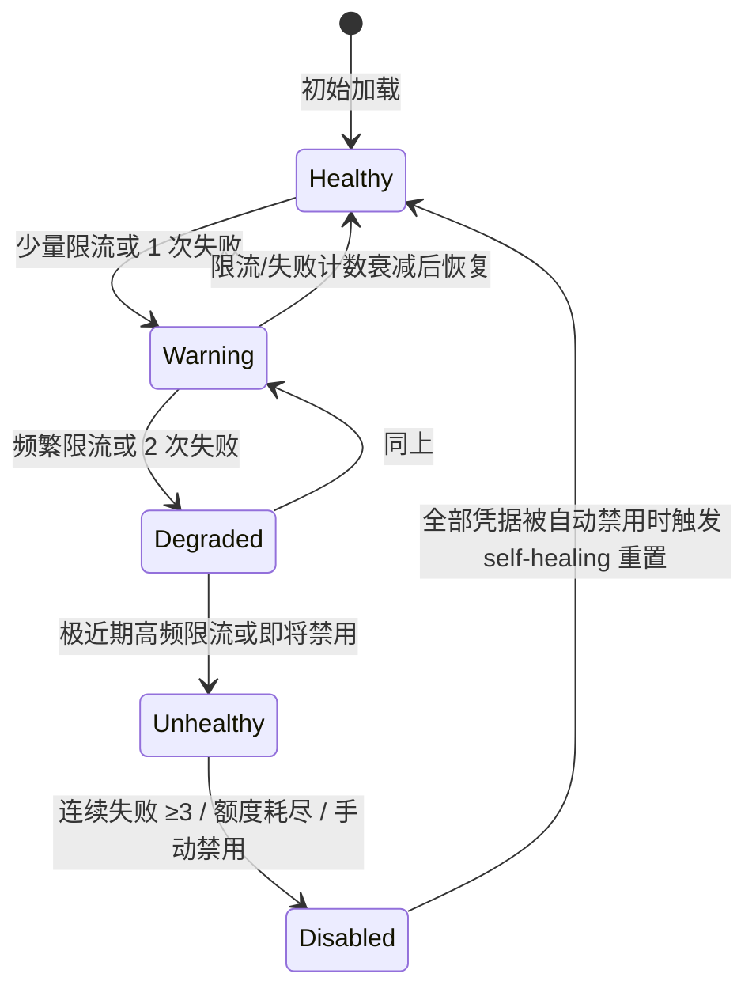
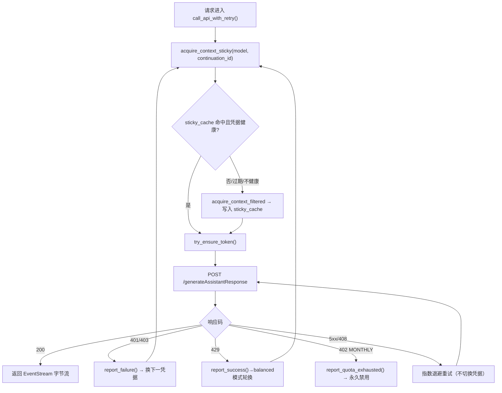
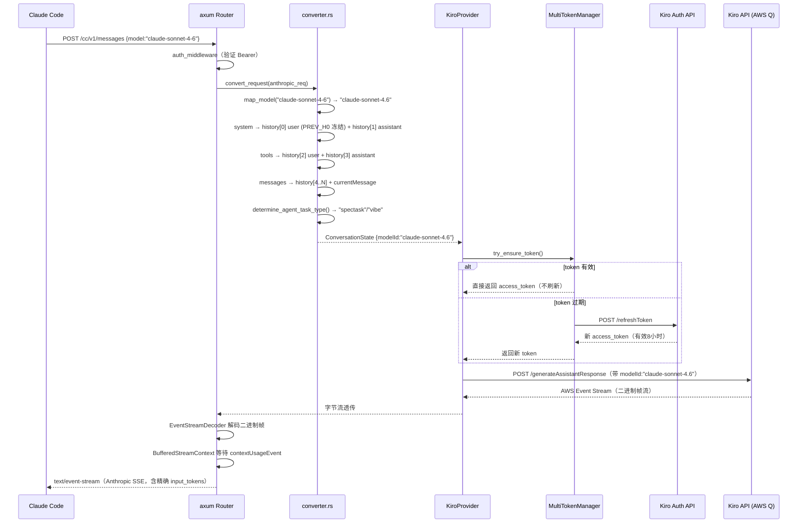
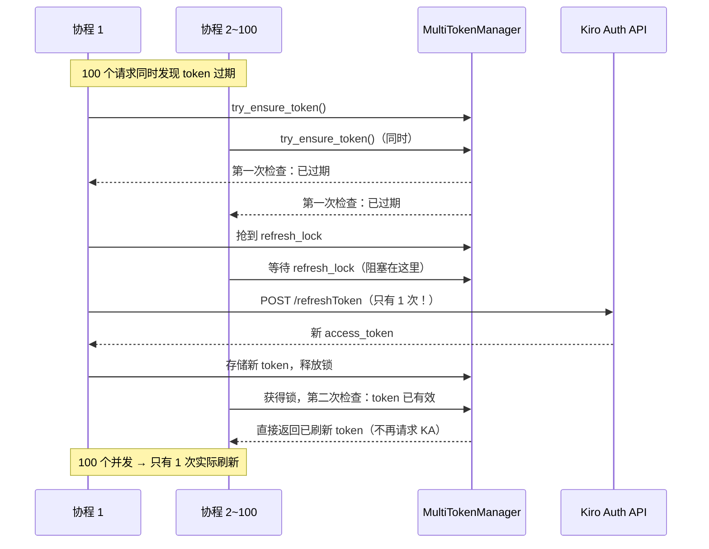

# 📖 kiro2cc-proxy 源码全景解析

## 🌟 小白导读

**一句话大白话：** 这个项目就像一个"协议翻译官"，把 Claude Code 说的"Anthropic 格式"请求实时翻译成 Kiro IDE（亚马逊 AWS Q 服务）听得懂的"Kiro 格式"，让你免费用 Kiro 的算力跑 Claude 4.6 / 4.7 / Sonnet / Opus / Haiku 等模型。

**生活类比：** 就像你去了一家只收人民币的餐厅，但你手里只有美元。这个代理就是你身边的兑换窗口——把美元（Anthropic 请求）实时换成人民币（Kiro 请求），餐厅根本感知不到你本来拿的是美元。

**读前预期：**
- 读完"反代机制全解析"后，你将彻底理解：从一个 Anthropic 请求到 Kiro 响应的全链路
- 读完"Claude 4.6/4.7 路由深度解析"后，你将掌握：模型名如何一步步路由到 AWS Q 上的正确 Claude 版本
- 读完"难点突破"后，你将搞清楚：AWS Event Stream 二进制协议、thinking 标签检测、Token 双重检查锁

---

## 📋 目录
- [★ 核心反代机制全解析（全链路追踪）](#核心反代机制全解析全链路追踪)
- [★ Claude 4.6 / 4.7 模型路由深度解析](#claude-46--47-模型路由深度解析)
  - [非 Claude 模型使用方式（deepseek/glm/minimax/qwen）](#6-非-claude-模型在-cc-中的使用方式deepseek--glm--minimax--qwen)
- [项目概述与技术栈](#项目概述与技术栈)
- [目录结构](#目录结构)
- [架构全景（附生活类比）](#架构全景附生活类比)
  - [负载均衡模式：priority vs balanced](#负载均衡模式priority-vs-balanced)
- [入口与初始化流程](#入口与初始化流程)
- [关键业务流程图解](#关键业务流程图解)
- [核心源码剥洋葱（三层深度）](#核心源码剥洋葱三层深度)
- [错误处理与安全边界](#错误处理与安全边界)
- [关键类型与接口定义](#关键类型与接口定义)
- [难点突破（逐个攻克）](#难点突破逐个攻克)
- [为什么要这样设计？](#为什么要这样设计)
- [避坑指南](#避坑指南)

---

## ★ 核心反代机制全解析（全链路追踪）

> 这是整个项目最核心的章节。读懂这里，你就懂了"反代"的本质。

### 1. 两种协议的核心差异

| 维度 | Anthropic API（Claude Code 使用） | Kiro API（AWS Q） |
|---|---|---|
| 请求格式 | `POST /v1/messages` JSON | `POST /generateAssistantResponse` JSON |
| 模型指定方式 | 顶层 `model` 字段 | 嵌套在 `conversationState.currentMessage.userInputMessage.modelId` |
| System Prompt | 顶层 `system` 数组字段 | 不存在，必须转换为历史消息中的 user+assistant 配对 |
| 响应格式 | Server-Sent Events（`text/event-stream`）纯文本行 | AWS Event Stream 二进制帧协议（有 CRC32C 校验） |
| 消息历史 | `messages` 数组（role + content） | `history` 数组（`userInputMessage` / `assistantResponseMessage` 嵌套结构） |
| 认证方式 | Bearer token（用户自定义 API Key） | Bearer token（Kiro IDE 的 access_token，有效期 8 小时，需自动刷新） |

### 2. 完整请求变换过程（带 JSON 示例）

**Claude Code 发出的原始 Anthropic 请求：**

```json
POST /v1/messages
Authorization: Bearer <用户的 API Key>

{
  "model": "claude-sonnet-4-6",
  "max_tokens": 8192,
  "system": [{"type": "text", "text": "你是一个代码助手"}],
  "messages": [
    {"role": "user", "content": "帮我写一个快排算法"}
  ],
  "stream": true
}
```

**converter.rs 转换后，发给 Kiro 的请求：**

```
POST https://q.us-east-1.amazonaws.com/generateAssistantResponse
Authorization: Bearer <Kiro access_token，每8小时刷新>
x-amzn-kiro-agent-mode: vibe
x-amz-user-agent: aws-sdk-js/1.0.27 KiroIDE-{version}-{machine_id}

{
  "conversationState": {
    "conversationId": "8bb5523b-ec7c-4540-a9ca-beb6d79f1552",
    "agentContinuationId": "3f7a2b1c-d4e5-6f78-9a0b-1c2d3e4f5a6b",
    "agentTaskType": "spectask",
    "chatTriggerType": "MANUAL",
    "history": [
      // ─── history[0]: System Prompt（PREV_H0 冻结，跨轮次不变）───
      {
        "userInputMessage": {
          "content": "你是一个代码助手\nWhen the Write or Edit tool has content size limits...\n<system_chunked_policy>...",
          "modelId": "claude-sonnet-4.6"
        }
      },
      // ─── history[1]: System Prompt 助手应答 ───
      {
        "assistantResponseMessage": {
          "content": "I will follow these instructions."
        }
      },
      // ─── history[2]: Tools 定义（注入 history 以命中 Kiro 前缀缓存）───
      {
        "userInputMessage": {
          "content": "<tools>[{\"toolSpecification\":{\"name\":\"read\",...}},...]</tools>",
          "modelId": "claude-sonnet-4.6"
        }
      },
      // ─── history[3]: Tools 助手应答 ───
      {
        "assistantResponseMessage": {
          "content": "OK"
        }
      },
      // ─── history[4..N]: 真实对话历史（每轮 user → assistant 配对）───
      {
        "userInputMessage": {
          "content": "上一轮用户消息",
          "modelId": "claude-sonnet-4.6",
          "userInputMessageContext": {
            "toolResults": [...]
          }
        }
      },
      {
        "assistantResponseMessage": {
          "content": "上一轮助手回复",
          "toolUses": [...]
        }
      }
    ],
    "currentMessage": {
      "userInputMessage": {
        "content": "帮我写一个快排算法",
        "modelId": "claude-sonnet-4.6",
        "origin": "AI_EDITOR",
        "userInputMessageContext": {
          "tools": [              // slim_tools（v2.5.6+）：触发 Kiro toolUseEvent 激活信号
            {"toolSpecification": {"name": "read", "description": "R", "inputSchema": {}}},
            {"toolSpecification": {"name": "write", "description": "W", "inputSchema": {}}},
            // ... 每个工具仅保留 name + 1字符 description + 空 inputSchema，~1680 tokens
          ],
          "toolResults": [{...}]   // 本轮 tool_result（如有）
        }
      }
    }
  }
}
```

**关键变换点总结：**
1. `model: "claude-sonnet-4-6"` → `modelId: "claude-sonnet-4.6"`（连字符换点号，嵌套进去）
2. `system` 数组 → 变成 `history[0]` user + `history[1]` assistant 配对（`"I will follow these instructions."`）
3. `tools` 全量定义 → normalize_json_schema → 注入 `history[2]` user + `history[3]` assistant 配对，使其被 Kiro 前缀缓存覆盖（tools 几乎不跨轮次变化）；同时生成 slim_tools（每工具仅 name + 1字符 description + 空 inputSchema）放入 `currentMessage.userInputMessageContext.tools`，触发 Kiro toolUseEvent 激活信号（v2.5.6 修复 tool_use 丢失问题）
4. `history[0]` 内容通过 `PREV_H0` 机制按 session_id 冻结第一次的值，后续轮次复用，防止 `cc_version`/`gitStatus`/`currentDate` 等动态字段破坏缓存
5. `agentContinuationId` 由 `conversationId` SHA-256 派生（稳定值），让 Kiro 后端识别同一会话的连续请求，启用跨请求 prompt caching
6. `messages` 数组 → 拆分成 `history[4..N]`（历史对话，每轮 user+assistant 配对）+ `currentMessage`（本轮用户输入）
7. 顶层 `Authorization` 的 Bearer → 换成 Kiro 的 access_token
8. 加上 Kiro IDE 特有的 Header（`x-amzn-kiro-agent-mode`、`x-amz-user-agent` 等）
9. tool_results → 注入 `currentMessage.userInputMessageContext.toolResults`（本轮）或历史 user 消息（往轮）

### 3. 完整响应变换过程

**Kiro 返回的 AWS Event Stream（二进制帧，不可直读）：**

```
[4字节: total_len][4字节: header_len][4字节: prelude_crc32c]
[headers: ":event-type" = "assistantResponseEvent"]
[payload: {"content": "快速排序（Quick Sort）是..."}]
[4字节: message_crc32c]
```

解码后的 Kiro JSON 事件（每个帧内 payload）：

```json
// 事件1：文本内容
{"assistantResponseEvent": {"content": "快速排序（Quick Sort）是一种..."}}

// 事件2：继续文本
{"assistantResponseEvent": {"content": "分治算法，基本思路是..."}}

// 事件3：使用量（stream末尾）
{"contextUsageEvent": {"conversationContextPercentage": 5.2}}
```

**StreamContext 转换后，发给 Claude Code 的 Anthropic SSE：**

```
data: {"type":"message_start","message":{"id":"msg_01X...","model":"claude-sonnet-4-6","usage":{"input_tokens":150,"output_tokens":0}}}

data: {"type":"content_block_start","index":0,"content_block":{"type":"text","text":""}}

data: {"type":"content_block_delta","index":0,"delta":{"type":"text_delta","text":"快速排序（Quick Sort）是一种"}}

data: {"type":"content_block_delta","index":0,"delta":{"type":"text_delta","text":"分治算法，基本思路是..."}}

data: {"type":"message_delta","delta":{"stop_reason":"end_turn"},"usage":{"output_tokens":512}}

data: {"type":"message_stop"}
```

**关键变换点总结：**
1. 二进制帧 → 文本 SSE（`EventStreamDecoder` + `StreamContext` 完成）
2. Kiro `assistantResponseEvent.content` → Anthropic `content_block_delta.text_delta.text`
3. `contextUsageEvent.conversationContextPercentage` → `input_tokens`（`/cc/v1` 缓冲模式才精确）
4. 整个响应包裹上 `message_start`、`content_block_start`、`message_stop` 等 Anthropic 特有事件

### 4. 代码层调用链（从请求入站到响应出站）

```
Claude Code 发出请求
  │
  ▼
axum Router → POST /v1/messages (anthropic/router.rs)
  │
  ▼
auth_middleware (middleware.rs)
  │  验证 Bearer Token（常量时间比较，防时序攻击）
  │
  ▼
handle_stream_request (handlers.rs)
  │
  ▼
convert_request (converter.rs)         ← 协议转换：Anthropic → Kiro JSON
	  │  1. map_model("claude-sonnet-4-6") → "claude-sonnet-4.6"
	  │  2. system → history[0] user (PREV_H0 冻结) + history[1] assistant
	  │  3. tools 全量 → normalize_json_schema → history[2/3]；slim_tools → context.tools（触发 toolUseEvent，v2.5.6）
	  │  4. messages → history[4..N] + currentMessage
	  │  5. tool_results → currentMessage.userInputMessageContext.toolResults
  ▼
serde_json::to_string(conversation_state)   ← 序列化为 JSON 字符串
  │
  ▼
KiroProvider.call_api_stream (provider.rs)  ← 发出 HTTP 请求
  │  1. acquire_context_sticky(model, bound_ids, continuation_id) → sticky 路由 + 选凭据
  │  2. try_ensure_token() → 获取/刷新 access_token（双重检查锁）
  │  3. build_headers() → 注入 Kiro IDE 伪装 Headers
  │  4. client.post(url).headers().body().send() → 真正发出 HTTP
  │
  ▼
reqwest Response (字节流)
  │
  ▼
EventStreamDecoder (kiro/parser/decoder.rs) ← 解码 AWS 二进制帧
  │  状态机：Ready → Parsing → 验证 CRC32C → 提取 payload JSON
  │
  ▼
StreamContext / BufferedStreamContext (anthropic/stream.rs) ← 转换为 SSE
  │  /v1:     实时转换，每帧立即发给客户端
  │  /cc/v1:  缓冲所有事件，等 contextUsageEvent，然后修正 input_tokens 再发
  │
  ▼
Claude Code 收到 Anthropic SSE 响应
```

<!-- SECTION:反代机制 -->
---

## ★ Claude 4.6 / 4.7 模型路由深度解析

> 这是项目的"灵魂所在"：用户指定的模型名，如何一步步路由到 AWS Q 后端对应的 Claude 版本。

### 1. 模型名转换函数 `map_model()` — 完整实现

**文件位置：** `src/anthropic/converter.rs:213`

```rust
pub fn map_model(model: &str) -> Option<String> {
    let model_lower = model.to_lowercase(); // 💡 大小写不敏感匹配

    if model_lower.contains("sonnet") {
        if model_lower.contains("4-6") || model_lower.contains("4.6") {
            Some("claude-sonnet-4.6".to_string()) // 💡 Sonnet 4.6：连字符→点号
        } else {
            Some("claude-sonnet-4.5".to_string()) // 💡 其他 sonnet → 降到 4.5
        }
    } else if model_lower.contains("opus") {
        if model_lower.contains("4-5") || model_lower.contains("4.5") {
            Some("claude-opus-4.5".to_string())   // 💡 Opus 4.5 明确指定
        } else if model_lower.contains("4-8") || model_lower.contains("4.8") {
            Some("claude-opus-4.8".to_string())   // 💡 Opus 4.8 最新模型
        } else if model_lower.contains("4-7") || model_lower.contains("4.7") {
            Some("claude-opus-4.7".to_string())   // 💡 Opus 4.7
        } else {
            Some("claude-opus-4.6".to_string())   // 💡 Opus 默认 → 4.6（兜底）
        }
    } else if model_lower.contains("haiku") {
        Some("claude-haiku-4.5".to_string())      // 💡 所有 haiku → 4.5
    } else if model_lower == "auto" {
        Some("auto".to_string())                   // 💡 让 Kiro 自动选模型
    } else if model_lower.contains("deepseek") {
        Some("deepseek-3.2".to_string())           // 💡 DeepSeek 模型支持
    } else if model_lower.contains("glm") {
        Some("glm-5".to_string())
    } else if model_lower.contains("minimax") {
        if model_lower.contains("2.5") || model_lower.contains("2-5") {
            Some("minimax-m2.5".to_string())
        } else {
            Some("minimax-m2.1".to_string())
        }
    } else if model_lower.contains("qwen") {
        Some("qwen3-coder-next".to_string())
    } else {
        None // 💡 不支持的模型 → 返回 None → HTTP 400
    }
}
```

### 2. 完整模型映射表

| Claude Code 传入（示例） | 匹配条件 | Kiro 模型 ID | AWS Q 路由到 |
|---|---|---|---|
| `claude-sonnet-4-6` | contains "sonnet" + contains "4-6" | `claude-sonnet-4.6` | Claude Sonnet 4.6 |
| `claude-sonnet-4-6-20251101` | contains "sonnet" + contains "4-6" | `claude-sonnet-4.6` | Claude Sonnet 4.6 |
| `claude-sonnet-4.6` | contains "sonnet" + contains "4.6" | `claude-sonnet-4.6` | Claude Sonnet 4.6 |
| `claude-sonnet-4-5` | contains "sonnet"（不含 4-6/4.6） | `claude-sonnet-4.5` | Claude Sonnet 4.5 |
| `claude-opus-4-8` | contains "opus" + contains "4-8" | `claude-opus-4.8` | Claude Opus 4.8 |
| `claude-opus-4-8-20260101-thinking` | contains "opus" + contains "4-8" | `claude-opus-4.8` | Claude Opus 4.8 |
| `claude-opus-4-7` | contains "opus" + contains "4-7" | `claude-opus-4.7` | Claude Opus 4.7 |
| `claude-opus-4-7-20251101-thinking` | contains "opus" + contains "4-7" | `claude-opus-4.7` | Claude Opus 4.7 |
| `claude-opus-4-6` | contains "opus" + contains "4-6" | `claude-opus-4.6` | Claude Opus 4.6 |
| `claude-opus-4-5` | contains "opus" + contains "4-5" | `claude-opus-4.5` | Claude Opus 4.5 |
| `claude-opus-4` | contains "opus"（不含4-5/4-6/4-7/4-8） | `claude-opus-4.6` | Claude Opus 4.6（默认） |
| `claude-haiku-4-5` | contains "haiku" | `claude-haiku-4.5` | Claude Haiku 4.5 |
| `auto` | 精确匹配 "auto" | `auto` | Kiro 自动选择 |
| `deepseek-r1` | contains "deepseek" | `deepseek-3.2` | DeepSeek 3.2 |
| `gpt-4` | 不匹配任何规则 | `None` → 400 错误 | — |

> ⚠️ **重要设计细节**：Opus 的匹配优先级是 4.5 > 4.8 > 4.7 > 默认4.6（不是数字大小排序）。因为 4.5/4.8/4.7 是明确版本，而 4.6 是兜底默认值。

### 2.5 `agentTaskType` 动态路由 — "spectask" vs "vibe"

**文件位置：** `src/anthropic/converter.rs:537`

请求中的 `agentTaskType` 并非固定为 `"vibe"`，而是由 `determine_agent_task_type()` 根据工具列表动态决定：

```rust
const CODE_TOOL_NAMES: &[&str] = &[
    "read", "write", "edit", "bash", "glob", "grep",
    "read_file", "write_file", "edit_file", "run_bash",
    "list_files", "search_files", "create_file", "delete_file",
    "str_replace_editor", "computer",
];

fn determine_agent_task_type(req: &MessagesRequest) -> &'static str {
    let Some(tools) = &req.tools else { return "vibe"; };
    if tools.is_empty() { return "vibe"; }
    let has_code_tool = tools.iter().any(|t| {
        CODE_TOOL_NAMES.iter().any(|&code_tool| t.name.to_lowercase() == code_tool)
    });
    if has_code_tool { "spectask" } else { "vibe" }
}
```

| 条件 | agentTaskType | 效果 |
|------|---------------|------|
| 工具列表含代码工具（bash/read/edit 等） | `spectask` | Kiro 后端优化代码生成质量 |
| 工具列表为空或不含代码工具 | `vibe` | Kiro 后端优化对话连续性 |

> Claude Code 始终携带代码工具，因此实际请求几乎都是 `spectask`。纯对话场景（如 Open WebUI 无工具调用）才会走 `vibe`。

---

### 3. model_id 在 Kiro JSON 请求中的位置

这是最关键的一点：`model_id` 不在请求体顶层，而是深埋在 `conversationState.currentMessage.userInputMessage.modelId`：

```json
{
  "conversationState": {
    "conversationId": "a0662283-7fd3-4399-a7eb-52b9a717ae88",
    "agentTaskType": "vibe",
    "chatTriggerType": "MANUAL",
    "history": [
      {
        "userInputMessage": {
          "content": "[系统提示内容]",
          "modelId": "claude-sonnet-4.6"  // ← 历史消息也携带 model_id！
        }
      },
      {"assistantResponseMessage": {"content": "I will follow these instructions."}}
    ],
    "currentMessage": {
      "userInputMessage": {
        "content": "用户输入的问题",
        "modelId": "claude-sonnet-4.6",   // ← ★ 这里决定了使用哪个 Claude 版本
        "origin": "AI_EDITOR",
        "userInputMessageContext": {
          "tools": [...],
          "toolResults": [...]
        }
      }
    }
  }
}
```

**注意**：每一条历史 user 消息和当前消息都要携带 `modelId`。这不是 Anthropic 协议的概念——Anthropic 里模型名只在最顶层出现一次，而 Kiro 要求每条 user 消息都指定。

### 4. model_id 的完整流转链路

```
用户在 Claude Code 配置中设置 model: "claude-sonnet-4-6"
  │
  ▼ Claude Code 发出请求
POST /v1/messages {"model": "claude-sonnet-4-6", ...}
  │
  ▼ converter.rs:337 — convert_request()
let model_id = map_model(&req.model)  // "claude-sonnet-4.6"
  │
  ▼ converter.rs:426 — UserInputMessage::new(content, &model_id)
UserInputMessage { model_id: "claude-sonnet-4.6", ... }
  │
  ▼ converter.rs:437 — ConversationState 构建完成
{currentMessage: {userInputMessage: {modelId: "claude-sonnet-4.6"}}}
  │
  ▼ provider.rs:148 — extract_model_from_request()
json["conversationState"]["currentMessage"]["userInputMessage"]["modelId"]
= "claude-sonnet-4.6"  // 读回来用于凭据过滤
  │
  ▼ provider.rs:502 — acquire_context_sticky(model, bound_ids, continuation_id)
按 agentContinuationId 查 sticky_cache，命中则复用缓存凭据，未命中则按模式选凭据并写缓存
  │
  ▼ 序列化后发出 HTTP POST
body = r#"{"conversationState":{"currentMessage":{"userInputMessage":{"modelId":"claude-sonnet-4.6",...}}}}"#
  │
  ▼ AWS Q 后端接收
modelId = "claude-sonnet-4.6" → 路由到 Claude Sonnet 4.6 实例
  │
  ▼ Kiro 返回 AWS Event Stream
{"assistantResponseEvent":{"content":"..."}}  // 实际是二进制帧，这里是解码后
  │
  ▼ StreamContext → Anthropic SSE
{"type":"content_block_delta","delta":{"text_delta":{"text":"..."}}}
  │
  ▼ Claude Code 收到响应
（model 字段原样返回 "claude-sonnet-4-6"，用户体验无任何差异）
```

### 5. 为什么用子串匹配而不是精确匹配？

Claude Code 发来的模型名变体众多：

```
claude-sonnet-4-6                    // 无日期后缀
claude-sonnet-4-6-20251101           // 带日期后缀
claude-sonnet-4-6-20251101-thinking  // 带 thinking 后缀
claude-sonnet-4.6                    // 点号版本
```

用精确匹配需要维护一张不断扩张的映射表；子串匹配只需关注版本号的核心模式（`"4-6"` 或 `"4.6"`），所有变体自动兼容。

**代价**：极端情况下如果某模型名里恰好含有 `4.6` 但语义不同（如 `deepseek-4.6`），会被误映射。但实际情况中 `deepseek` 先被检测到，不会触发 sonnet/opus 分支，所以这个代价是可接受的。

### 6. 非 Claude 模型在 CC 中的使用方式（deepseek / glm / minimax / qwen）

#### 6.1 代理侧无需额外配置

`build_model_list()`（`src/anthropic/handlers.rs:125`）已将所有非 Claude 模型写入 `/v1/models` 响应：

| 模型 ID（客户端发送） | Kiro 实际模型 | `owned_by` |
|---|---|---|
| `deepseek-3.2` 或任意含 `deepseek` 的名字 | `deepseek-3.2` | `deepseek` |
| `glm-5` 或任意含 `glm` 的名字 | `glm-5` | `glm` |
| `minimax-m2.5` 或含 `minimax` + `2.5`/`2-5` | `minimax-m2.5` | `minimax` |
| `minimax-m2.1` 或含 `minimax`（其余） | `minimax-m2.1` | `minimax` |
| `qwen3-coder-next` 或任意含 `qwen` 的名字 | `qwen3-coder-next` | `qwen` |
| `auto` | `auto`（Kiro 智能路由） | `kiro` |

Claude Code 启动时会拉取 `/v1/models`，这些模型会自动出现在模型列表中。

#### 6.2 客户端指定模型的三种方式

```bash
# 方式一：--model 标志（最直接）
claude --model deepseek-3.2
claude --model glm-5

# 方式二：环境变量
ANTHROPIC_MODEL=deepseek-3.2 claude

# 方式三：任意含关键词的名字（子串匹配）
# 以下三种都会路由到 deepseek-3.2：
claude --model deepseek
claude --model deepseek-chat
claude --model my-deepseek-v3
```

#### 6.3 凭据过滤行为

`select_next_credential()`（`src/kiro/token_manager.rs:702`）**只对 opus 做订阅检查**，deepseek/glm 不做任何模型筛选：

```rust
// token_manager.rs:706 — 只有 opus 走 supports_opus() 检查
let is_opus = model
    .map(|m| m.to_lowercase().contains("opus"))
    .unwrap_or(false);

if is_opus && !e.credentials.supports_opus() {
    return false;  // deepseek/glm 永远不会走到这里
}
```

**结论**：deepseek/glm 请求会用负载均衡选出的任意凭据发出。如果某账号不支持这些模型，Kiro API 会返回 403/401，代理如实透传该错误。

#### 6.4 前提条件

你的 **Kiro 账号订阅**必须实际开通了对应模型的访问权限。代理只负责格式转换和路由，不负责授权。若 Kiro 返回 `AccessDeniedException` 或 `ModelNotAvailableException`，说明账号未开通，需要在 Kiro IDE 侧确认。

<!-- SECTION:模型路由 -->
---

## 🎯 项目概述与技术栈

kiro2cc-proxy 是一个用 **Rust** 编写的高性能反向代理服务器，将标准 Anthropic API（Claude Code 所使用的协议）转发到 Kiro IDE 背后的 AWS Q API（底层是 Amazon 托管的 Claude 模型）。用户只需提供 Kiro IDE 的 refresh_token，即可将任何支持 Anthropic API 的客户端（Claude Code、Open WebUI 等）路由到 Kiro 后端，使用 Claude 4.6 / 4.7 等新模型。

**技术栈：**

| 技术/库 | 版本 | 在本项目中的具体角色 |
|---|---|---|
| Rust | Edition 2024 | 语言基础，零成本抽象 + 内存安全，异步运行时基础 |
| axum | 0.8 | HTTP 服务器框架，处理路由/中间件/状态提取器 |
| tokio | 1.0 (full) | 异步运行时，驱动所有 async/await 并发 |
| reqwest | 0.12 | HTTP 客户端，向 Kiro（AWS Q）发送请求，支持流式响应 |
| serde_json | 1.0 | JSON 序列化/反序列化，Anthropic ↔ Kiro 协议转换核心 |
| parking_lot | 0.12 | 高性能同步原语（比标准库 Mutex 快），用于 token 状态管理 |
| bytes | 1 | 高效字节缓冲，处理 AWS Event Stream 二进制帧 |
| sha2 / hex | — | 生成 machine_id 设备指纹（伪装 Kiro IDE 身份） |
| subtle | 2.6 | 常量时间字符串比较，防止 API Key 验证时序攻击 |
| rust-embed | 8 | 将前端 HTML/JS 静态资源编译进二进制文件 |
| uuid | 1.10 | 生成会话 ID（conversationId）、请求追踪 ID |
| tower-http | 0.6 | CORS + 请求追踪 middleware |

**核心特性：**
- **双向协议桥接**：完整的 Anthropic Messages API ↔ Kiro generateAssistantResponse 双向转换
- **多凭据管理**：多账号故障转移、优先级调度、Least-Used 负载均衡
- **流式透明代理**：AWS Event Stream 二进制帧 → Anthropic SSE 实时无损转换
- **Claude 4.6 / 4.7 精确路由**：子串匹配算法，兼容带日期后缀的模型名所有变体
- **`/cc/v1` 缓冲模式**：专为 Claude Code 设计，等 `contextUsageEvent` 后发送精确 `input_tokens`

---

## 📂 目录结构

```
src/
├── main.rs                    # 程序入口，初始化并组装所有模块
├── anthropic/                 # ★ 核心：处理入站 Anthropic API 请求
│   ├── router.rs              # 路由配置：/v1/messages, /cc/v1/messages 等
│   ├── handlers.rs            # 请求处理器：流式/非流式分发
│   ├── converter.rs           # ★★ 协议转换核心：Anthropic→Kiro + map_model()
│   ├── stream.rs              # ★★ 流式响应处理：Kiro Event → Anthropic SSE
│   ├── middleware.rs          # API Key 认证中间件
│   ├── types.rs               # Anthropic 请求/响应类型定义（MessagesRequest 等）
│   └── websearch.rs           # WebSearch 工具特殊处理
├── kiro/                      # ★ 核心：向 Kiro API 发送请求
│   ├── provider.rs            # ★★ 反代核心：多凭据故障转移 HTTP 客户端
│   ├── token_manager.rs       # ★★ Token 管理：自动刷新、双重检查锁
│   ├── machine_id.rs          # 设备指纹生成（模拟 Kiro IDE 身份）
│   ├── model/
│   │   ├── credentials.rs     # Kiro OAuth 凭证结构体
│   │   ├── events/            # Kiro 响应事件类型（assistant/toolUse/contextUsage）
│   │   └── requests/          # ★ Kiro 请求类型（ConversationState/UserInputMessage 等）
│   │       ├── conversation.rs # ConversationState、UserInputMessage（含 model_id 字段）
│   │       └── tool.rs        # Tool、ToolResult 等工具调用类型
│   └── parser/                # ★ AWS Event Stream 二进制帧解码器
│       ├── decoder.rs         # 四状态机解码器（Ready/Parsing/Recovering/Stopped）
│       ├── frame.rs           # 帧结构解析（CRC32C 校验）
│       ├── header.rs          # 二进制帧头解析
│       └── crc.rs             # CRC32C 实现
├── common/                    # 公共工具模块
│   └── auth.rs                # API Key 提取 + 常量时间比较（subtle crate）
├── model/                     # 配置/参数/API Key 管理数据结构
│   ├── config.rs              # Config：从 config.json 加载，含 region、kiro_version 等
│   ├── api_key.rs             # 多用户 API Key 管理
│   ├── rpm.rs                 # RPM 统计追踪
│   ├── throttle_log.rs        # 限流日志持久化
│   └── usage.rs               # Token 用量追踪
├── admin/                     # Admin API（管理凭据、查看状态）
├── admin_ui/                  # Admin 前端静态资源路由
├── user/                      # User API（用户登录、用量查询）
├── user_ui/                   # User 前端静态资源路由
├── cache.rs                   # Prompt Cache 模拟（伪造 cache_read_tokens）
├── token.rs                   # Token 计数（估算 input_tokens）
├── http_client.rs             # reqwest Client 构建（代理配置）
├── debug.rs                   # 调试工具
└── test.rs                    # 测试辅助
```

<!-- SECTION:概述 -->
<!-- SECTION:目录结构 -->
---

## 🏗️ 架构全景（附生活类比）

### MultiTokenManager — 多凭据 Token 生命周期管理

**大白话**：就像一个密码管家，帮你记住所有 Kiro 账号的临时通行证。快过期了自动续期，某个账号被封了自动换下一个。

**凭据健康状态模型（5 级）：**



| 健康等级 | 颜色 | 触发条件 | 行为 |
|----------|------|----------|------|
| `Healthy` | 🟢 | 无失败无限流 | 正常使用 |
| `Warning` | 🟡 | 4 天内有限流记录或 1 次失败 | 正常使用但标记 |
| `Degraded` | 🟠 | 近期频繁限流（rate>20%）或 2 次失败 | 正常使用但降低优先级 |
| `Unhealthy` | 🔴 | 极近期高频限流（rate>40%）或即将禁用 | 选凭据时跳过（除非全部不健康） |
| `Disabled` | ⚫ | 连续失败≥3 / 402 额度耗尽 / Admin 手动禁用 | 完全不使用 |

**禁用原因（`DisabledReason`）：**
- `TooManyFailures` — 连续 401/403 失败达到阈值（≥3 次）→ 自动禁用
- `QuotaExceeded` — 402 + MONTHLY_REQUEST_COUNT → 永久禁用（不自动恢复）
- `Manual` — Admin API 手动禁用

**Self-healing 机制：** 当所有凭据均为 `TooManyFailures` 自动禁用状态时，系统自动重置所有失败计数并重新启用，避免全部凭据因瞬态错误同时锁死。`QuotaExceeded` 不参与自动恢复。

**双重检查锁（防止 100 并发同时触发刷新）：**

```rust
// file: src/kiro/token_manager.rs
pub async fn try_ensure_token(&self) -> Result<String, Error> {
    // 第一次检查：不加锁，快速路径（99%的请求走这里）
    if let Some(token) = self.get_valid_token_fast() {
        return Ok(token);
    }
    // 只有 token 过期时才加锁
    let _lock = self.refresh_lock.lock().await;
    // 第二次检查：可能已有其他协程刷好了
    if let Some(token) = self.get_valid_token_fast() {
        return Ok(token); // 💡 "捡漏"：别人刚刷好，直接用
    }
    self.do_refresh_token().await // 真正刷新，只执行一次
}
```

### 负载均衡模式：priority vs balanced

**大白话**：priority 是"让最强的人先上"，balanced 是"大家轮流上"。

#### priority 模式（默认）

每次请求都优先使用 `priority` 数值最小的凭据（数字越小优先级越高）。只有当该凭据失败、被禁用或 Token 刷新失败时，才切换到下一个优先级最高的可用凭据。

**核心逻辑（`select_next_credential`，`token_manager.rs:746`）：**

```rust
// priority 模式（默认）：选择优先级最高的
let entry = available.iter().min_by_key(|e| e.credentials.priority)?;
Some((entry.id, entry.credentials.clone()))
```

**`acquire_context` 中的 priority 路径（`token_manager.rs:779`）：**

```rust
// priority 模式：优先使用 current_id 指向的凭据（不重新选择）
let current_hit = if is_balanced {
    None  // balanced 模式跳过此路径
} else {
    entries.iter()
        .find(|e| e.id == current_id && !e.disabled)
        .map(|e| (e.id, e.credentials.clone()))
};
```

**行为特征：**
- 正常情况下 100% 流量打到优先级最高的凭据
- 该凭据连续失败 3 次 → 自动禁用 → 切换到次优先级凭据
- 适合"主备"场景：主账号用完配额前不动用备用账号

#### balanced 模式（Round-Robin）

每次请求通过原子计数器 `rr_counter` 轮转选择凭据，所有可用凭据均匀分摊流量。

**核心逻辑（`select_next_credential`，`token_manager.rs:737`）：**

```rust
"balanced" => {
    // Round-Robin：原子递增计数器，对可用凭据数取模
    let idx = self.rr_counter.fetch_add(1, Ordering::Relaxed) as usize;
    let entry = &available[idx % available.len()];
    Some((entry.id, entry.credentials.clone()))
}
```

**`acquire_context` 中的 balanced 路径（`token_manager.rs:776`）：**

```rust
// balanced 模式：每次请求都重新轮询，不固定 current_id
let is_balanced = self.load_balancing_mode.lock().as_str() == "balanced";
let current_hit = if is_balanced {
    None  // 强制走 select_next_credential，触发 Round-Robin
} else {
    // priority 模式：复用 current_id
    ...
};
```

**429 限流时的 balanced 联动（`provider.rs`）：**

```rust
// 429 Too Many Requests：先记录限流事件（影响健康状态计算），再递增 success_count 推进轮转
self.token_manager.report_throttled(ctx.id);  // 更新 throttle_count + last_throttled_at
self.token_manager.report_success(ctx.id);    // 使 balanced 模式下一次 acquire_context 轮转
```

**行为特征：**
- 流量均匀分散到所有可用凭据，延长单账号配额寿命
- 遇到 429 限流时，下一次请求自动轮转到其他凭据
- 适合"多账号均摊"场景：多个同等级账号共同承载流量

#### 两种模式对比

| 维度 | priority 模式 | balanced 模式 |
|---|---|---|
| 凭据选择算法 | `min_by_key(priority)` | `rr_counter % available.len()` |
| 正常流量分布 | 100% 打到最高优先级凭据 | 均匀分散到所有可用凭据 |
| 故障切换触发 | 连续失败 3 次 / Token 刷新失败 | 同上（故障切换逻辑相同） |
| 429 限流响应 | 不主动切换（等下次重试） | `report_success()` 推进 rr_counter |
| `current_id` 使用 | 复用，减少重新选择开销 | 每次请求忽略，强制重新选择 |
| 适用场景 | 主备账号、有明确主力账号 | 多账号均摊、延长配额寿命 |
| 默认值 | ✅ 是 | 否 |

#### 配置方式

**config.json（持久化，重启后生效）：**

```json
{
  "loadBalancingMode": "priority"
}
```

**环境变量（容器部署）：**

```bash
LOAD_BALANCING_MODE=balanced
```

**Admin API（运行时热切换，同时持久化到 config.json）：**

```bash
POST /api/admin/settings/load-balancing-mode
{"mode": "balanced"}
```

#### Sticky Cache — 会话级粘性路由

**大白话**：同一个 Claude Code 会话的所有请求，不管负载均衡怎么选，都会"锁"在第一次选中的那个 Kiro 账号上。因为 Kiro 的 prompt cache 是按账号隔离的，中途切换账号就等于 cache 全失效。

**数据结构：**

```rust
// file: src/kiro/token_manager.rs:603
const STICKY_CACHE_TTL: StdDuration = StdDuration::from_secs(60 * 60); // 60 分钟

struct StickyCacheEntry {
    credential_id: u64,
    inserted_at: Instant, // 每次命中都会重置（活跃续期）
}

// HashMap<agentContinuationId, StickyCacheEntry>
sticky_cache: Mutex<HashMap<String, StickyCacheEntry>>
```

**完整路由流程（`acquire_context_sticky`，`token_manager.rs:988`）：**

```
请求携带 agentContinuationId（由 conversationId SHA-256 派生，同会话固定不变）
    ↓
① 查 sticky_cache
    ├── 命中 → ② 检查 TTL（60 分钟，每次命中重置计时）
    │               ├── 未过期 → ③ 检查凭据健康（未禁用 & 非 Unhealthy）
    │               │               ├── 健康 → ④ 刷新 token → 续期 inserted_at → 直接返回
    │               │               └── 不健康 → 驱逐条目，走重选逻辑
    │               └── 已过期 → 驱逐条目，走重选逻辑
    └── 未命中 → 走重选逻辑

重选逻辑（acquire_context_filtered）：
    按 priority/balanced 模式选一个健康凭据
    → 写入 sticky_cache（agentContinuationId → 凭据 ID）
    → 懒惰 GC：顺手清理所有已过期条目
```

**与负载均衡模式的交互：**

| | priority 模式 | balanced 模式 |
|---|---|---|
| 会话首次请求 | 选优先级最高的凭据 | 轮询选一个凭据 |
| 同会话后续请求 | **绑定到首次选的凭据** | **同样绑定到首次选的凭据** |
| 新会话 | 选同一个最高优先级 | 轮询到下一个凭据 |

Sticky Cache **包裹在**负载均衡之外：命中缓存时完全绕过模式选择；只有首次请求或缓存失效时才触发模式选择。balanced 模式的轮询因此是**会话粒度**的分散，而非请求粒度。

**懒惰 GC：**

TTL 过期的条目不靠后台任务清理，而是在每次写入新条目时顺带 `retain`：

```rust
cache.retain(|_, v| v.inserted_at.elapsed() < STICKY_CACHE_TTL);
```

**前提：agentContinuationId 必须稳定**

若 `metadata.user_id` 中无 `session_UUID`（如 curl 直调），`conversationId` 随机生成，`agentContinuationId` 也随机，sticky 路由退化为每次请求重新选凭据，prompt cache 同时失效。

---

### Prompt Caching — 跨请求 KV Cache

**大白话**：就像老师批改作业，第一次要从头读题目，第二次只需看新增的答案——历史消息已经"记住"了，不用重新处理。

**实现原理**：
- `conversationId` 从 `metadata.user_id` 的 `session_UUID` 提取，同一 CC 会话内稳定
- `agentContinuationId = SHA-256("agent-continuation:" + conversationId)` 前16字节格式化为 UUID
- Kiro 后端检测到相同 `agentContinuationId` → 复用历史消息的 KV cache
- `contextUsageEvent` 上报的百分比反映实际 context 占用（含 cache 命中后的折扣）

**无 metadata 时的降级**：`conversationId` 随机生成，`agentContinuationId` 也随机，每次请求对 Kiro 来说是全新会话，prompt caching 不生效。

#### Cache 命中验证方案

Kiro 的 `meteringEvent` 不透传 `cache_read_input_tokens` / `cache_creation_input_tokens`，无法直接观测。proxy 采用以下方法间接验证：

**指标：`effective_rate`**

```
effective_rate = metering_credits / (input_tokens + 5 × output_tokens) × 1000
```

`5` 是 Sonnet 4.6 output/input 定价比（$15/$3），消除 output token 比例对费率的干扰。若 cache 命中，`effective_rate` 会低于无缓存基准值。该指标已记录在 `[usage] 入库` 日志中。

**受控实验方法**

使用 `scripts/test-cache-effectiveness.sh` 在同一 session 内发两条内容完全相同的请求（R1 冷启动、R2 复用缓存），对比 `effective_rate`：

```bash
./scripts/test-cache-effectiveness.sh https://<proxy_url> <api_key>
```

**实测数据（2026-05-22，v2.0.6，claude-sonnet-4-6）**

| | R1（冷启动） | R2（同 session） |
|--|------------|----------------|
| input tokens | 822 | 822 |
| output tokens | 2 | 2 |
| metering_credits | 0.017537 | 0.009628 |
| effective_rate | 0.021078 | 0.011573 |
| agentContinuationId | 27c06e4c | 27c06e4c（相同）|

原始日志（session 62c79ff4，`curl/8.7.1`）：

```
# R1
2026-05-22T08:28:33 [session] conversationId=62c79ff4-bde5-4b8f-a6a9-997af965a804 agentContinuationId=27c06e4c-9996-a0e1-b956-3b37ffade646
2026-05-22T08:28:35 [P0] contextUsageEvent: 0.41% → input_tokens=822 (200K窗口)
2026-05-22T08:28:35 [metering] meteringEvent: usage=0.01753706144278607 credits model=claude-sonnet-4-6 cache_read=None cache_creation=None
2026-05-22T08:28:35 [usage] 入库: model=claude-sonnet-4-6 input=822 output=2 metering_credits=Some(0.01753706144278607) credits_per_ktok=Some(0.021334624626260425) effective_rate=Some(0.021078198849502492) cache_read=None cache_creation=None api_key=2 credential=Some(4)

# R2（紧接 R1，相同内容）
2026-05-22T08:28:36 [session] conversationId=62c79ff4-bde5-4b8f-a6a9-997af965a804 agentContinuationId=27c06e4c-9996-a0e1-b956-3b37ffade646
2026-05-22T08:28:38 [P0] contextUsageEvent: 0.41% → input_tokens=822 (200K窗口)
2026-05-22T08:28:38 [metering] meteringEvent: usage=0.00962840472636816 credits model=claude-sonnet-4-6 cache_read=None cache_creation=None
2026-05-22T08:28:38 [usage] 入库: model=claude-sonnet-4-6 input=822 output=2 metering_credits=Some(0.00962840472636816) credits_per_ktok=Some(0.01171338774497343) effective_rate=Some(0.011572601834577116) cache_read=None cache_creation=None api_key=2 credential=Some(4)
```

R1 与无缓存理论值完全吻合（k=7.026），用于标定 k 值：

```
k = 0.017537 / ((822×$3 + 2×$15) / 1,000,000) = 7.026
```

R2 比 R1 便宜 **45.1%**，反推 cache read 比例：

```
R2 cache read tokens ≈ 417 / 822 = 51%
```

**结论**：prompt cache 确认生效。R1 建立缓存，R2 命中缓存，节省约 45% credits。`[metering]` 日志中 `cache_read=None` 只是 Kiro 未透传字段，不代表缓存未命中——实际计费数据已证明缓存在工作。

**局限性**：Kiro 系统提示中未加 `cache_control` 标记的部分（约 49%）仍按全价计费，proxy 层无法干预。

#### cch= 规范化 — 稳定 history[0] hash（v2.1.0）

**问题根因**：Claude Code 在每条请求的 system prompt 第一行注入如下 header：

```
x-anthropic-billing-header: cc_version=2.1.128.138; cc_entrypoint=cli; cch=f90c2;
```

其中 `cch=` 是一个**每次请求都不同的计费哈希**，但长度固定（5 字符）。这导致 `history[0]` 的内容每次都变，Kiro 无法复用 KV cache，即使 `len` 不变，hash 也每次不同。

**诊断过程**：在 `build_history()` 中加入 `[exp2] h0_diff` 日志，对比相邻两次请求的 `history[0]` 逐行差异，第一条 diff 日志立即定位到：

```
prev="...cch=f90c2;..."  cur="...cch=ed40f;..."
```

只有 `cch` 值不同，其余内容完全一致。

**修复方案**：`normalize_billing_header()` 函数在构建 `history[0]` 时将 `cch=<任意值>` 替换为固定的 `cch=0`：

```rust
// file: src/anthropic/converter.rs — normalize_billing_header()
fn normalize_billing_header(content: String) -> String {
    const PREFIX: &str = "cch=";
    let Some(cch_pos) = content.find(PREFIX) else {
        return content;
    };
    let value_start = cch_pos + PREFIX.len();
    let value_end = content[value_start..]
        .find(|c: char| c == ';' || c == '\n')
        .map(|i| value_start + i)
        .unwrap_or(content.len());
    let mut result = content;
    result.replace_range(value_start..value_end, "0");
    result
}
```

`cch` 字段对 Kiro 后端无任何语义，固定为 `"0"` 不影响功能。

**效果**：`history[0] hash` 从每次请求都不同，变为同一会话内完全稳定（实测 `hash=4e40dd51` 连续 20+ 次请求不变），`effective_rate` 从冷启动的 `0.0207` 下降至 `0.011~0.012`，降幅约 **47%**。

#### PREV_H0 — 冻结 history[0] 跨轮次（v2.4.0）

**问题根因**：虽然 `cch` 已通过 `normalize_billing_header()` 固定为 `"0"`，但 Claude Code 的 system prompt 首行还包含 `cc_version=`（版本号递增）、`gitStatus=`（Git 仓库状态哈希）、`currentDate=`（日期变化）等动态字段。这些字段每次请求都可能变化，同样导致 `history[0]` hash 不稳定。

**修复方案**：引入 `PREV_H0` 全局状态（`static OnceLock<Mutex<HashMap<String, String>>>`），按 `session_id` 存储第一轮的 `history[0]` 内容，后续所有轮次直接复用，完全冻结所有动态字段（`cc_version`/`gitStatus`/`currentDate` 等）：

```rust
// file: src/anthropic/converter.rs — PREV_H0 冻结逻辑
static PREV_H0: OnceLock<Mutex<HashMap<String, String>>> = OnceLock::new();

// build_history() 中：
let final_content = {
    let cache = PREV_H0.get_or_init(|| Mutex::new(HashMap::new()));
    let mut map = cache.lock().unwrap_or_else(|e| e.into_inner());
    if let Some(prev) = map.get(session_id) {
        // 第二轮起：直接返回首轮冻存的内容
        tracing::info!("[exp2] history[0] frozen hash={} len={} session={}", h0_hash, prev.len(), session_id);
        prev.clone()
    } else {
        // 首轮：写入缓存
        tracing::info!("[exp2] history[0] first hash={} len={} session={}", h0_hash, final_content.len(), session_id);
        map.insert(session_id.to_string(), final_content.clone());
        // 内存保护：超过128个会话时清空旧条目
        if map.len() > 128 { map.retain(|k, _| k == &current_key); }
        final_content
    }
};
```

**效果**：`history[0]` 的内容在整个会话内逐字节完全一致（不仅是 `cch` 固定、`cc_version`、`currentDate` 等均冻结在首轮值），Kiro 前缀缓存从 `history[0]` 起就能命中。

**副作用**：若用户中途升级 Claude Code 版本导致 system prompt 模板变化，`history[0]` 仍使用旧版内容（直到会话结束或 cache 淘汰）。这比缓存失效更好——缓存失效会导致 credits 虚高，而冻存旧版只是 system prompt 少了对升级的感知。

#### Tools 注入 history[2/3] — 前缀缓存覆盖工具定义（v2.5.0）

**原理**：Claude Code 携带大量工具定义（通常 120–140KB），每轮请求都要发送。若将 tools 放在 `currentMessage.userInputMessageContext.tools` 中，每次请求 tools 都作为新内容发送，Kiro 无法缓存。

**修复方案**：将 `tools` 定义从 `currentMessage` 移到 `history` 的固定位置（`history[2]` user + `history[3]` assistant，紧跟系统提示对）。tools 内容几乎不跨轮次变化，放入 history 后成为前缀缓存的固定部分，Kiro 可对 tool 定义做 KV cache：

```rust
// file: src/anthropic/converter.rs — tools 注入 history[2/3]
let tools_history_idx = if !tools.is_empty() {
    let insert_pos = if history.len() >= 2 { 2 } else { history.len() };
    let tools_json = serde_json::to_string(&tools).unwrap_or_default();
    let tools_user = HistoryUserMessage::new(
        format!("<tools>{}</tools>", tools_json), &model_id
    );
    let tools_assistant = HistoryAssistantMessage::new("OK");
    history.insert(insert_pos, Message::Assistant(tools_assistant));
    history.insert(insert_pos, Message::User(tools_user));
    Some(insert_pos)
} else {
    None
};
```

**最终 history 排列顺序：**

| 索引 | 内容 | 是否跨轮次变化 | 缓存行为 |
|------|------|---------------|---------|
| `history[0]` | System Prompt user（PREV_H0 冻结） | ❌ 不变 | 首轮写入，后续命中 |
| `history[1]` | System Prompt assistant | ❌ 不变 | 命中 |
| `history[2]` | Tools 定义 user | ❌ 几乎不变 | 命中（除非工具列表变化） |
| `history[3]` | Tools 定义 assistant | ❌ 不变 | 命中 |
| `history[4]` | 第 1 轮用户消息 | ❌ 不变 | 命中 |
| `history[5]` | 第 1 轮助手回复 | ❌ 不变 | 命中 |
| `...` | 后续历史轮次 | ❌ 不变 | 命中 |
| `history[last]` | 最近一轮助手回复（新增） | ✅ 每轮新增 | 无缓存（新内容） |

**cache-check 日志：** 修改后 `build_history()` 末尾统一打印每条 history 条目的 hash，便于诊断：

```
[cache-check] session=xxx history[0] hash=4e40dd51 len=26455
[cache-check] session=xxx history[1] hash=a1b2c3d4 len=39
[cache-check] session=xxx history[2] hash=e5f6a7b8 len=124867 (tools)
[cache-check] session=xxx history[3] hash=9c0d1e2f len=6
[cache-check] session=xxx history[4] hash=3f4a5b6c len=152
...
```

**tools 变化时的影响：** 若某轮 tools 列表变化（如 Claude Code 加载了新 MCP server），`history[2]` hash 将不同于之前，Kiro 前缀缓存从 `history[2]` 起全部失效。但 `history[0]` 和 `history[1]` 仍可命中（成本较低，仅 26KB）。

#### Slim Tools — context.tools 触发 toolUseEvent（v2.5.6）

**问题根因（v2.5.0 引入的 bug）**：将 tools 移入 `history[2/3]` 后，`currentMessage.userInputMessageContext.tools` 变为空数组。Kiro 后端检测 `context.tools` 是否非空来决定是否激活 toolUseEvent 模式——空数组导致 Kiro 始终返回纯文本，`has_tool_use=false`，工具调用完全丢失（proxy 日志可见但 stream 无 toolUseEvent）。

**修复方案（v2.5.6）**：职责分离——context.tools 专职"激活信号"，history[2] 专职"完整 schema"。

```rust
// file: src/anthropic/converter.rs — slim_tools 生成
let slim_tools: Vec<Tool> = tools
    .iter()
    .map(|t| Tool {
        tool_specification: ToolSpecification {
            name: t.tool_specification.name.clone(),
            description: t.tool_specification.description.chars().take(1).collect(), // 1字符即满足非空条件
            input_schema: InputSchema::default(), // {"type":"object","properties":{}}
        },
    })
    .collect();
context.tools = slim_tools;
```

**职责分离表：**

| 位置 | 内容 | 大小 | 职责 |
|------|------|------|------|
| `context.tools`（currentMessage） | slim_tools（name + 1字符 desc + 空 schema） | ~1680 tokens | 触发 Kiro toolUseEvent 激活模式 |
| `history[2]`（user message） | 完整 tools JSON（含 inputSchema） | ~34K tokens | 提供实际工具 schema，被前缀缓存覆盖 |

**关键发现**：Kiro 只检查 `description` 是否非空（1 字符即可），不校验 `inputSchema` 内容。即使 slim_tools 的 schema 是空对象，toolUseEvent 也能正常触发。模型真正使用的 schema 来自 history[2] 的完整定义。

**token 开销**：slim_tools 约 1680 tokens（vs 完整 tools 34K tokens），每轮请求节省约 32K tokens 的重复发送，且不影响前缀缓存。

#### cache_read_input_tokens 反推公式（v2.5.1–v2.5.3）

**背景**：Kiro 的 `meteringEvent` 不透传 `cache_read_input_tokens` / `cache_creation_input_tokens` 字段（始终为 `None`）。`input_tokens` 来自 `contextUsageEvent.contextUsagePercentage × 200000` 窗口估算，也不区分缓存命中 vs 未命中。但 Kiro 实际按缓存折扣计费——`metering_credits` 中已体现了缓存命中带来的 credits 减免。

**核心思路**：从 `metering_credits`（真实计费数据）反推 `cache_read_input_tokens`。

**公式推导：**

1. 从 `metering_credits` 扣除 output 部分（output 无缓存折扣）：
   ```
   output_usd = output_price × output_tokens / 1,000,000
   output_credits = k_ref × output_usd
   input_credits = metering_credits - output_credits
   ```

2. 无缓存时 input 应消耗的 credits 基准：
   ```
   baseline = k_ref × input_price / 1,000,000 × input_tokens
   ```

3. 节省的 credits 来自缓存命中（cache read 仅收 10% 价格）：
   ```
   saved_credits = baseline - input_credits
   cache_read_tokens = saved_credits / (0.9 × baseline_rate)
   ```

**k_ref 取值（按模型）：**

| 模型 | k_ref | input_price | output_price |
|------|-----:|------------:|-------------:|
| claude-sonnet-4-* | 7.16 | $3/M | $15/M |
| claude-opus-4-7 | 2.60 | $15/M | $75/M |
| claude-opus-4-6 | 2.40 | $15/M | $75/M |
| claude-haiku-* | — | — | —（k_ref 未实测，跳过反推） |

**完整实现（`infer_cache_read_tokens`）：**

```rust
// file: src/anthropic/stream.rs
fn infer_cache_read_tokens(
    total: i32,          // input_tokens（来自 contextUsageEvent 估算）
    credits: Option<f64>, // metering_credits
    output_tokens: i32,  // 实际输出 token 数
    model: &str,         // 模型名（用于查 k_ref）
) -> Option<i32> {
    let credits = credits?;
    let (k_ref, input_price, output_price) = match model {
        m if m.contains("opus") && m.contains("4-7") => (2.60, 15.0, 75.0),
        m if m.contains("opus") => (2.40, 15.0, 75.0),
        m if m.contains("haiku") => return None, // k_ref 未实测
        _ => (7.16, 3.0, 15.0), // sonnet
    };
    // 从总 credits 中扣除 output 部分
    let output_usd = output_price * output_tokens as f64 / 1_000_000.0;
    let output_credits = k_ref * output_usd;
    let input_credits = (credits - output_credits).max(0.0);
    // 基准 rate
    let rate = k_ref * input_price / 1_000_000.0;
    let baseline = rate * total as f64;
    if baseline <= input_credits {
        return Some(0);
    }
    // cache read token 享受 90% 折扣（仅付 10% 原价）
    let r = ((baseline - input_credits) / (0.9 * rate)).round() as i32;
    Some(r.clamp(0, total))
}
```

**调用时机**：在 `StreamContext/BufferedStreamContext::finalize()` 中，**等待** `meteringEvent` 后再调用，确保传入了真实的 `metering_credits` 值而非估算值。

**准确性验证**：公式推导出的 `cache_read_input_tokens` 与受控实验中观测到的 `effective_rate` 降幅（约 45-47%）高度吻合。受控实验（R1 写缓存 → R2 读缓存）中：
- R1（冷启动）：`credits_per_ktok ≈ 0.021`，公式算得 `cache_read ≈ 0`
- R2（命中缓存）：`credits_per_ktok ≈ 0.012`，公式算得 `cache_read ≈ 417`
- 缓存命中率：`417/822 ≈ 51%`，与实际 45.1% credits 节省匹配

**局限性**：
- 依赖 `k_ref` 的经验值准确性；`k_ref` 本身由无缓存请求标定
- haiku 模型不支持（k_ref 未实测）
- output token 较多时（如 extended thinking），output 扣减模型误差会放大

#### 多凭据轮换时的缓存隔离与预热

Kiro 的 prompt cache 是**按账号（credential）隔离**的。多凭据轮换使用时，每个 credential 需要独立预热一次：

| 阶段 | 行为 |
|---|---|
| credential 首次被使用 | cache 冷启动，`effective_rate` 偏高（约 `0.013~0.015`） |
| 同一 credential 第二次起 | cache 命中，`effective_rate` 降至 `0.011~0.012` |
| 多 credential 轮换后再切回 | 各自 cache 独立保留，切回后直接命中，无需重新预热 |

**实测数据（v2.1.0，claude-sonnet-4-6，双凭据轮换）**：

```
# credential=4（先使用，已预热）
effective_rate: 0.0112 ~ 0.0127（低，cache 命中）

# credential=2（首次切入，冷启动）
effective_rate: 0.0131 ~ 0.0145（高，output 多时拉高整体费率）

# credential=2（再次使用，已预热）
effective_rate: 0.0119 ~ 0.0122（与 credential=4 持平）
```

**结论**：两个 credential 各自预热一次后，轮换使用不会有额外 cache 损耗。`effective_rate` 偏高的轮次通常对应 output token 较多（141~370 tokens），是 output 单价拉高了整体费率，不是 cache 未命中。

---

### KiroProvider — 上游 HTTP 客户端与故障转移引擎

**大白话**：就像你有多张信用卡，刷第一张被拒了立刻换第二张；配额用完的卡扔一边不再用。



---

## 🚀 入口与初始化流程

程序启动时，`main.rs` 按以下严格顺序完成初始化：

```rust
// file: src/main.rs
#[tokio::main]
async fn main() {
    let args = Args::parse();                                    // 1. 解析命令行参数
    let config = Config::load(&args.config).await?;             // 2. 加载 config.json
    let credentials = load_credentials(&args.credentials).await?; // 3. 加载凭据列表
    let token_manager = MultiTokenManager::new(config, credentials, ...); // 4. 创建 token 管理器
    let kiro_provider = Arc::new(KiroProvider::new(token_manager)); // 5. 创建上游客户端
    let app = build_router(kiro_provider, config.clone());       // 6. 组装路由
    axum::serve(listener, app).await?;                          // 7. 监听端口（默认3000）
}
```

顺序必然性：Config → Token Manager（依赖 Config） → Provider（依赖 Token Manager） → Router（依赖 Provider）

---

## 🗺️ 关键业务流程图解

### 完整请求链路时序图



### Token 刷新双重检查锁并发时序



<!-- SECTION:架构全景 -->
<!-- SECTION:入口流程 -->
<!-- SECTION:业务流程 -->
---

## 🔍 核心源码剥洋葱（三层深度）

### 解析一：convert_request() — 13 步完整转换流程

**文件位置：** `src/anthropic/converter.rs:397`

```rust
pub fn convert_request(req: &MessagesRequest) -> Result<ConversionResult, ConversionError> {
    // 1. 模型名映射（核心！决定路由到哪个Claude版本）
    let model_id = map_model(&req.model)
        .ok_or_else(|| ConversionError::UnsupportedModel(req.model.clone()))?;
    // 2. 空消息检查
    if req.messages.is_empty() { return Err(ConversionError::EmptyMessages); }
    // 2.5 末尾 assistant prefill 静默丢弃（Claude 4.x 已废弃此特性）
    let messages = strip_trailing_assistant_prefill(&req.messages)?;
    // 3. 会话 ID 提取 + agentContinuationId 派生
    let conversation_id = extract_session_id_from_metadata(&req.metadata);
    let agent_continuation_id = derive_agent_continuation_id(&conversation_id);
    // 4. 确定 chatTriggerType（固定 "MANUAL"）
    // 5. 处理末条消息 → text_content + images + tool_results
    // 6. 转换 tools 定义（含 JSON Schema 规范化）
    // 7. build_history(): system → history[0/1]; 对话消息 → history[4..N]
    // 8. validate_tool_pairing(): 过滤孤立 tool_result
    // 9. remove_orphaned_tool_uses(): 清理孤立 tool_use
    // 10. collect_history_tool_names(): 为历史引用但不在 tools 列表的工具生成占位符
    // 11. tools 注入 history[2/3]（使 Kiro 前缀缓存覆盖工具定义）
    // 11b. 生成 slim_tools → 注入 context.tools（触发 Kiro toolUseEvent，v2.5.6）
    // 11c. 构建 UserInputMessageContext（含 slim_tools + tool_results）
    // 12. 构建 CurrentMessage（含 modelId）
    // 13. 最终构建 ConversationState
    let agent_task_type = determine_agent_task_type(req); // "spectask" 或 "vibe"
    let conversation_state = ConversationState::new(conversation_id)
        .with_agent_continuation_id(agent_continuation_id)
        .with_agent_task_type(agent_task_type)
        .with_chat_trigger_type("MANUAL")
        .with_current_message(current_message) // ← currentMessage 含 modelId
        .with_history(history);                 // ← history 每条 user msg 也含 modelId
    Ok(ConversionResult { conversation_state })
}
```

**history 完整排列顺序（发给 Kiro 的最终格式）：**

```
history[0] = System Prompt user      ← PREV_H0 冻结，跨轮次不变
history[1] = System Prompt assistant ← "I will follow these instructions."
history[2] = Tools 定义 user        ← <tools>[{...}]</tools>（几乎不跨轮次变化）
history[3] = Tools 定义 assistant   ← "OK"
history[4] = 第1轮 用户消息          ← 含 tool_results
history[5] = 第1轮 助手回复          ← 含 tool_uses
...
history[N-1] = 最近一轮助手回复      ← 每轮新增内容
currentMessage = 本轮用户输入        ← 含 modelId + slim_tools（toolUseEvent 触发信号，v2.5.6）+ tool_results（本轮）
```

**最难理解的点**：System Prompt 为什么变成 `history[0]` 的 user+assistant 配对？

因为 Kiro API 没有独立的 `system` 字段，必须用"角色扮演对话"的方式注入系统指令：
```json
history[0] = {"userInputMessage": {"content": "你是一个代码助手\n...", "modelId": "..."}}
history[1] = {"assistantResponseMessage": {"content": "I will follow these instructions."}}
```
这样模型就"记住"了系统指令。

---

### 解析二：/cc/v1 缓冲模式 — 精准 input_tokens

**文件位置：** `src/anthropic/stream.rs`

普通的 `/v1` 端点直接流式转发，`input_tokens` 是本地估算值。`/cc/v1` 端点专为 Claude Code 设计：

```
普通 /v1：
  Kiro frame → 立即转换为 SSE → 发给客户端（低延迟，input_tokens 估算）

/cc/v1 缓冲模式：
  Kiro frame → 先缓冲到内存
  ...等待...
  Kiro contextUsageEvent {conversationContextPercentage: 5.2}
  → input_tokens = 5.2% × 200000 = 10400（来自 Kiro 的精确值）
  → 把所有缓冲的 SSE 事件重新发出，usage 字段用精确值
```

**注意**：prompt caching 生效后，`contextUsageEvent` 上报的百分比会远低于本地估算（历史消息被 Kiro 缓存，不重复计入 context 占用）。`cap_input_tokens` 只做绝对上限截断（200K），不再强制下限兜底，避免用本地估算覆盖 Kiro 的真实数据。

**v2.5.1+ 缓存读取反推**：`/cc/v1` 缓冲模式在等待 `meteringEvent` 后，通过 `infer_cache_read_tokens()` 从 `metering_credits` 反推 `cache_read_input_tokens`（详见"Prompt Caching → cache_read_input_tokens 反推公式"章节），将精确的缓存命中 token 数写入 Anthropic SSE 的 `usage` 字段和用量记录。

**为什么 Claude Code 需要精确 input_tokens**：Claude Code 根据 input_tokens 判断 context 窗口是否快满了，误差过大会导致它提前"压缩上下文"或错误告警。

---

## 🛡️ 错误处理与安全边界

### API Key 鉴权（常量时间比较）

```rust
// file: src/common/auth.rs
// 💡 使用 subtle crate，防止时序攻击：
// 普通字符串比较在第一个不匹配字符处就返回，响应时间差异可被攻击者利用
// subtle::ConstantTimeEq 无论哪里不匹配，都花费相同时间
if !provided_key.as_bytes().ct_eq(expected_key.as_bytes()).into() {
    return StatusCode::UNAUTHORIZED.into_response();
}
```

### 上游错误码处理策略

| 状态码 | 含义 | 处理策略 |
|---|---|---|
| 200 | 成功 | 透传字节流，`report_success()` |
| 400 | 请求格式错误 | 直接返回给客户端（不重试，不切换凭据） |
| 401/403 | Token 失效 | `report_failure()` → 换下一凭据重试 |
| 402 + MONTHLY_REQUEST_COUNT | 月配额耗尽 | `report_quota_exhausted()` → 永久禁用 |
| 429 | 被限流 | `report_throttled()` 记录限流 + `report_success()` 推进轮换，并持久化到 ThrottleLogStore |
| 408/5xx | 上游瞬态错误 | 指数退避重试（不切换凭据，避免误禁用） |

### 安全相关设计

- **refresh_token 保护**：仅存在内存中，不写日志，不暴露在 API 响应里
- **`x-amzn-codewhisperer-optout: true`**：告知 AWS 不将请求内容用于训练
- **并发控制**：`Semaphore(50)` 防止上游连接过载触发 Kiro 频率限制
- **Kiro 伪装身份的必要性**：API 不公开，必须伪装成 KiroIDE 客户端身份才能调用

---

## 📐 关键类型与接口定义

```rust
// file: src/kiro/model/requests/conversation.rs:14 — 发给 Kiro 的完整请求体
pub struct ConversationState {
    pub conversation_id: String,
    pub agent_task_type: Option<String>,   // "spectask"（含代码工具）或 "vibe"（纯对话）
    pub chat_trigger_type: Option<String>, // "MANUAL"
    pub current_message: CurrentMessage,   // 包含 UserInputMessage（modelId + tool_results）
    pub history: Vec<Message>,             // 历史消息排列：
        // history[0]=system user (PREV_H0 冻结), history[1]=system asst,
        // history[2]=tools user, history[3]=tools asst,
        // history[4..N]=对话 user/asst 配对
}

// file: src/kiro/model/requests/conversation.rs:95 — ★ 核心：决定 Claude 版本
pub struct UserInputMessage {
    pub content: String,                          // 用户消息文本
    pub model_id: String,                         // ★ Kiro 模型 ID（由 map_model 生成）
    pub user_input_message_context: UserInputMessageContext, // 工具结果（tools 已移入 history[2/3]）
    pub images: Vec<KiroImage>,                   // 图片列表
    pub origin: Option<String>,                   // "AI_EDITOR"（伪装身份用）
}
```

| 概念/类型 | 文件位置 | 业务含义 |
|---|---|---|
| `ConversationState` | `kiro/model/requests/conversation.rs:14` | 完整 Kiro 请求体 |
| `UserInputMessage.model_id` | `conversation.rs:101` | ★ 选择哪个 Claude 版本 |
| `MessagesRequest` | `anthropic/types.rs` | Claude Code 发来的入站请求 |
| `ConversionResult` | `anthropic/converter.rs:252` | 转换结果（含 ConversationState） |
| `MultiTokenManager` | `kiro/token_manager.rs` | 多账号 token 生命周期管理 |
| `KiroProvider` | `kiro/provider.rs:37` | 上游 HTTP 客户端（含故障转移） |
| `EventStreamDecoder` | `kiro/parser/decoder.rs` | AWS 二进制帧解码状态机 |
| `CredentialStatus` | `kiro/token_manager.rs` | Active/TooManyFailures/QuotaExhausted |

<!-- SECTION:源码剥洋葱 -->
<!-- SECTION:错误处理 -->
<!-- SECTION:类型定义 -->
---

## 📦 完整数据结构字段详解

> 本章节是"关键类型与接口定义"的深度展开，逐字段说明两侧协议的所有数据结构。

### 一、Anthropic 侧（Claude Code 发来的请求 / 代理返回的响应）

#### 1.1 `MessagesRequest` — 入站请求体

**文件：** `src/anthropic/types.rs`

```
MessagesRequest
├── model: String
│     Claude Code 指定的模型名，如 "claude-sonnet-4-6"、"claude-opus-4-7-20251101-thinking"
│     → 经 map_model() 转换后写入 Kiro 请求的 modelId 字段
│
├── max_tokens: i32
│     最大输出 token 数，如 8192
│     → 当前版本不透传给 Kiro（Kiro 侧无对应字段）
│
├── messages: Vec<Message>
│     对话历史，至少 1 条。最后一条变成 currentMessage，其余变成 history
│     每条 Message:
│       ├── role: String          "user" 或 "assistant"
│       └── content: JSON Value   字符串 或 ContentBlock 数组（见 1.4）
│
├── stream: bool
│     是否流式响应，默认 false。Claude Code 始终传 true
│
├── system: Option<Vec<SystemMessage>>
│     系统提示，支持字符串或数组两种格式（反序列化时自动统一为数组）
│     每条 SystemMessage:
│       └── text: String          系统提示文本
│     → 转换为 history[0] user (PREV_H0 冻结) + history[1] assistant 配对注入 Kiro
│
├── tools: Option<Vec<Tool>>
│     工具定义列表（见 1.3）
│     → 经 normalize_json_schema() 规范化后注入 Kiro history[2] user + history[3] assistant
│       （v2.5.0 起改为注入 history 以使 Kiro 前缀缓存覆盖工具定义）
│
├── tool_choice: Option<JSON Value>
│     工具选择策略，如 {"type":"auto"} / {"type":"any"} / {"type":"tool","name":"xxx"}
│     → 当前版本不透传给 Kiro
│
├── thinking: Option<Thinking>
│     Extended Thinking 配置（见 1.5）
│
├── output_config: Option<OutputConfig>
│     输出配置（见 1.6）
│
└── metadata: Option<Metadata>
      Claude Code 附带的元数据（见 1.7）
```

#### 1.2 `Message` — 对话消息

```
Message
├── role: String
│     "user" 或 "assistant"
│
└── content: JSON Value
      两种格式：
      ① 纯字符串：  "帮我写一个快排算法"
      ② ContentBlock 数组（见 1.4）：
         [{"type":"text","text":"..."}, {"type":"tool_use","id":"...","name":"...","input":{}}]
```

#### 1.3 `Tool` — 工具定义（Anthropic 侧）

```
Tool
├── type: Option<String>
│     仅 WebSearch 工具有此字段，值为 "web_search_20250305"
│     普通工具无此字段
│
├── name: String
│     工具名称，如 "read_file"、"bash"、"web_search"
│
├── description: String
│     工具功能描述，普通工具必需
│
├── input_schema: HashMap<String, JSON Value>
│     工具参数的 JSON Schema，普通工具必需
│     注意：可能含 anyOf/oneOf/allOf，需经 normalize_json_schema() 规范化
│     规范化规则：
│       - anyOf/oneOf/allOf → 删除（Kiro 不支持）
│       - "type": ["string","null"] → "type": "string"（取第一个非 null）
│       - "required": null → "required": []
│       - "properties": null → "properties": {}
│       - 保留白名单字段：type/properties/required/items/additionalProperties/description/enum
│
└── max_uses: Option<i32>
      仅 WebSearch 工具有此字段，限制最大调用次数，如 8
```

#### 1.4 `ContentBlock` — 内容块

```
ContentBlock
├── type: String
│     内容块类型，可选值：
│       "text"       — 文本内容
│       "thinking"   — 思考内容（Extended Thinking 模式）
│       "tool_use"   — 工具调用（助手发起）
│       "tool_result"— 工具结果（用户侧返回）
│       "image"      — 图片
│
├── text: Option<String>
│     type="text" 时的文本内容
│
├── thinking: Option<String>
│     type="thinking" 时的思考内容
│
├── id: Option<String>
│     type="tool_use" 时的工具调用 ID，如 "toolu_01XxXx..."
│
├── name: Option<String>
│     type="tool_use" 时的工具名称
│
├── input: Option<JSON Value>
│     type="tool_use" 时的工具输入参数对象
│
├── tool_use_id: Option<String>
│     type="tool_result" 时对应的工具调用 ID
│
├── content: Option<JSON Value>
│     type="tool_result" 时的结果内容
│
├── is_error: Option<bool>
│     type="tool_result" 时是否为错误结果
│
└── source: Option<ImageSource>
      type="image" 时的图片数据源
      ImageSource:
        ├── type: String        "base64"
        ├── media_type: String  "image/jpeg" / "image/png" / "image/gif" / "image/webp"
        └── data: String        base64 编码的图片数据
```

#### 1.5 `Thinking` — Extended Thinking 配置

```
Thinking
├── type: String
│     "enabled"  — 强制启用思考
│     "adaptive" — 自适应（模型自行决定是否思考）
│     "disabled" — 禁用
│
└── budget_tokens: i32
      思考 token 预算，默认 20000，上限 24576（MAX_BUDGET_TOKENS）
      超出上限时自动截断为 24576
```

#### 1.6 `OutputConfig` — 输出配置

```
OutputConfig
├── effort: String
│     输出努力程度，默认 "high"
│
└── format: Option<OutputFormat>
      OutputFormat:
        ├── type: String         格式类型，如 "json_schema"
        └── schema: JSON Value   JSON Schema 定义
```

#### 1.7 `Metadata` — 请求元数据

```
Metadata
└── user_id: Option<String>
      Claude Code 传入的用户 ID，格式：
      "user_xxx_account__session_0b4445e1-f5be-49e1-87ce-62bbc28ad705"
      → converter.rs 从中提取 session_ 后的 UUID 作为 conversationId，
        确保多轮对话使用同一会话 ID
```

#### 1.8 Anthropic SSE 响应事件序列

代理返回给 Claude Code 的 `text/event-stream` 格式，每行格式为 `event: <type>\ndata: <json>\n\n`：

```
① message_start（流开始，只出现一次）
   {
     "type": "message_start",
     "message": {
       "id": "msg_01Xxx...",          // UUID 格式消息 ID
       "type": "message",
       "role": "assistant",
       "content": [],
       "model": "claude-sonnet-4-6",  // 原样返回请求中的 model 名
       "stop_reason": null,
       "stop_sequence": null,
       "usage": {
         "input_tokens": 150,                    // /v1: 本地估算；/cc/v1: contextUsageEvent 精确值
         "output_tokens": 1,
         "cache_creation_input_tokens": 0,       // 模拟 prompt cache 字段
         "cache_read_input_tokens": 0
       }
     }
   }

② content_block_start（每个内容块开始，index 从 0 递增）
   文本块：
   {"type":"content_block_start","index":0,"content_block":{"type":"text","text":""}}

   thinking 块（Extended Thinking 模式，index=0）：
   {"type":"content_block_start","index":0,"content_block":{"type":"thinking","thinking":""}}

   tool_use 块：
   {"type":"content_block_start","index":1,"content_block":{"type":"tool_use","id":"toolu_01...","name":"bash","input":{}}}

③ content_block_delta（内容增量，可多次）
   文本增量：
   {"type":"content_block_delta","index":0,"delta":{"type":"text_delta","text":"快速排序..."}}

   thinking 增量：
   {"type":"content_block_delta","index":0,"delta":{"type":"thinking_delta","thinking":"让我思考..."}}

   工具参数增量（JSON 字符串流式拼接）：
   {"type":"content_block_delta","index":1,"delta":{"type":"input_json_delta","partial_json":"{\"cmd\":"}}

   签名增量（伪造，用于通过检测工具验证）：
   {"type":"content_block_delta","index":0,"delta":{"type":"signature_delta","signature":"ABC...=="}}

④ content_block_stop（内容块结束）
   {"type":"content_block_stop","index":0}

⑤ message_delta（流结束前，只出现一次）
   {
     "type": "message_delta",
     "delta": {
       "stop_reason": "end_turn",   // "end_turn" / "tool_use" / "max_tokens" / "model_context_window_exceeded"
       "stop_sequence": null
     },
     "usage": {
       "input_tokens": 150,
       "output_tokens": 512,
       "cache_creation_input_tokens": 0,
       "cache_read_input_tokens": 0
     }
   }

⑥ message_stop（流结束，只出现一次）
   {"type":"message_stop"}
```

---

### 二、Kiro 侧（代理发出的请求 / Kiro 返回的响应）

#### 2.1 `KiroRequest` — 发给 Kiro 的完整请求体

**文件：** `src/kiro/model/requests/kiro.rs`

```
KiroRequest
├── conversation_state: ConversationState   ★ 核心字段（见 2.2）
│
└── profile_arn: Option<String>
      AWS Profile ARN，IdC 认证时从 RefreshResponse 获取并透传
      Social 认证时为 None
```

#### 2.2 `ConversationState` — 对话状态

**文件：** `src/kiro/model/requests/conversation.rs`

```
ConversationState
├── conversation_id: String
│     会话 UUID，如 "8bb5523b-ec7c-4540-a9ca-beb6d79f1552"
│     优先从 metadata.user_id 的 session_ 段提取，确保多轮对话一致性
│     无 metadata 时每次请求生成新 UUID
│
├── agent_task_type: Option<String>
│     由 determine_agent_task_type() 动态决定：
│     "spectask"（请求含代码工具时，优化代码生成）或 "vibe"（纯对话，优化连续性）
│
├── chat_trigger_type: Option<String>
│     固定值 "MANUAL"，表示用户手动触发
│
├── agent_continuation_id: Option<String>
│     ★ 跨请求 prompt caching 的关键字段
│     由 SHA-256("agent-continuation:" + conversationId) 前16字节格式化为 UUID
│     同一 conversationId 始终产生相同值，让 Kiro 后端识别连续请求并复用 KV cache
│     无 metadata 时 conversationId 随机，agentContinuationId 也随机（无法 caching）
│
├── current_message: CurrentMessage
│     当前用户消息（见 2.3）
│
└── history: Vec<Message>
      历史消息列表，可为空
      完整结构：
        history[0]=system_user (PREV_H0 冻结)
        history[1]=system_assistant
        history[2]=tools_user (v2.5.0+)
        history[3]=tools_assistant (v2.5.0+)
        history[4..N]=对话 user/asst 配对 (msg1_user, msg1_asst, ..., msgN_user, msgN_asst)
      注意：system prompt + tools 定义均转换为此格式，每条 user msg 都含 modelId
      每条 Message 是 enum，两种变体（见 2.5/2.6）
```

#### 2.3 `CurrentMessage` / `UserInputMessage` — 当前消息

```
CurrentMessage
└── user_input_message: UserInputMessage

UserInputMessage
├── content: String
│     用户消息文本（纯文本，图片单独放 images 字段）
│
├── model_id: String
│     ★ 决定路由到哪个 Claude 版本，如 "claude-sonnet-4.6"
│     由 map_model() 从 Anthropic 的 model 字段转换而来
│
├── user_input_message_context: UserInputMessageContext
│     工具定义和工具结果（见 2.4）
│
├── images: Vec<KiroImage>
│     图片列表，空时不序列化
│     KiroImage:
│       ├── format: String        "jpeg" / "png" / "gif" / "webp"
│       └── source: KiroImageSource
│             └── bytes: String   base64 编码的图片数据
│
└── origin: Option<String>
      固定值 "AI_EDITOR"，伪装为 Kiro IDE 的 AI 编辑器来源
```

#### 2.4 `UserInputMessageContext` — 消息上下文

> **v2.5.0 变更**：完整 `tools` 已从 context 移至 `history[2/3]`（前缀缓存覆盖）。  
> **v2.5.6 变更**：context 重新加入 slim_tools（每工具仅 name + 1字符 description + 空 inputSchema），用于触发 Kiro toolUseEvent 激活信号；完整 schema 仍在 history[2/3]。

```
UserInputMessageContext
├── tools: Vec<Tool>  slim_tools（v2.5.6+）
│     职责：触发 Kiro 的 toolUseEvent 激活信号（Kiro 检测 description 非空即启用工具调用模式）
│     内容：每工具仅保留 name + 1字符 description + 空 inputSchema（约 1680 tokens，vs 全量 34K tokens）
│     完整工具 schema 在 history[2] — slim_tools 不重复存储 schema
│     空时不序列化
│     Kiro Tool（与 Anthropic Tool 结构不同）：
│       └── tool_specification: ToolSpecification
│             ├── name: String          工具名称
│             ├── description: String   工具描述（slim_tools 中截断为 1 字符）
│             └── input_schema: InputSchema
│                   └── json: JSON Value   规范化后的 JSON Schema（slim_tools 中为空 {}）
│
└── tool_results: Vec<ToolResult>
      工具执行结果列表，空时不序列化
      ToolResult:
        ├── tool_use_id: String                          对应的工具调用 ID
        ├── content: Vec<Map<String, JSON Value>>        结果内容数组，每项含 "text" 键
        ├── status: Option<String>                       "success" 或 "error"
        └── is_error: bool                               是否为错误（false 时不序列化）
```

#### 2.5 历史用户消息 `HistoryUserMessage` / `UserMessage`

```
HistoryUserMessage
└── user_input_message: UserMessage

UserMessage
├── content: String           消息文本
├── model_id: String          模型 ID（与 currentMessage 相同）
├── origin: Option<String>    固定 "AI_EDITOR"
├── images: Vec<KiroImage>    图片列表，空时不序列化
└── user_input_message_context: UserInputMessageContext
      工具定义和工具结果（仅在该轮有工具调用时非空）
      空时不序列化（由 is_default_context() 判断）
```

#### 2.6 历史助手消息 `HistoryAssistantMessage` / `AssistantMessage`

```
HistoryAssistantMessage
└── assistant_response_message: AssistantMessage

AssistantMessage
├── content: String                    助手回复文本
└── tool_uses: Option<Vec<ToolUseEntry>>
      工具调用记录，None 时不序列化
      ToolUseEntry:
        ├── tool_use_id: String    工具调用 ID
        ├── name: String           工具名称
        └── input: JSON Value      工具输入参数
```

#### 2.7 Kiro 请求 HTTP Headers

```
Authorization: Bearer <access_token>          Kiro access_token（8小时有效期）
Content-Type: application/json
x-amzn-kiro-agent-mode: vibe                  伪装为 Vibe 模式
x-amzn-codewhisperer-optout: true             告知 AWS 不用于训练
x-amz-user-agent: aws-sdk-js/1.0.27 KiroIDE-{version}-{machine_id}
User-Agent: aws-sdk-js/1.0.27 ua/2.1 os/{os} lang/js md/nodejs#{node} api/codewhispererstreaming#1.0.27 m/E KiroIDE-{version}-{machine_id}
amz-sdk-invocation-id: {random UUID}          每次请求随机生成
amz-sdk-request: attempt=1; max=3
```

---

#### 2.8 Kiro 响应事件（AWS Event Stream 解码后的 JSON）

Kiro 返回 AWS Event Stream 二进制帧，解码后每帧 payload 是以下 JSON 之一：

**① `assistantResponseEvent` — 文本内容增量**

```json
{
  "assistantResponseEvent": {
    "content": "快速排序（Quick Sort）是一种..."
  }
}
```

```
AssistantResponseEvent
└── content: String   文本片段，流式拼接后为完整回复
    （其余字段如 conversationId、messageId、messageStatus、followupPrompt 被 extra 字段捕获，不使用）
```

**② `toolUseEvent` — 工具调用增量**

```json
{
  "toolUseEvent": {
    "name": "bash",
    "toolUseId": "toolu_01XxXx...",
    "input": "{\"command\": \"ls -la\"",
    "stop": false
  }
}
```

```
ToolUseEvent
├── name: String        工具名称
├── tool_use_id: String 工具调用 ID（与 Anthropic 侧 tool_use.id 对应）
├── input: String       工具参数 JSON 字符串（流式，可能是部分数据）
└── stop: bool          是否是最后一个块（true 表示参数传输完毕）
```

**③ `contextUsageEvent` — 上下文使用率**

```json
{
  "contextUsageEvent": {
    "contextUsagePercentage": 5.2
  }
}
```

```
ContextUsageEvent
└── context_usage_percentage: f64
      上下文窗口使用百分比（0-100）
      → /cc/v1 模式：input_tokens = percentage × 1_000_000 / 100
      → 达到 100% 时设置 stop_reason = "model_context_window_exceeded"
```

**④ `meteringEvent` — 计费事件**

无 payload 字段，代理直接忽略。

**⑤ `error` 帧 — 服务端错误**

```
Event::Error
├── error_code: String     错误代码，如 "AccessDeniedException"
└── error_message: String  错误消息文本
```

**⑥ `exception` 帧 — 服务端异常**

```
Event::Exception
├── exception_type: String  异常类型，如 "ContentLengthExceededException"
└── message: String         异常消息
    → ContentLengthExceededException 时设置 stop_reason = "max_tokens"
```

---

### 三、凭据与 Token 刷新数据结构

#### 3.1 `KiroCredentials` — Kiro OAuth 凭据

**文件：** `src/kiro/model/credentials.rs`

```
KiroCredentials
├── id: Option<u64>                  凭据自增 ID（多凭据时自动分配）
├── access_token: Option<String>     当前有效的访问令牌（8小时有效期）
├── refresh_token: Option<String>    刷新令牌（Social 认证）
├── profile_arn: Option<String>      AWS Profile ARN（IdC 认证）
├── expires_at: Option<String>       access_token 过期时间（RFC3339 格式）
├── auth_method: Option<String>      认证方式："social" 或 "idc"（"builder-id"/"iam" 自动规范化为 "idc"）
├── client_id: Option<String>        OIDC Client ID（IdC 认证必需）
├── client_secret: Option<String>    OIDC Client Secret（IdC 认证必需）
├── priority: u32                    凭据优先级，数字越小越优先，默认 0（为 0 时不序列化）
├── region: Option<String>           凭据级通用 Region（auth/api 的回退值）
├── auth_region: Option<String>      凭据级 Token 刷新 Region（优先级最高）
├── api_region: Option<String>       凭据级 API 请求 Region（优先级最高）
├── machine_id: Option<String>       凭据级 Machine ID（64字符 hex，覆盖全局配置）
├── email: Option<String>            用户邮箱（从 Anthropic API 获取，用于显示）
├── nickname: Option<String>         用户备注名（前端显示用）
├── subscription_title: Option<String> 订阅等级，含 "FREE" 则不支持 Opus 模型
├── proxy_url: Option<String>        凭据级代理 URL，"direct" 表示强制不使用代理
├── proxy_username: Option<String>   代理认证用户名
├── proxy_password: Option<String>   代理认证密码
└── disabled: bool                   是否禁用该凭据，默认 false
```

**Region 优先级链：**
- Auth Region：`凭据.auth_region` > `凭据.region` > `config.auth_region` > `config.region`
- API Region：`凭据.api_region` > `config.api_region` > `config.region`

#### 3.2 Token 刷新请求/响应

**Social 认证（`auth_method: "social"`）：**

```
RefreshRequest（POST /refreshToken）
└── refresh_token: String   Kiro refresh_token

RefreshResponse
├── access_token: String            新的 access_token
├── refresh_token: Option<String>   可能返回新的 refresh_token（轮换机制）
├── profile_arn: Option<String>     AWS Profile ARN
└── expires_in: Option<i64>         有效期秒数
```

**IdC 认证（`auth_method: "idc"`，AWS SSO OIDC）：**

```
IdcRefreshRequest（POST /token）
├── client_id: String       OIDC Client ID
├── client_secret: String   OIDC Client Secret
├── refresh_token: String   当前 refresh_token
└── grant_type: String      固定 "refresh_token"

IdcRefreshResponse
├── access_token: String            新的 access_token
├── refresh_token: Option<String>   可能返回新的 refresh_token
└── expires_in: Option<i64>         有效期秒数
```

<!-- SECTION:数据结构详解 -->
---

## 🧩 难点突破（逐个攻克）

### 难点 1：AWS Event Stream 二进制帧协议

**难在哪里**：Kiro 返回的不是普通 JSON，而是 AWS 私有二进制帧协议。每帧有固定头部、长度字段、CRC32C 校验，直接读字节是乱码。

**心智模型**：就像快递分拣系统——每个包裹外面有标准纸箱（帧头），纸箱上写着里面有多少货物（payload length），货物装进去后贴防伪标（CRC）。必须先拆箱、验防伪，再取真正的货物（JSON 事件）。

**帧结构**：
```
[4字节: total_len] [4字节: header_len] [4字节: prelude_crc32c]
[headers: ":event-type" 等] [payload: JSON] [4字节: message_crc32c]
```

**解码状态机（4个状态）**：
```
Ready      → 等待至少 16 字节（帧头最小尺寸）
Parsing    → 读取 total_len → 等缓冲区 >= total_len → 验 CRC32C → 提取 payload
Recovering → CRC 错误，跳过当前帧，找下一帧边界
Stopped    → 连续 5 次失败，放弃该流
```

**最常见陷阱**：
- TCP 分包导致帧不完整 → 必须等 `buffer.len() >= total_len` 才解帧
- CRC 算法是 CRC32C（Castagnoli），不是常见的 CRC32（Ethernet）

---

### 难点 2：thinking 标签误判检测

**难在哪里**：AI 在 extended thinking 模式下的思考内容，可能讨论 `</thinking>` 字符串本身（比如思考一段含该标签的代码）。直接搜 `</thinking>` 会误判。

**实际实现**：不是嵌套深度计数，而是两个条件的组合判断：

```rust
// file: src/anthropic/stream.rs:72 — find_real_thinking_end_tag()
fn find_real_thinking_end_tag(buffer: &str) -> Option<usize> {
    while let Some(pos) = buffer[search_start..].find("</thinking>") {
        // 条件1：前后没有引号类字符（反引号、双引号等）
        let has_quote_before = is_quote_char(buffer, absolute_pos - 1);
        let has_quote_after = is_quote_char(buffer, absolute_pos + TAG.len());
        if has_quote_before || has_quote_after {
            search_start += 1; continue; // 被引号包裹 → 是引用，跳过
        }
        // 条件2：标签后面跟着双换行符 \n\n（真正的结束标签后必有段落分隔）
        if after_content.starts_with("\n\n") {
            return Some(absolute_pos); // 找到真正的结束标签
        }
        search_start += 1; // 不是 \n\n → 是内容中提到的标签，跳过
    }
    None
}
```

**为什么是 `\n\n` 而不是嵌套计数**：Claude 的 extended thinking 输出中，真正的 `</thinking>` 后面总是跟着两个换行符再接正文。而在思考内容中被"引用"的 `</thinking>`，通常出现在代码块或句子中间，后面不会有双换行。

---

### 难点 3：Kiro IDE 身份伪装

**难在哪里**：Kiro API 不是公开 API，只接受来自 Kiro IDE 客户端的请求。User-Agent 格式、Header 集合必须精确匹配。

**完整 Header 注入**：
```
x-amzn-kiro-agent-mode: vibe
x-amzn-codewhisperer-optout: true
x-amz-user-agent: aws-sdk-js/1.0.27 KiroIDE-{kiro_version}-{machine_id}
User-Agent: aws-sdk-js/1.0.27 ua/2.1 os/{os} lang/js md/nodejs#{node} api/codewhispererstreaming#1.0.27 m/E KiroIDE-{version}-{machine_id}
amz-sdk-invocation-id: {random UUID}
amz-sdk-request: attempt=1; max=3
```

**machine_id 生成**：
```rust
// file: src/kiro/machine_id.rs
// 从 refresh_token 的 SHA256 生成 64 字符 hex 字符串
sha256("KotlinNativeAPI/" + refresh_token) → 格式化为 64-char lowercase hex
```

---

### 难点 4：JSON Schema 规范化

**难在哪里**：Claude Code 传来的工具 JSON Schema 可能含 Kiro 不支持的字段（`anyOf`/`oneOf`/`allOf`、类型数组）。直接转发会触发 Kiro 400 错误。

**规范化规则**：
```
anyOf/oneOf/allOf → 直接删除（Kiro 不支持组合 schema）
"type": ["string", "null"] → "type": "string"（取第一个非 null 类型）
"required": null → "required": []
"properties": null → "properties": {}
保留字段白名单：type/properties/required/items/additionalProperties/description/enum
```

### 难点 5：跨请求 Prompt Caching

**难在哪里**：Kiro 后端支持对历史消息做 KV cache（类似 Anthropic 的 prompt caching），但前提是同一会话的连续请求必须携带相同的 `agentContinuationId`。原实现每次请求生成随机 UUID，Kiro 无法识别连续性，每次都全量重算，caching 完全失效。

**根因**：`agentContinuationId` 之前用 `Uuid::new_v4()` 生成，每次请求不同。

**修复方案**：用 `conversationId` 的 SHA-256 哈希前16字节派生稳定值：

```rust
// file: src/anthropic/converter.rs:303 — derive_agent_continuation_id()
fn derive_agent_continuation_id(conversation_id: &str) -> String {
    let mut hasher = Sha256::new();
    hasher.update(b"agent-continuation:");
    hasher.update(conversation_id.as_bytes());
    let result = hasher.finalize();
    // 取前16字节格式化为 UUID 形式，同一 conversationId 始终产生相同值
    format!(
        "{:02x}{:02x}{:02x}{:02x}-{:02x}{:02x}-{:02x}{:02x}-{:02x}{:02x}-{:02x}{:02x}{:02x}{:02x}{:02x}{:02x}",
        result[0], result[1], result[2], result[3], ...
    )
}
```

**效果**：同一 Claude Code 会话（相同 `session_UUID`）的所有请求，`agentContinuationId` 始终相同，Kiro 后端识别后对历史消息做 KV cache，`contextUsageEvent` 上报的百分比显著低于本地估算（约 22~30%），实际 input_tokens 大幅减少。

**实测验证**：受控实验（同 session 发两条相同请求）显示 R2 比 R1 便宜 45.1%（0.017537 → 0.009628 credits），约 51% 的 input tokens 命中 cache read（详见"Prompt Caching — Cache 命中验证方案"章节）。

**副作用修复**：caching 生效后 `contextUsageEvent` 值合理低于本地估算，旧的 `cap_input_tokens` 有 `.max(local_estimate)` 下限兜底，会强制用本地估算覆盖 Kiro 数据，导致 input_tokens 虚高约 4 倍。同步移除该下限逻辑。

---

### 难点 6：history[0] hash 不稳定导致 cache 失效

**难在哪里**：`history[0]` 的 `len` 每次请求完全相同（如 `26455`），但 hash 每次都变（`0838d7f3 → e3d454b7 → 3f003e57`），说明内容有细微差异，但肉眼看不出来。

**诊断方法**：在 `build_history()` 中引入 `PREV_H0`（`OnceLock<Mutex<HashMap<String, String>>>`），按 `session_id` 存储上一轮的 `history[0]` 内容，每次请求时逐行对比并打印差异：

```rust
// file: src/anthropic/converter.rs — [exp2] h0_diff 日志块
static PREV_H0: OnceLock<Mutex<HashMap<String, String>>> = OnceLock::new();

// build_history() 末尾
{
    let cache = PREV_H0.get_or_init(|| Mutex::new(HashMap::new()));
    let mut map = cache.lock().unwrap();
    if let Some(prev) = map.get(session_id) {
        if prev != &final_content {
            // 逐行对比，打印前 5 处差异及上下文
        }
    }
    map.insert(session_id.to_string(), final_content.clone());
}
```

**第一条 diff 日志立即定位根因**：

```
[exp2] h0_diff line=0
  prev="...cch=f90c2;..."
  cur ="...cch=ed40f;..."
```

只有 `cch=` 后面的 5 字符不同，其余内容完全一致。

**根因**：Claude Code 在 system prompt 第一行注入 `x-anthropic-billing-header`，其中 `cch=` 是每次请求独立生成的计费哈希，长度固定但值不同。Kiro 对 `history[0]` 做内容哈希，`cch` 变化 → hash 变化 → cache miss。

**修复**：`normalize_billing_header()` 在写入 `history[0]` 前将 `cch=<任意值>` 替换为 `cch=0`（详见"Prompt Caching — cch= 规范化"章节）。`cch` 对 Kiro 无语义，固定值不影响功能。

**验证**：修复后 `history[0] hash=4e40dd51` 在整个会话内保持不变，`effective_rate` 下降约 47%。

---

## 🎯 为什么要这样设计？

### 决策一：Rust 而不是 Node.js / Python

- **问题**：代理需要同时持有大量 SSE 长连接，处理大量二进制帧
- **Rust 的优势**：`tokio` 异步运行时用极少线程处理大量并发；`bytes::Bytes` 零拷贝字节操作；`parking_lot` 的 Mutex 在低争用时比标准库快 3-5 倍
- **代价**：编译时间长；贡献门槛高（Rust 学习曲线陡）

### 决策二：`/v1` 和 `/cc/v1` 分成两个端点

- **问题**：非 CC 客户端（curl、Open WebUI）不需要精确 token 计数，但缓冲会增加延迟；Claude Code 需要精确 `input_tokens` 管理 context 窗口
- **方案**：`/v1` 流式快速响应，`/cc/v1` 缓冲等 contextUsageEvent
- **代价**：用户需要在 Claude Code 配置中指定 `/cc/v1` 路径

### 决策三：Opus 的"4.5 > 4.8 > 4.7 > 默认4.6"优先级

- **问题**：Opus 系列有 4.5/4.6/4.7/4.8 四个版本，如何确定默认版本？
- **逻辑**：4.5/4.8/4.7 是用户明确指定的版本；4.6 是"没有明确指定时"的兜底默认值
- **注意**：不是"数字越大越新"的简单规则，而是"指定的优于默认的"

### 决策四：模型名含 "thinking" 时自动启用 Extended Thinking

- **问题**：用户传 `claude-opus-4-6-thinking` 时，如何无配置启用思考模式？
- **方案**：`override_thinking_from_model_name()` 检测模型名含 "thinking" 时自动注入 thinking 配置
- **细节**：Opus 4.6/4.8 使用 `adaptive`（模型自决定是否思考），其余使用 `enabled`（强制思考），budget 默认 20000
- **代价**：模型名驱动行为，用户无需额外配置 thinking 字段即可启用

---

## ⚠️ 避坑指南

### 潜在风险

- **风险1：`/v1` 下 Claude Code token 统计不准**
  描述：`/v1` 端点的 `input_tokens` 来自本地估算，偏差可达 10-20%
  规避：在 Claude Code 的 `ANTHROPIC_API_URL` 中用 `/cc/v1` 路径

- **风险2：月配额耗尽的凭据不自动恢复**
  描述：`QuotaExhausted` 状态需要等到下个月，程序不自动重置
  规避：Admin API 监控凭据状态；配置多账号分散用量

- **风险3：Kiro IDE 版本更新导致 User-Agent 失效**
  描述：AWS 更新 Kiro IDE 版本后，旧版 User-Agent 可能被拒绝
  规避：关注项目更新；通过抓包真实 Kiro IDE 流量验证

- **风险4：refresh_token 过期无法自动获取**
  描述：账号改密码或撤销授权后，整个凭据失效，需手动更新
  规避：Admin 界面提供 token 更新 API；配置多账号备份

- **风险5：JSON Schema 规范化丢失语义**
  描述：`anyOf` 直接删除，可能丢失联合类型约束
  规避：如工具调用出现参数验证失败，检查 Schema 是否含 `anyOf`/`oneOf`

### 优化建议

- **分布式部署**：当前 token 状态存在内存中，多实例时不共享；可用 Redis 共享 token 缓存
- **Prometheus 指标**：建议添加凭据健康状态、token 刷新次数、各模型请求分布等指标
- **动态凭据热重载**：目前修改凭据需重启；可通过 Admin API 实现运行时添加/删除
- **流式错误传播**：流式响应中途出错时客户端可能只收到截断响应；建议注入 SSE error 事件

<!-- SECTION:难点突破 -->
<!-- SECTION:设计思想 -->
<!-- SECTION:避坑指南 -->
