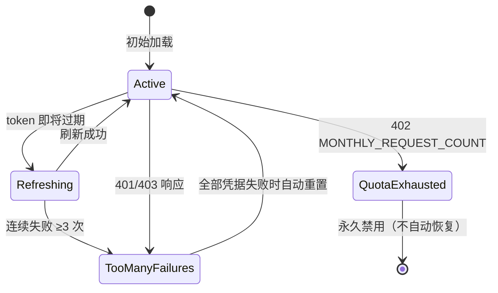
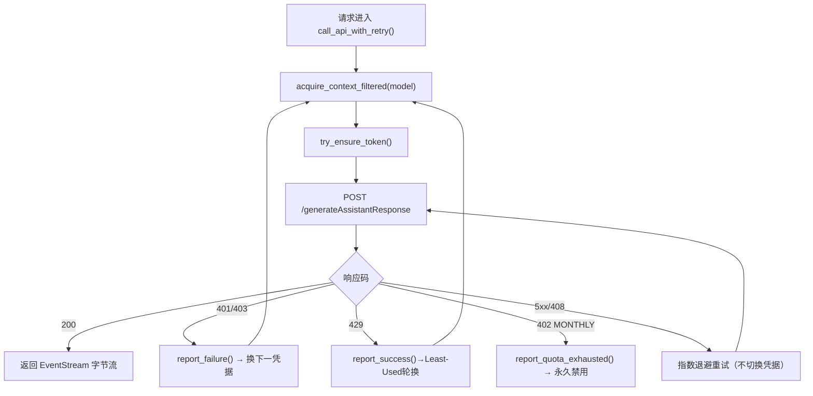
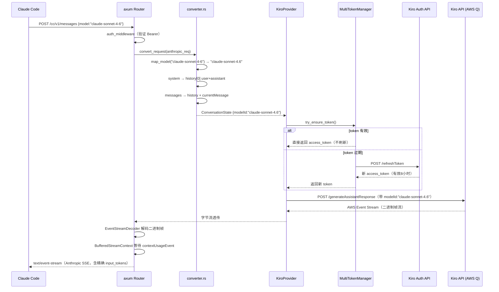
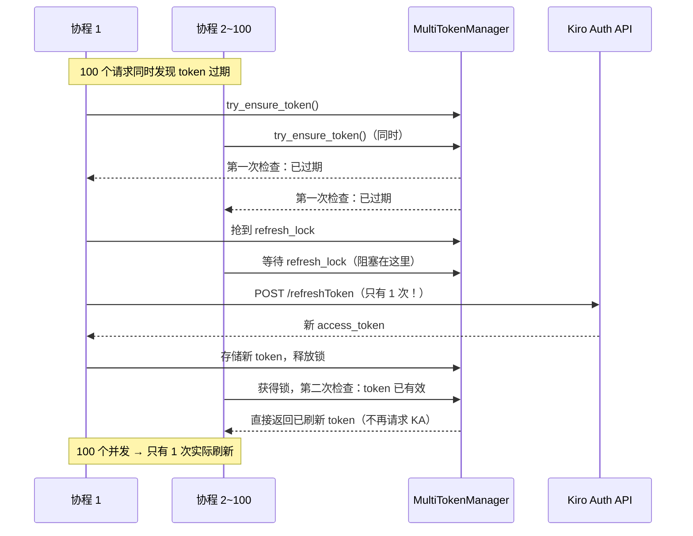

> **注：** 本文档由 **claude-sonnet-4-6** 模型自动生成。

# 📖 kiro2cc-proxy 源码全景解析

## 🌟 小白导读

**一句话大白话：** 这个项目就像一个"协议翻译官"，把 Claude Code 说的"Anthropic 格式"请求实时翻译成 Kiro IDE（亚马逊 AWS Q 服务）听得懂的"Kiro 格式"，让你免费用 Kiro 的算力跑 Claude 4.6 / 4.7 / Sonnet / Opus / Haiku 等模型。

**生活类比：** 就像你去了一家只收人民币的餐厅，但你手里只有美元。这个代理就是你身边的兑换窗口——把美元（Anthropic 请求）实时换成人民币（Kiro 请求），餐厅根本感知不到你本来拿的是美元。

**读前预期：**
- 读完"反代机制全解析"后，你将彻底理解：从一个 Anthropic 请求到 Kiro 响应的全链路
- 读完"Claude 4.6/4.7 路由深度解析"后，你将掌握：模型名如何一步步路由到 AWS Q 上的正确 Claude 版本
- 读完"难点突破"后，你将搞清楚：AWS Event Stream 二进制协议、thinking 标签检测、Token 双重检查锁

---

## 📋 目录
- [★ 核心反代机制全解析（全链路追踪）](#核心反代机制全解析全链路追踪)
- [★ Claude 4.6 / 4.7 模型路由深度解析](#claude-46--47-模型路由深度解析)
  - [非 Claude 模型使用方式（deepseek/glm/minimax/qwen）](#6-非-claude-模型在-cc-中的使用方式deepseek--glm--minimax--qwen)
- [项目概述与技术栈](#项目概述与技术栈)
- [目录结构](#目录结构)
- [架构全景（附生活类比）](#架构全景附生活类比)
- [入口与初始化流程](#入口与初始化流程)
- [关键业务流程图解](#关键业务流程图解)
- [核心源码剥洋葱（三层深度）](#核心源码剥洋葱三层深度)
- [错误处理与安全边界](#错误处理与安全边界)
- [关键类型与接口定义](#关键类型与接口定义)
- [难点突破（逐个攻克）](#难点突破逐个攻克)
- [为什么要这样设计？](#为什么要这样设计)
- [避坑指南](#避坑指南)

---

## ★ 核心反代机制全解析（全链路追踪）

> 这是整个项目最核心的章节。读懂这里，你就懂了"反代"的本质。

### 1. 两种协议的核心差异

| 维度 | Anthropic API（Claude Code 使用） | Kiro API（AWS Q） |
|---|---|---|
| 请求格式 | `POST /v1/messages` JSON | `POST /generateAssistantResponse` JSON |
| 模型指定方式 | 顶层 `model` 字段 | 嵌套在 `conversationState.currentMessage.userInputMessage.modelId` |
| System Prompt | 顶层 `system` 数组字段 | 不存在，必须转换为历史消息中的 user+assistant 配对 |
| 响应格式 | Server-Sent Events（`text/event-stream`）纯文本行 | AWS Event Stream 二进制帧协议（有 CRC32C 校验） |
| 消息历史 | `messages` 数组（role + content） | `history` 数组（`userInputMessage` / `assistantResponseMessage` 嵌套结构） |
| 认证方式 | Bearer token（用户自定义 API Key） | Bearer token（Kiro IDE 的 access_token，有效期 8 小时，需自动刷新） |

### 2. 完整请求变换过程（带 JSON 示例）

**Claude Code 发出的原始 Anthropic 请求：**

```json
POST /v1/messages
Authorization: Bearer <用户的 API Key>

{
  "model": "claude-sonnet-4-6",
  "max_tokens": 8192,
  "system": [{"type": "text", "text": "你是一个代码助手"}],
  "messages": [
    {"role": "user", "content": "帮我写一个快排算法"}
  ],
  "stream": true
}
```

**converter.rs 转换后，发给 Kiro 的请求：**

```json
POST https://q.us-east-1.amazonaws.com/generateAssistantResponse
Authorization: Bearer <Kiro access_token，每8小时刷新>
x-amzn-kiro-agent-mode: vibe
x-amz-user-agent: aws-sdk-js/1.0.27 KiroIDE-{version}-{machine_id}

{
  "conversationState": {
    "conversationId": "8bb5523b-ec7c-4540-a9ca-beb6d79f1552",
    "agentTaskType": "vibe",
    "chatTriggerType": "MANUAL",
    "history": [
      {
        "userInputMessage": {
          "content": "你是一个代码助手\nWhen the Write or Edit tool has content size limits...",
          "modelId": "claude-sonnet-4.6"
        }
      },
      {
        "assistantResponseMessage": {
          "content": "I will follow these instructions."
        }
      }
    ],
    "currentMessage": {
      "userInputMessage": {
        "content": "帮我写一个快排算法",
        "modelId": "claude-sonnet-4.6",
        "origin": "AI_EDITOR",
        "userInputMessageContext": {}
      }
    }
  }
}
```

**关键变换点总结：**
1. `model: "claude-sonnet-4-6"` → `modelId: "claude-sonnet-4.6"`（连字符换点号，嵌套进去）
2. `system` 数组 → 变成 `history` 最开头的 user+assistant 配对（`"I will follow these instructions."`）
3. `messages` 数组 → 拆分成 `history`（历史）+ `currentMessage`（最后一条）
4. 顶层 `Authorization` 的 Bearer → 换成 Kiro 的 access_token
5. 加上 Kiro IDE 特有的 Header（`x-amzn-kiro-agent-mode`、`x-amz-user-agent` 等）

### 3. 完整响应变换过程

**Kiro 返回的 AWS Event Stream（二进制帧，不可直读）：**

```
[4字节: total_len][4字节: header_len][4字节: prelude_crc32c]
[headers: ":event-type" = "assistantResponseEvent"]
[payload: {"content": "快速排序（Quick Sort）是..."}]
[4字节: message_crc32c]
```

解码后的 Kiro JSON 事件（每个帧内 payload）：

```json
// 事件1：文本内容
{"assistantResponseEvent": {"content": "快速排序（Quick Sort）是一种..."}}

// 事件2：继续文本
{"assistantResponseEvent": {"content": "分治算法，基本思路是..."}}

// 事件3：使用量（stream末尾）
{"contextUsageEvent": {"conversationContextPercentage": 5.2}}
```

**StreamContext 转换后，发给 Claude Code 的 Anthropic SSE：**

```
data: {"type":"message_start","message":{"id":"msg_01X...","model":"claude-sonnet-4-6","usage":{"input_tokens":150,"output_tokens":0}}}

data: {"type":"content_block_start","index":0,"content_block":{"type":"text","text":""}}

data: {"type":"content_block_delta","index":0,"delta":{"type":"text_delta","text":"快速排序（Quick Sort）是一种"}}

data: {"type":"content_block_delta","index":0,"delta":{"type":"text_delta","text":"分治算法，基本思路是..."}}

data: {"type":"message_delta","delta":{"stop_reason":"end_turn"},"usage":{"output_tokens":512}}

data: {"type":"message_stop"}
```

**关键变换点总结：**
1. 二进制帧 → 文本 SSE（`EventStreamDecoder` + `StreamContext` 完成）
2. Kiro `assistantResponseEvent.content` → Anthropic `content_block_delta.text_delta.text`
3. `contextUsageEvent.conversationContextPercentage` → `input_tokens`（`/cc/v1` 缓冲模式才精确）
4. 整个响应包裹上 `message_start`、`content_block_start`、`message_stop` 等 Anthropic 特有事件

### 4. 代码层调用链（从请求入站到响应出站）

```
Claude Code 发出请求
  │
  ▼
axum Router → POST /v1/messages (anthropic/router.rs)
  │
  ▼
auth_middleware (middleware.rs)
  │  验证 Bearer Token（常量时间比较，防时序攻击）
  │
  ▼
handle_stream_request (handlers.rs)
  │
  ▼
convert_request (converter.rs)         ← 协议转换：Anthropic → Kiro JSON
  │  1. map_model("claude-sonnet-4-6") → "claude-sonnet-4.6"
  │  2. system → history[0] user + history[1] assistant
  │  3. messages → history[2..n] + currentMessage
  │  4. tools → normalize_json_schema → Kiro tool format
  │
  ▼
serde_json::to_string(conversation_state)   ← 序列化为 JSON 字符串
  │
  ▼
KiroProvider.call_api_stream (provider.rs)  ← 发出 HTTP 请求
  │  1. acquire_context_filtered(model, bound_ids) → 选凭据
  │  2. try_ensure_token() → 获取/刷新 access_token（双重检查锁）
  │  3. build_headers() → 注入 Kiro IDE 伪装 Headers
  │  4. client.post(url).headers().body().send() → 真正发出 HTTP
  │
  ▼
reqwest Response (字节流)
  │
  ▼
EventStreamDecoder (kiro/parser/decoder.rs) ← 解码 AWS 二进制帧
  │  状态机：Ready → Parsing → 验证 CRC32C → 提取 payload JSON
  │
  ▼
StreamContext / BufferedStreamContext (anthropic/stream.rs) ← 转换为 SSE
  │  /v1:     实时转换，每帧立即发给客户端
  │  /cc/v1:  缓冲所有事件，等 contextUsageEvent，然后修正 input_tokens 再发
  │
  ▼
Claude Code 收到 Anthropic SSE 响应
```

<!-- SECTION:反代机制 -->
---

## ★ Claude 4.6 / 4.7 模型路由深度解析

> 这是项目的"灵魂所在"：用户指定的模型名，如何一步步路由到 AWS Q 后端对应的 Claude 版本。

### 1. 模型名转换函数 `map_model()` — 完整实现

**文件位置：** `src/anthropic/converter.rs:213`

```rust
pub fn map_model(model: &str) -> Option<String> {
    let model_lower = model.to_lowercase(); // 💡 大小写不敏感匹配

    if model_lower.contains("sonnet") {
        if model_lower.contains("4-6") || model_lower.contains("4.6") {
            Some("claude-sonnet-4.6".to_string()) // 💡 Sonnet 4.6：连字符→点号
        } else {
            Some("claude-sonnet-4.5".to_string()) // 💡 其他 sonnet → 降到 4.5
        }
    } else if model_lower.contains("opus") {
        if model_lower.contains("4-5") || model_lower.contains("4.5") {
            Some("claude-opus-4.5".to_string())   // 💡 Opus 4.5 明确指定
        } else if model_lower.contains("4-7") || model_lower.contains("4.7") {
            Some("claude-opus-4.7".to_string())   // 💡 Opus 4.7 最新模型
        } else {
            Some("claude-opus-4.6".to_string())   // 💡 Opus 默认 → 4.6（最稳定版）
        }
    } else if model_lower.contains("haiku") {
        Some("claude-haiku-4.5".to_string())      // 💡 所有 haiku → 4.5
    } else if model_lower == "auto" {
        Some("auto".to_string())                   // 💡 让 Kiro 自动选模型
    } else if model_lower.contains("deepseek") {
        Some("deepseek-3.2".to_string())           // 💡 DeepSeek 模型支持
    } else if model_lower.contains("glm") {
        Some("glm-5".to_string())
    } else if model_lower.contains("minimax") {
        if model_lower.contains("2.5") || model_lower.contains("2-5") {
            Some("minimax-m2.5".to_string())
        } else {
            Some("minimax-m2.1".to_string())
        }
    } else if model_lower.contains("qwen") {
        Some("qwen3-coder-next".to_string())
    } else {
        None // 💡 不支持的模型 → 返回 None → HTTP 400
    }
}
```

### 2. 完整模型映射表

| Claude Code 传入（示例） | 匹配条件 | Kiro 模型 ID | AWS Q 路由到 |
|---|---|---|---|
| `claude-sonnet-4-6` | contains "sonnet" + contains "4-6" | `claude-sonnet-4.6` | Claude Sonnet 4.6 |
| `claude-sonnet-4-6-20251101` | contains "sonnet" + contains "4-6" | `claude-sonnet-4.6` | Claude Sonnet 4.6 |
| `claude-sonnet-4.6` | contains "sonnet" + contains "4.6" | `claude-sonnet-4.6` | Claude Sonnet 4.6 |
| `claude-sonnet-4-5` | contains "sonnet"（不含 4-6/4.6） | `claude-sonnet-4.5` | Claude Sonnet 4.5 |
| `claude-opus-4-7` | contains "opus" + contains "4-7" | `claude-opus-4.7` | Claude Opus 4.7 |
| `claude-opus-4-7-20251101-thinking` | contains "opus" + contains "4-7" | `claude-opus-4.7` | Claude Opus 4.7 |
| `claude-opus-4-6` | contains "opus" + contains "4-6" | `claude-opus-4.6` | Claude Opus 4.6 |
| `claude-opus-4-5` | contains "opus" + contains "4-5" | `claude-opus-4.5` | Claude Opus 4.5 |
| `claude-opus-4` | contains "opus"（不含4-5/4-6/4-7） | `claude-opus-4.6` | Claude Opus 4.6（默认） |
| `claude-haiku-4-5` | contains "haiku" | `claude-haiku-4.5` | Claude Haiku 4.5 |
| `auto` | 精确匹配 "auto" | `auto` | Kiro 自动选择 |
| `deepseek-r1` | contains "deepseek" | `deepseek-3.2` | DeepSeek 3.2 |
| `gpt-4` | 不匹配任何规则 | `None` → 400 错误 | — |

> ⚠️ **重要设计细节**：Opus 的优先级是 4.5 > 4.7 > 默认4.6（不是数字大小排序）。因为 4.5 和 4.7 是明确版本，而 4.6 是兜底默认值。

### 3. model_id 在 Kiro JSON 请求中的位置

这是最关键的一点：`model_id` 不在请求体顶层，而是深埋在 `conversationState.currentMessage.userInputMessage.modelId`：

```json
{
  "conversationState": {
    "conversationId": "a0662283-7fd3-4399-a7eb-52b9a717ae88",
    "agentTaskType": "vibe",
    "chatTriggerType": "MANUAL",
    "history": [
      {
        "userInputMessage": {
          "content": "[系统提示内容]",
          "modelId": "claude-sonnet-4.6"  // ← 历史消息也携带 model_id！
        }
      },
      {"assistantResponseMessage": {"content": "I will follow these instructions."}}
    ],
    "currentMessage": {
      "userInputMessage": {
        "content": "用户输入的问题",
        "modelId": "claude-sonnet-4.6",   // ← ★ 这里决定了使用哪个 Claude 版本
        "origin": "AI_EDITOR",
        "userInputMessageContext": {
          "tools": [...],
          "toolResults": [...]
        }
      }
    }
  }
}
```

**注意**：每一条历史 user 消息和当前消息都要携带 `modelId`。这不是 Anthropic 协议的概念——Anthropic 里模型名只在最顶层出现一次，而 Kiro 要求每条 user 消息都指定。

### 4. model_id 的完整流转链路

```
用户在 Claude Code 配置中设置 model: "claude-sonnet-4-6"
  │
  ▼ Claude Code 发出请求
POST /v1/messages {"model": "claude-sonnet-4-6", ...}
  │
  ▼ converter.rs:337 — convert_request()
let model_id = map_model(&req.model)  // "claude-sonnet-4.6"
  │
  ▼ converter.rs:426 — UserInputMessage::new(content, &model_id)
UserInputMessage { model_id: "claude-sonnet-4.6", ... }
  │
  ▼ converter.rs:437 — ConversationState 构建完成
{currentMessage: {userInputMessage: {modelId: "claude-sonnet-4.6"}}}
  │
  ▼ provider.rs:148 — extract_model_from_request()
json["conversationState"]["currentMessage"]["userInputMessage"]["modelId"]
= "claude-sonnet-4.6"  // 读回来用于凭据过滤
  │
  ▼ provider.rs:469 — acquire_context_filtered(model, bound_ids)
选择支持该模型的凭据（如有凭据绑定模型约束的话）
  │
  ▼ 序列化后发出 HTTP POST
body = r#"{"conversationState":{"currentMessage":{"userInputMessage":{"modelId":"claude-sonnet-4.6",...}}}}"#
  │
  ▼ AWS Q 后端接收
modelId = "claude-sonnet-4.6" → 路由到 Claude Sonnet 4.6 实例
  │
  ▼ Kiro 返回 AWS Event Stream
{"assistantResponseEvent":{"content":"..."}}  // 实际是二进制帧，这里是解码后
  │
  ▼ StreamContext → Anthropic SSE
{"type":"content_block_delta","delta":{"text_delta":{"text":"..."}}}
  │
  ▼ Claude Code 收到响应
（model 字段原样返回 "claude-sonnet-4-6"，用户体验无任何差异）
```

### 5. 为什么用子串匹配而不是精确匹配？

Claude Code 发来的模型名变体众多：

```
claude-sonnet-4-6                    // 无日期后缀
claude-sonnet-4-6-20251101           // 带日期后缀
claude-sonnet-4-6-20251101-thinking  // 带 thinking 后缀
claude-sonnet-4.6                    // 点号版本
```

用精确匹配需要维护一张不断扩张的映射表；子串匹配只需关注版本号的核心模式（`"4-6"` 或 `"4.6"`），所有变体自动兼容。

**代价**：极端情况下如果某模型名里恰好含有 `4.6` 但语义不同（如 `deepseek-4.6`），会被误映射。但实际情况中 `deepseek` 先被检测到，不会触发 sonnet/opus 分支，所以这个代价是可接受的。

### 6. 非 Claude 模型在 CC 中的使用方式（deepseek / glm / minimax / qwen）

#### 6.1 代理侧无需额外配置

`build_model_list()`（`src/anthropic/handlers.rs:125`）已将所有非 Claude 模型写入 `/v1/models` 响应：

| 模型 ID（客户端发送） | Kiro 实际模型 | `owned_by` |
|---|---|---|
| `deepseek-3.2` 或任意含 `deepseek` 的名字 | `deepseek-3.2` | `deepseek` |
| `glm-5` 或任意含 `glm` 的名字 | `glm-5` | `glm` |
| `minimax-m2.5` 或含 `minimax` + `2.5`/`2-5` | `minimax-m2.5` | `minimax` |
| `minimax-m2.1` 或含 `minimax`（其余） | `minimax-m2.1` | `minimax` |
| `qwen3-coder-next` 或任意含 `qwen` 的名字 | `qwen3-coder-next` | `qwen` |
| `auto` | `auto`（Kiro 智能路由） | `kiro` |

Claude Code 启动时会拉取 `/v1/models`，这些模型会自动出现在模型列表中。

#### 6.2 客户端指定模型的三种方式

```bash
# 方式一：--model 标志（最直接）
claude --model deepseek-3.2
claude --model glm-5

# 方式二：环境变量
ANTHROPIC_MODEL=deepseek-3.2 claude

# 方式三：任意含关键词的名字（子串匹配）
# 以下三种都会路由到 deepseek-3.2：
claude --model deepseek
claude --model deepseek-chat
claude --model my-deepseek-v3
```

#### 6.3 凭据过滤行为

`select_next_credential()`（`src/kiro/token_manager.rs:702`）**只对 opus 做订阅检查**，deepseek/glm 不做任何模型筛选：

```rust
// token_manager.rs:706 — 只有 opus 走 supports_opus() 检查
let is_opus = model
    .map(|m| m.to_lowercase().contains("opus"))
    .unwrap_or(false);

if is_opus && !e.credentials.supports_opus() {
    return false;  // deepseek/glm 永远不会走到这里
}
```

**结论**：deepseek/glm 请求会用负载均衡选出的任意凭据发出。如果某账号不支持这些模型，Kiro API 会返回 403/401，代理如实透传该错误。

#### 6.4 前提条件

你的 **Kiro 账号订阅**必须实际开通了对应模型的访问权限。代理只负责格式转换和路由，不负责授权。若 Kiro 返回 `AccessDeniedException` 或 `ModelNotAvailableException`，说明账号未开通，需要在 Kiro IDE 侧确认。

<!-- SECTION:模型路由 -->
---

## 🎯 项目概述与技术栈

kiro2cc-proxy 是一个用 **Rust** 编写的高性能反向代理服务器，将标准 Anthropic API（Claude Code 所使用的协议）转发到 Kiro IDE 背后的 AWS Q API（底层是 Amazon 托管的 Claude 模型）。用户只需提供 Kiro IDE 的 refresh_token，即可将任何支持 Anthropic API 的客户端（Claude Code、Open WebUI 等）路由到 Kiro 后端，使用 Claude 4.6 / 4.7 等新模型。

**技术栈：**

| 技术/库 | 版本 | 在本项目中的具体角色 |
|---|---|---|
| Rust | Edition 2024 | 语言基础，零成本抽象 + 内存安全，异步运行时基础 |
| axum | 0.8 | HTTP 服务器框架，处理路由/中间件/状态提取器 |
| tokio | 1.0 (full) | 异步运行时，驱动所有 async/await 并发 |
| reqwest | 0.12 | HTTP 客户端，向 Kiro（AWS Q）发送请求，支持流式响应 |
| serde_json | 1.0 | JSON 序列化/反序列化，Anthropic ↔ Kiro 协议转换核心 |
| parking_lot | 0.12 | 高性能同步原语（比标准库 Mutex 快），用于 token 状态管理 |
| bytes | 1 | 高效字节缓冲，处理 AWS Event Stream 二进制帧 |
| sha2 / hex | — | 生成 machine_id 设备指纹（伪装 Kiro IDE 身份） |
| subtle | 2.6 | 常量时间字符串比较，防止 API Key 验证时序攻击 |
| rust-embed | 8 | 将前端 HTML/JS 静态资源编译进二进制文件 |
| uuid | 1.10 | 生成会话 ID（conversationId）、请求追踪 ID |
| tower-http | 0.6 | CORS + 请求追踪 middleware |

**核心特性：**
- **双向协议桥接**：完整的 Anthropic Messages API ↔ Kiro generateAssistantResponse 双向转换
- **多凭据管理**：多账号故障转移、优先级调度、Least-Used 负载均衡
- **流式透明代理**：AWS Event Stream 二进制帧 → Anthropic SSE 实时无损转换
- **Claude 4.6 / 4.7 精确路由**：子串匹配算法，兼容带日期后缀的模型名所有变体
- **`/cc/v1` 缓冲模式**：专为 Claude Code 设计，等 `contextUsageEvent` 后发送精确 `input_tokens`

---

## 📂 目录结构

```
src/
├── main.rs                    # 程序入口，初始化并组装所有模块
├── anthropic/                 # ★ 核心：处理入站 Anthropic API 请求
│   ├── router.rs              # 路由配置：/v1/messages, /cc/v1/messages 等
│   ├── handlers.rs            # 请求处理器：流式/非流式分发
│   ├── converter.rs           # ★★ 协议转换核心：Anthropic→Kiro + map_model()
│   ├── stream.rs              # ★★ 流式响应处理：Kiro Event → Anthropic SSE
│   ├── middleware.rs          # API Key 认证中间件
│   ├── types.rs               # Anthropic 请求/响应类型定义（MessagesRequest 等）
│   └── websearch.rs           # WebSearch 工具特殊处理
├── kiro/                      # ★ 核心：向 Kiro API 发送请求
│   ├── provider.rs            # ★★ 反代核心：多凭据故障转移 HTTP 客户端
│   ├── token_manager.rs       # ★★ Token 管理：自动刷新、双重检查锁
│   ├── machine_id.rs          # 设备指纹生成（模拟 Kiro IDE 身份）
│   ├── model/
│   │   ├── credentials.rs     # Kiro OAuth 凭证结构体
│   │   ├── events/            # Kiro 响应事件类型（assistant/toolUse/contextUsage）
│   │   └── requests/          # ★ Kiro 请求类型（ConversationState/UserInputMessage 等）
│   │       ├── conversation.rs # ConversationState、UserInputMessage（含 model_id 字段）
│   │       └── tool.rs        # Tool、ToolResult 等工具调用类型
│   └── parser/                # ★ AWS Event Stream 二进制帧解码器
│       ├── decoder.rs         # 四状态机解码器（Ready/Parsing/Recovering/Stopped）
│       ├── frame.rs           # 帧结构解析（CRC32C 校验）
│       ├── header.rs          # 二进制帧头解析
│       └── crc.rs             # CRC32C 实现
├── model/                     # 配置/参数/API Key 管理数据结构
│   ├── config.rs              # Config：从 config.json 加载，含 region、kiro_version 等
│   ├── api_key.rs             # 多用户 API Key 管理
│   ├── rpm.rs                 # RPM 统计追踪
│   └── usage.rs               # Token 用量追踪
├── admin/                     # Admin API（管理凭据、查看状态）
├── admin_ui/                  # Admin 前端静态资源路由
├── user/                      # User API（用户登录、用量查询）
├── cache.rs                   # Prompt Cache 模拟（伪造 cache_read_tokens）
├── token.rs                   # Token 计数（估算 input_tokens）
└── http_client.rs             # reqwest Client 构建（代理配置）
```

<!-- SECTION:概述 -->
<!-- SECTION:目录结构 -->
---

## 🏗️ 架构全景（附生活类比）

### MultiTokenManager — 多凭据 Token 生命周期管理

**大白话**：就像一个密码管家，帮你记住所有 Kiro 账号的临时通行证。快过期了自动续期，某个账号被封了自动换下一个。

**凭据状态机：**



**双重检查锁（防止 100 并发同时触发刷新）：**

```rust
// file: src/kiro/token_manager.rs
pub async fn try_ensure_token(&self) -> Result<String, Error> {
    // 第一次检查：不加锁，快速路径（99%的请求走这里）
    if let Some(token) = self.get_valid_token_fast() {
        return Ok(token);
    }
    // 只有 token 过期时才加锁
    let _lock = self.refresh_lock.lock().await;
    // 第二次检查：可能已有其他协程刷好了
    if let Some(token) = self.get_valid_token_fast() {
        return Ok(token); // 💡 "捡漏"：别人刚刷好，直接用
    }
    self.do_refresh_token().await // 真正刷新，只执行一次
}
```

### KiroProvider — 上游 HTTP 客户端与故障转移引擎

**大白话**：就像你有多张信用卡，刷第一张被拒了立刻换第二张；配额用完的卡扔一边不再用。



---

## 🚀 入口与初始化流程

程序启动时，`main.rs` 按以下严格顺序完成初始化：

```rust
// file: src/main.rs
#[tokio::main]
async fn main() {
    let args = Args::parse();                                    // 1. 解析命令行参数
    let config = Config::load(&args.config).await?;             // 2. 加载 config.json
    let credentials = load_credentials(&args.credentials).await?; // 3. 加载凭据列表
    let token_manager = MultiTokenManager::new(config, credentials, ...); // 4. 创建 token 管理器
    let kiro_provider = Arc::new(KiroProvider::new(token_manager)); // 5. 创建上游客户端
    let app = build_router(kiro_provider, config.clone());       // 6. 组装路由
    axum::serve(listener, app).await?;                          // 7. 监听端口（默认3000）
}
```

顺序必然性：Config → Token Manager（依赖 Config） → Provider（依赖 Token Manager） → Router（依赖 Provider）

---

## 🗺️ 关键业务流程图解

### 完整请求链路时序图



### Token 刷新双重检查锁并发时序



<!-- SECTION:架构全景 -->
<!-- SECTION:入口流程 -->
<!-- SECTION:业务流程 -->
---

## 🔍 核心源码剥洋葱（三层深度）

### 解析一：convert_request() — 13 步完整转换流程

**文件位置：** `src/anthropic/converter.rs:335`

```rust
pub fn convert_request(req: &MessagesRequest) -> Result<ConversionResult, ConversionError> {
    // 1. 模型名映射（核心！决定路由到哪个Claude版本）
    let model_id = map_model(&req.model)
        .ok_or_else(|| ConversionError::UnsupportedModel(req.model.clone()))?;
    // 2. 空消息检查
    if req.messages.is_empty() { return Err(ConversionError::EmptyMessages); }
    // 2.5 末尾 assistant prefill 静默丢弃（Claude 4.x 已废弃此特性）
    let messages = strip_trailing_assistant_prefill(&req.messages)?;
    // 3. 会话 ID 提取（优先从 metadata.user_id 的 session_ 段提取，确保多轮对话一致性）
    let conversation_id = extract_session_id_from_metadata(&req.metadata);
    // 4-12. 构建 history + currentMessage + tools ...
    // 13. 最终构建 ConversationState
    let conversation_state = ConversationState::new(conversation_id)
        .with_agent_task_type("vibe")
        .with_chat_trigger_type("MANUAL")
        .with_current_message(current_message) // ← currentMessage 含 modelId
        .with_history(history);                 // ← history 每条 user msg 也含 modelId
    Ok(ConversionResult { conversation_state })
}
```

**最难理解的点**：System Prompt 为什么变成 `history[0]` 的 user+assistant 配对？

因为 Kiro API 没有独立的 `system` 字段，必须用"角色扮演对话"的方式注入系统指令：
```json
history[0] = {"userInputMessage": {"content": "你是一个代码助手\n...", "modelId": "..."}}
history[1] = {"assistantResponseMessage": {"content": "I will follow these instructions."}}
```
这样模型就"记住"了系统指令。

---

### 解析二：/cc/v1 缓冲模式 — 精准 input_tokens

**文件位置：** `src/anthropic/stream.rs`

普通的 `/v1` 端点直接流式转发，`input_tokens` 是本地估算值。`/cc/v1` 端点专为 Claude Code 设计：

```
普通 /v1：
  Kiro frame → 立即转换为 SSE → 发给客户端（低延迟，input_tokens 估算）

/cc/v1 缓冲模式：
  Kiro frame → 先缓冲到内存
  ...等待...
  Kiro contextUsageEvent {conversationContextPercentage: 5.2}
  → input_tokens = 5.2% × 200000 = 10400（精确！）
  → 把所有缓冲的 SSE 事件重新发出，usage 字段用精确值
```

**为什么 Claude Code 需要精确 input_tokens**：Claude Code 根据 input_tokens 判断 context 窗口是否快满了，误差过大会导致它提前"压缩上下文"或错误告警。

---

## 🛡️ 错误处理与安全边界

### API Key 鉴权（常量时间比较）

```rust
// file: src/common/auth.rs
// 💡 使用 subtle crate，防止时序攻击：
// 普通字符串比较在第一个不匹配字符处就返回，响应时间差异可被攻击者利用
// subtle::ConstantTimeEq 无论哪里不匹配，都花费相同时间
if !provided_key.as_bytes().ct_eq(expected_key.as_bytes()).into() {
    return StatusCode::UNAUTHORIZED.into_response();
}
```

### 上游错误码处理策略

| 状态码 | 含义 | 处理策略 |
|---|---|---|
| 200 | 成功 | 透传字节流，`report_success()` |
| 400 | 请求格式错误 | 直接返回给客户端（不重试，不切换凭据） |
| 401/403 | Token 失效 | `report_failure()` → 换下一凭据重试 |
| 402 + MONTHLY_REQUEST_COUNT | 月配额耗尽 | `report_quota_exhausted()` → 永久禁用 |
| 429 | 被限流 | `report_success()` → Least-Used 算法自然轮换 |
| 408/5xx | 上游瞬态错误 | 指数退避重试（不切换凭据，避免误禁用） |

### 安全相关设计

- **refresh_token 保护**：仅存在内存中，不写日志，不暴露在 API 响应里
- **`x-amzn-codewhisperer-optout: true`**：告知 AWS 不将请求内容用于训练
- **并发控制**：`Semaphore(50)` 防止上游连接过载触发 Kiro 频率限制
- **Kiro 伪装身份的必要性**：API 不公开，必须伪装成 KiroIDE 客户端身份才能调用

---

## 📐 关键类型与接口定义

```rust
// file: src/kiro/model/requests/conversation.rs:14 — 发给 Kiro 的完整请求体
pub struct ConversationState {
    pub conversation_id: String,
    pub agent_task_type: Option<String>,   // "vibe"
    pub chat_trigger_type: Option<String>, // "MANUAL"
    pub current_message: CurrentMessage,   // 包含 UserInputMessage
    pub history: Vec<Message>,             // 历史消息，每条 user 消息都含 model_id
}

// file: src/kiro/model/requests/conversation.rs:95 — ★ 核心：决定 Claude 版本
pub struct UserInputMessage {
    pub content: String,                          // 用户消息文本
    pub model_id: String,                         // ★ Kiro 模型 ID（由 map_model 生成）
    pub user_input_message_context: UserInputMessageContext, // 工具定义和工具结果
    pub images: Vec<KiroImage>,                   // 图片列表
    pub origin: Option<String>,                   // "AI_EDITOR"（伪装身份用）
}
```

| 概念/类型 | 文件位置 | 业务含义 |
|---|---|---|
| `ConversationState` | `kiro/model/requests/conversation.rs:14` | 完整 Kiro 请求体 |
| `UserInputMessage.model_id` | `conversation.rs:101` | ★ 选择哪个 Claude 版本 |
| `MessagesRequest` | `anthropic/types.rs` | Claude Code 发来的入站请求 |
| `ConversionResult` | `anthropic/converter.rs:252` | 转换结果（含 ConversationState） |
| `MultiTokenManager` | `kiro/token_manager.rs` | 多账号 token 生命周期管理 |
| `KiroProvider` | `kiro/provider.rs:37` | 上游 HTTP 客户端（含故障转移） |
| `EventStreamDecoder` | `kiro/parser/decoder.rs` | AWS 二进制帧解码状态机 |
| `CredentialStatus` | `kiro/token_manager.rs` | Active/TooManyFailures/QuotaExhausted |

<!-- SECTION:源码剥洋葱 -->
<!-- SECTION:错误处理 -->
<!-- SECTION:类型定义 -->
---

## 📦 完整数据结构字段详解

> 本章节是"关键类型与接口定义"的深度展开，逐字段说明两侧协议的所有数据结构。

### 一、Anthropic 侧（Claude Code 发来的请求 / 代理返回的响应）

#### 1.1 `MessagesRequest` — 入站请求体

**文件：** `src/anthropic/types.rs`

```
MessagesRequest
├── model: String
│     Claude Code 指定的模型名，如 "claude-sonnet-4-6"、"claude-opus-4-7-20251101-thinking"
│     → 经 map_model() 转换后写入 Kiro 请求的 modelId 字段
│
├── max_tokens: i32
│     最大输出 token 数，如 8192
│     → 当前版本不透传给 Kiro（Kiro 侧无对应字段）
│
├── messages: Vec<Message>
│     对话历史，至少 1 条。最后一条变成 currentMessage，其余变成 history
│     每条 Message:
│       ├── role: String          "user" 或 "assistant"
│       └── content: JSON Value   字符串 或 ContentBlock 数组（见 1.4）
│
├── stream: bool
│     是否流式响应，默认 false。Claude Code 始终传 true
│
├── system: Option<Vec<SystemMessage>>
│     系统提示，支持字符串或数组两种格式（反序列化时自动统一为数组）
│     每条 SystemMessage:
│       └── text: String          系统提示文本
│     → 转换为 history[0] user + history[1] assistant 配对注入 Kiro
│
├── tools: Option<Vec<Tool>>
│     工具定义列表（见 1.3）
│     → 经 normalize_json_schema() 规范化后写入 Kiro currentMessage 的 tools 字段
│
├── tool_choice: Option<JSON Value>
│     工具选择策略，如 {"type":"auto"} / {"type":"any"} / {"type":"tool","name":"xxx"}
│     → 当前版本不透传给 Kiro
│
├── thinking: Option<Thinking>
│     Extended Thinking 配置（见 1.5）
│
├── output_config: Option<OutputConfig>
│     输出配置（见 1.6）
│
└── metadata: Option<Metadata>
      Claude Code 附带的元数据（见 1.7）
```

#### 1.2 `Message` — 对话消息

```
Message
├── role: String
│     "user" 或 "assistant"
│
└── content: JSON Value
      两种格式：
      ① 纯字符串：  "帮我写一个快排算法"
      ② ContentBlock 数组（见 1.4）：
         [{"type":"text","text":"..."}, {"type":"tool_use","id":"...","name":"...","input":{}}]
```

#### 1.3 `Tool` — 工具定义（Anthropic 侧）

```
Tool
├── type: Option<String>
│     仅 WebSearch 工具有此字段，值为 "web_search_20250305"
│     普通工具无此字段
│
├── name: String
│     工具名称，如 "read_file"、"bash"、"web_search"
│
├── description: String
│     工具功能描述，普通工具必需
│
├── input_schema: HashMap<String, JSON Value>
│     工具参数的 JSON Schema，普通工具必需
│     注意：可能含 anyOf/oneOf/allOf，需经 normalize_json_schema() 规范化
│     规范化规则：
│       - anyOf/oneOf/allOf → 删除（Kiro 不支持）
│       - "type": ["string","null"] → "type": "string"（取第一个非 null）
│       - "required": null → "required": []
│       - "properties": null → "properties": {}
│       - 保留白名单字段：type/properties/required/items/additionalProperties/description/enum
│
└── max_uses: Option<i32>
      仅 WebSearch 工具有此字段，限制最大调用次数，如 8
```

#### 1.4 `ContentBlock` — 内容块

```
ContentBlock
├── type: String
│     内容块类型，可选值：
│       "text"       — 文本内容
│       "thinking"   — 思考内容（Extended Thinking 模式）
│       "tool_use"   — 工具调用（助手发起）
│       "tool_result"— 工具结果（用户侧返回）
│       "image"      — 图片
│
├── text: Option<String>
│     type="text" 时的文本内容
│
├── thinking: Option<String>
│     type="thinking" 时的思考内容
│
├── id: Option<String>
│     type="tool_use" 时的工具调用 ID，如 "toolu_01XxXx..."
│
├── name: Option<String>
│     type="tool_use" 时的工具名称
│
├── input: Option<JSON Value>
│     type="tool_use" 时的工具输入参数对象
│
├── tool_use_id: Option<String>
│     type="tool_result" 时对应的工具调用 ID
│
├── content: Option<JSON Value>
│     type="tool_result" 时的结果内容
│
├── is_error: Option<bool>
│     type="tool_result" 时是否为错误结果
│
└── source: Option<ImageSource>
      type="image" 时的图片数据源
      ImageSource:
        ├── type: String        "base64"
        ├── media_type: String  "image/jpeg" / "image/png" / "image/gif" / "image/webp"
        └── data: String        base64 编码的图片数据
```

#### 1.5 `Thinking` — Extended Thinking 配置

```
Thinking
├── type: String
│     "enabled"  — 强制启用思考
│     "adaptive" — 自适应（模型自行决定是否思考）
│     "disabled" — 禁用
│
└── budget_tokens: i32
      思考 token 预算，默认 20000，上限 24576（MAX_BUDGET_TOKENS）
      超出上限时自动截断为 24576
```

#### 1.6 `OutputConfig` — 输出配置

```
OutputConfig
├── effort: String
│     输出努力程度，默认 "high"
│
└── format: Option<OutputFormat>
      OutputFormat:
        ├── type: String         格式类型，如 "json_schema"
        └── schema: JSON Value   JSON Schema 定义
```

#### 1.7 `Metadata` — 请求元数据

```
Metadata
└── user_id: Option<String>
      Claude Code 传入的用户 ID，格式：
      "user_xxx_account__session_0b4445e1-f5be-49e1-87ce-62bbc28ad705"
      → converter.rs 从中提取 session_ 后的 UUID 作为 conversationId，
        确保多轮对话使用同一会话 ID
```

#### 1.8 Anthropic SSE 响应事件序列

代理返回给 Claude Code 的 `text/event-stream` 格式，每行格式为 `event: <type>\ndata: <json>\n\n`：

```
① message_start（流开始，只出现一次）
   {
     "type": "message_start",
     "message": {
       "id": "msg_01Xxx...",          // UUID 格式消息 ID
       "type": "message",
       "role": "assistant",
       "content": [],
       "model": "claude-sonnet-4-6",  // 原样返回请求中的 model 名
       "stop_reason": null,
       "stop_sequence": null,
       "usage": {
         "input_tokens": 150,                    // /v1: 本地估算；/cc/v1: contextUsageEvent 精确值
         "output_tokens": 1,
         "cache_creation_input_tokens": 0,       // 模拟 prompt cache 字段
         "cache_read_input_tokens": 0
       }
     }
   }

② content_block_start（每个内容块开始，index 从 0 递增）
   文本块：
   {"type":"content_block_start","index":0,"content_block":{"type":"text","text":""}}

   thinking 块（Extended Thinking 模式，index=0）：
   {"type":"content_block_start","index":0,"content_block":{"type":"thinking","thinking":""}}

   tool_use 块：
   {"type":"content_block_start","index":1,"content_block":{"type":"tool_use","id":"toolu_01...","name":"bash","input":{}}}

③ content_block_delta（内容增量，可多次）
   文本增量：
   {"type":"content_block_delta","index":0,"delta":{"type":"text_delta","text":"快速排序..."}}

   thinking 增量：
   {"type":"content_block_delta","index":0,"delta":{"type":"thinking_delta","thinking":"让我思考..."}}

   工具参数增量（JSON 字符串流式拼接）：
   {"type":"content_block_delta","index":1,"delta":{"type":"input_json_delta","partial_json":"{\"cmd\":"}}

   签名增量（伪造，用于通过检测工具验证）：
   {"type":"content_block_delta","index":0,"delta":{"type":"signature_delta","signature":"ABC...=="}}

④ content_block_stop（内容块结束）
   {"type":"content_block_stop","index":0}

⑤ message_delta（流结束前，只出现一次）
   {
     "type": "message_delta",
     "delta": {
       "stop_reason": "end_turn",   // "end_turn" / "tool_use" / "max_tokens" / "model_context_window_exceeded"
       "stop_sequence": null
     },
     "usage": {
       "input_tokens": 150,
       "output_tokens": 512,
       "cache_creation_input_tokens": 0,
       "cache_read_input_tokens": 0
     }
   }

⑥ message_stop（流结束，只出现一次）
   {"type":"message_stop"}
```

---

### 二、Kiro 侧（代理发出的请求 / Kiro 返回的响应）

#### 2.1 `KiroRequest` — 发给 Kiro 的完整请求体

**文件：** `src/kiro/model/requests/kiro.rs`

```
KiroRequest
├── conversation_state: ConversationState   ★ 核心字段（见 2.2）
│
└── profile_arn: Option<String>
      AWS Profile ARN，IdC 认证时从 RefreshResponse 获取并透传
      Social 认证时为 None
```

#### 2.2 `ConversationState` — 对话状态

**文件：** `src/kiro/model/requests/conversation.rs`

```
ConversationState
├── conversation_id: String
│     会话 UUID，如 "8bb5523b-ec7c-4540-a9ca-beb6d79f1552"
│     优先从 metadata.user_id 的 session_ 段提取，确保多轮对话一致性
│     无 metadata 时每次请求生成新 UUID
│
├── agent_task_type: Option<String>
│     固定值 "vibe"，伪装为 Kiro IDE 的 Vibe 模式
│
├── chat_trigger_type: Option<String>
│     固定值 "MANUAL"，表示用户手动触发
│
├── agent_continuation_id: Option<String>
│     代理延续 ID，当前版本不使用（None）
│
├── current_message: CurrentMessage
│     当前用户消息（见 2.3）
│
└── history: Vec<Message>
      历史消息列表，可为空
      结构：[system_user, system_assistant, msg1_user, msg1_assistant, ..., msgN_user, msgN_assistant]
      注意：system prompt 被转换为 history[0]+history[1] 的 user+assistant 配对
      每条 Message 是 enum，两种变体（见 2.5/2.6）
```

#### 2.3 `CurrentMessage` / `UserInputMessage` — 当前消息

```
CurrentMessage
└── user_input_message: UserInputMessage

UserInputMessage
├── content: String
│     用户消息文本（纯文本，图片单独放 images 字段）
│
├── model_id: String
│     ★ 决定路由到哪个 Claude 版本，如 "claude-sonnet-4.6"
│     由 map_model() 从 Anthropic 的 model 字段转换而来
│
├── user_input_message_context: UserInputMessageContext
│     工具定义和工具结果（见 2.4）
│
├── images: Vec<KiroImage>
│     图片列表，空时不序列化
│     KiroImage:
│       ├── format: String        "jpeg" / "png" / "gif" / "webp"
│       └── source: KiroImageSource
│             └── bytes: String   base64 编码的图片数据
│
└── origin: Option<String>
      固定值 "AI_EDITOR"，伪装为 Kiro IDE 的 AI 编辑器来源
```

#### 2.4 `UserInputMessageContext` — 消息上下文

```
UserInputMessageContext
├── tools: Vec<Tool>
│     可用工具列表，空时不序列化
│     Kiro Tool（与 Anthropic Tool 结构不同）：
│       └── tool_specification: ToolSpecification
│             ├── name: String          工具名称
│             ├── description: String   工具描述
│             └── input_schema: InputSchema
│                   └── json: JSON Value   规范化后的 JSON Schema
│
└── tool_results: Vec<ToolResult>
      工具执行结果列表，空时不序列化
      ToolResult:
        ├── tool_use_id: String                          对应的工具调用 ID
        ├── content: Vec<Map<String, JSON Value>>        结果内容数组，每项含 "text" 键
        ├── status: Option<String>                       "success" 或 "error"
        └── is_error: bool                               是否为错误（false 时不序列化）
```

#### 2.5 历史用户消息 `HistoryUserMessage` / `UserMessage`

```
HistoryUserMessage
└── user_input_message: UserMessage

UserMessage
├── content: String           消息文本
├── model_id: String          模型 ID（与 currentMessage 相同）
├── origin: Option<String>    固定 "AI_EDITOR"
├── images: Vec<KiroImage>    图片列表，空时不序列化
└── user_input_message_context: UserInputMessageContext
      工具定义和工具结果（仅在该轮有工具调用时非空）
      空时不序列化（由 is_default_context() 判断）
```

#### 2.6 历史助手消息 `HistoryAssistantMessage` / `AssistantMessage`

```
HistoryAssistantMessage
└── assistant_response_message: AssistantMessage

AssistantMessage
├── content: String                    助手回复文本
└── tool_uses: Option<Vec<ToolUseEntry>>
      工具调用记录，None 时不序列化
      ToolUseEntry:
        ├── tool_use_id: String    工具调用 ID
        ├── name: String           工具名称
        └── input: JSON Value      工具输入参数
```

#### 2.7 Kiro 请求 HTTP Headers

```
Authorization: Bearer <access_token>          Kiro access_token（8小时有效期）
Content-Type: application/json
x-amzn-kiro-agent-mode: vibe                  伪装为 Vibe 模式
x-amzn-codewhisperer-optout: true             告知 AWS 不用于训练
x-amz-user-agent: aws-sdk-js/1.0.27 KiroIDE-{version}-{machine_id}
User-Agent: aws-sdk-js/1.0.27 ua/2.1 os/{os} lang/js md/nodejs#{node} api/codewhispererstreaming#1.0.27 m/E KiroIDE-{version}-{machine_id}
amz-sdk-invocation-id: {random UUID}          每次请求随机生成
amz-sdk-request: attempt=1; max=3
```

---

#### 2.8 Kiro 响应事件（AWS Event Stream 解码后的 JSON）

Kiro 返回 AWS Event Stream 二进制帧，解码后每帧 payload 是以下 JSON 之一：

**① `assistantResponseEvent` — 文本内容增量**

```json
{
  "assistantResponseEvent": {
    "content": "快速排序（Quick Sort）是一种..."
  }
}
```

```
AssistantResponseEvent
└── content: String   文本片段，流式拼接后为完整回复
    （其余字段如 conversationId、messageId、messageStatus、followupPrompt 被 extra 字段捕获，不使用）
```

**② `toolUseEvent` — 工具调用增量**

```json
{
  "toolUseEvent": {
    "name": "bash",
    "toolUseId": "toolu_01XxXx...",
    "input": "{\"command\": \"ls -la\"",
    "stop": false
  }
}
```

```
ToolUseEvent
├── name: String        工具名称
├── tool_use_id: String 工具调用 ID（与 Anthropic 侧 tool_use.id 对应）
├── input: String       工具参数 JSON 字符串（流式，可能是部分数据）
└── stop: bool          是否是最后一个块（true 表示参数传输完毕）
```

**③ `contextUsageEvent` — 上下文使用率**

```json
{
  "contextUsageEvent": {
    "contextUsagePercentage": 5.2
  }
}
```

```
ContextUsageEvent
└── context_usage_percentage: f64
      上下文窗口使用百分比（0-100）
      → /cc/v1 模式：input_tokens = percentage × 1_000_000 / 100
      → 达到 100% 时设置 stop_reason = "model_context_window_exceeded"
```

**④ `meteringEvent` — 计费事件**

无 payload 字段，代理直接忽略。

**⑤ `error` 帧 — 服务端错误**

```
Event::Error
├── error_code: String     错误代码，如 "AccessDeniedException"
└── error_message: String  错误消息文本
```

**⑥ `exception` 帧 — 服务端异常**

```
Event::Exception
├── exception_type: String  异常类型，如 "ContentLengthExceededException"
└── message: String         异常消息
    → ContentLengthExceededException 时设置 stop_reason = "max_tokens"
```

---

### 三、凭据与 Token 刷新数据结构

#### 3.1 `KiroCredentials` — Kiro OAuth 凭据

**文件：** `src/kiro/model/credentials.rs`

```
KiroCredentials
├── id: Option<u64>                  凭据自增 ID（多凭据时自动分配）
├── access_token: Option<String>     当前有效的访问令牌（8小时有效期）
├── refresh_token: Option<String>    刷新令牌（Social 认证）
├── profile_arn: Option<String>      AWS Profile ARN（IdC 认证）
├── expires_at: Option<String>       access_token 过期时间（RFC3339 格式）
├── auth_method: Option<String>      认证方式："social" 或 "idc"（"builder-id"/"iam" 自动规范化为 "idc"）
├── client_id: Option<String>        OIDC Client ID（IdC 认证必需）
├── client_secret: Option<String>    OIDC Client Secret（IdC 认证必需）
├── priority: u32                    凭据优先级，数字越小越优先，默认 0（为 0 时不序列化）
├── region: Option<String>           凭据级通用 Region（auth/api 的回退值）
├── auth_region: Option<String>      凭据级 Token 刷新 Region（优先级最高）
├── api_region: Option<String>       凭据级 API 请求 Region（优先级最高）
├── machine_id: Option<String>       凭据级 Machine ID（64字符 hex，覆盖全局配置）
├── email: Option<String>            用户邮箱（从 Anthropic API 获取，用于显示）
├── nickname: Option<String>         用户备注名（前端显示用）
├── subscription_title: Option<String> 订阅等级，含 "FREE" 则不支持 Opus 模型
├── proxy_url: Option<String>        凭据级代理 URL，"direct" 表示强制不使用代理
├── proxy_username: Option<String>   代理认证用户名
├── proxy_password: Option<String>   代理认证密码
└── disabled: bool                   是否禁用该凭据，默认 false
```

**Region 优先级链：**
- Auth Region：`凭据.auth_region` > `凭据.region` > `config.auth_region` > `config.region`
- API Region：`凭据.api_region` > `config.api_region` > `config.region`

#### 3.2 Token 刷新请求/响应

**Social 认证（`auth_method: "social"`）：**

```
RefreshRequest（POST /refreshToken）
└── refresh_token: String   Kiro refresh_token

RefreshResponse
├── access_token: String            新的 access_token
├── refresh_token: Option<String>   可能返回新的 refresh_token（轮换机制）
├── profile_arn: Option<String>     AWS Profile ARN
└── expires_in: Option<i64>         有效期秒数
```

**IdC 认证（`auth_method: "idc"`，AWS SSO OIDC）：**

```
IdcRefreshRequest（POST /token）
├── client_id: String       OIDC Client ID
├── client_secret: String   OIDC Client Secret
├── refresh_token: String   当前 refresh_token
└── grant_type: String      固定 "refresh_token"

IdcRefreshResponse
├── access_token: String            新的 access_token
├── refresh_token: Option<String>   可能返回新的 refresh_token
└── expires_in: Option<i64>         有效期秒数
```

<!-- SECTION:数据结构详解 -->
---

## 🧩 难点突破（逐个攻克）

### 难点 1：AWS Event Stream 二进制帧协议

**难在哪里**：Kiro 返回的不是普通 JSON，而是 AWS 私有二进制帧协议。每帧有固定头部、长度字段、CRC32C 校验，直接读字节是乱码。

**心智模型**：就像快递分拣系统——每个包裹外面有标准纸箱（帧头），纸箱上写着里面有多少货物（payload length），货物装进去后贴防伪标（CRC）。必须先拆箱、验防伪，再取真正的货物（JSON 事件）。

**帧结构**：
```
[4字节: total_len] [4字节: header_len] [4字节: prelude_crc32c]
[headers: ":event-type" 等] [payload: JSON] [4字节: message_crc32c]
```

**解码状态机（4个状态）**：
```
Ready      → 等待至少 16 字节（帧头最小尺寸）
Parsing    → 读取 total_len → 等缓冲区 >= total_len → 验 CRC32C → 提取 payload
Recovering → CRC 错误，跳过当前帧，找下一帧边界
Stopped    → 连续 5 次失败，放弃该流
```

**最常见陷阱**：
- TCP 分包导致帧不完整 → 必须等 `buffer.len() >= total_len` 才解帧
- CRC 算法是 CRC32C（Castagnoli），不是常见的 CRC32（Ethernet）

---

### 难点 2：thinking 标签误判检测

**难在哪里**：AI 在 extended thinking 模式下的思考内容，可能讨论 `</thinking>` 字符串本身（比如思考一段含该标签的代码）。直接搜 `</thinking>` 会误判。

**实际实现**：不是嵌套深度计数，而是两个条件的组合判断：

```rust
// file: src/anthropic/stream.rs:72 — find_real_thinking_end_tag()
fn find_real_thinking_end_tag(buffer: &str) -> Option<usize> {
    while let Some(pos) = buffer[search_start..].find("</thinking>") {
        // 条件1：前后没有引号类字符（反引号、双引号等）
        let has_quote_before = is_quote_char(buffer, absolute_pos - 1);
        let has_quote_after = is_quote_char(buffer, absolute_pos + TAG.len());
        if has_quote_before || has_quote_after {
            search_start += 1; continue; // 被引号包裹 → 是引用，跳过
        }
        // 条件2：标签后面跟着双换行符 \n\n（真正的结束标签后必有段落分隔）
        if after_content.starts_with("\n\n") {
            return Some(absolute_pos); // 找到真正的结束标签
        }
        search_start += 1; // 不是 \n\n → 是内容中提到的标签，跳过
    }
    None
}
```

**为什么是 `\n\n` 而不是嵌套计数**：Claude 的 extended thinking 输出中，真正的 `</thinking>` 后面总是跟着两个换行符再接正文。而在思考内容中被"引用"的 `</thinking>`，通常出现在代码块或句子中间，后面不会有双换行。

---

### 难点 3：Kiro IDE 身份伪装

**难在哪里**：Kiro API 不是公开 API，只接受来自 Kiro IDE 客户端的请求。User-Agent 格式、Header 集合必须精确匹配。

**完整 Header 注入**：
```
x-amzn-kiro-agent-mode: vibe
x-amzn-codewhisperer-optout: true
x-amz-user-agent: aws-sdk-js/1.0.27 KiroIDE-{kiro_version}-{machine_id}
User-Agent: aws-sdk-js/1.0.27 ua/2.1 os/{os} lang/js md/nodejs#{node} api/codewhispererstreaming#1.0.27 m/E KiroIDE-{version}-{machine_id}
amz-sdk-invocation-id: {random UUID}
amz-sdk-request: attempt=1; max=3
```

**machine_id 生成**：
```rust
// file: src/kiro/machine_id.rs
// 从 refresh_token 的 SHA256 生成 64 字符 hex 字符串
sha256("KotlinNativeAPI/" + refresh_token) → 格式化为 64-char lowercase hex
```

---

### 难点 4：JSON Schema 规范化

**难在哪里**：Claude Code 传来的工具 JSON Schema 可能含 Kiro 不支持的字段（`anyOf`/`oneOf`/`allOf`、类型数组）。直接转发会触发 Kiro 400 错误。

**规范化规则**：
```
anyOf/oneOf/allOf → 直接删除（Kiro 不支持组合 schema）
"type": ["string", "null"] → "type": "string"（取第一个非 null 类型）
"required": null → "required": []
"properties": null → "properties": {}
保留字段白名单：type/properties/required/items/additionalProperties/description/enum
```

---

## 🎯 为什么要这样设计？

### 决策一：Rust 而不是 Node.js / Python

- **问题**：代理需要同时持有大量 SSE 长连接，处理大量二进制帧
- **Rust 的优势**：`tokio` 异步运行时用极少线程处理大量并发；`bytes::Bytes` 零拷贝字节操作；`parking_lot` 的 Mutex 在低争用时比标准库快 3-5 倍
- **代价**：编译时间长；贡献门槛高（Rust 学习曲线陡）

### 决策二：`/v1` 和 `/cc/v1` 分成两个端点

- **问题**：非 CC 客户端（curl、Open WebUI）不需要精确 token 计数，但缓冲会增加延迟；Claude Code 需要精确 `input_tokens` 管理 context 窗口
- **方案**：`/v1` 流式快速响应，`/cc/v1` 缓冲等 contextUsageEvent
- **代价**：用户需要在 Claude Code 配置中指定 `/cc/v1` 路径

### 决策三：Opus 的"4.5 > 4.7 > 默认4.6"优先级

- **问题**：Opus 系列有 4.5/4.6/4.7 三个版本，如何确定默认版本？
- **逻辑**：4.5 和 4.7 是用户明确指定的版本；4.6 是"没有明确指定时的最新稳定版"默认值
- **注意**：不是"数字越大越新"的简单规则，而是"指定的优于默认的"

---

## ⚠️ 避坑指南

### 潜在风险

- **风险1：`/v1` 下 Claude Code token 统计不准**
  描述：`/v1` 端点的 `input_tokens` 来自本地估算，偏差可达 10-20%
  规避：在 Claude Code 的 `ANTHROPIC_API_URL` 中用 `/cc/v1` 路径

- **风险2：月配额耗尽的凭据不自动恢复**
  描述：`QuotaExhausted` 状态需要等到下个月，程序不自动重置
  规避：Admin API 监控凭据状态；配置多账号分散用量

- **风险3：Kiro IDE 版本更新导致 User-Agent 失效**
  描述：AWS 更新 Kiro IDE 版本后，旧版 User-Agent 可能被拒绝
  规避：关注项目更新；通过抓包真实 Kiro IDE 流量验证

- **风险4：refresh_token 过期无法自动获取**
  描述：账号改密码或撤销授权后，整个凭据失效，需手动更新
  规避：Admin 界面提供 token 更新 API；配置多账号备份

- **风险5：JSON Schema 规范化丢失语义**
  描述：`anyOf` 直接删除，可能丢失联合类型约束
  规避：如工具调用出现参数验证失败，检查 Schema 是否含 `anyOf`/`oneOf`

### 优化建议

- **分布式部署**：当前 token 状态存在内存中，多实例时不共享；可用 Redis 共享 token 缓存
- **Prometheus 指标**：建议添加凭据健康状态、token 刷新次数、各模型请求分布等指标
- **动态凭据热重载**：目前修改凭据需重启；可通过 Admin API 实现运行时添加/删除
- **流式错误传播**：流式响应中途出错时客户端可能只收到截断响应；建议注入 SSE error 事件

<!-- SECTION:难点突破 -->
<!-- SECTION:设计思想 -->
<!-- SECTION:避坑指南 -->
