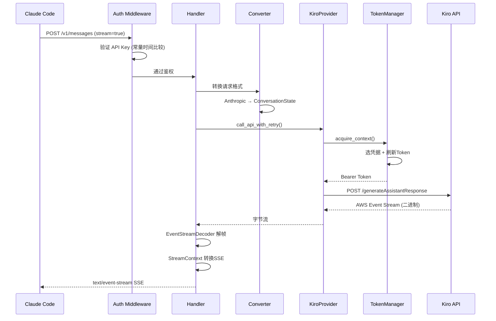
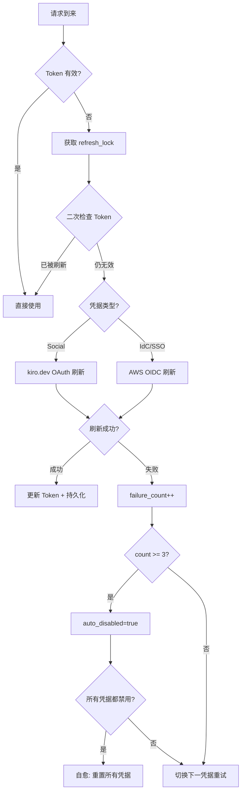

> **注：** 本文档由 **claude-sonnet-4-6** 模型自动生成。

# 📖 kiro2cc-proxy 源码全景解析

## 🌟 小白导读

**一句话大白话：** 这个项目是一个"翻译官+调度中心"——它把 Claude Code 发来的 Anthropic API 请求，翻译成 AWS Kiro 服务能听懂的格式，再把 Kiro 的回答翻译回来，让 Claude Code 以为自己在直接和 Anthropic 对话。

> 如需变更深度剖析（Mode B），可追加指令"变更分析"生成第二份文档。

**生活类比：** 想象你是一个只会说中文的老板（Claude Code），你的供应商只会说英文（AWS Kiro）。这个代理就是你雇的翻译兼秘书：它接收你的中文指令，翻译成英文发给供应商，收到英文回复后再翻译成中文汇报给你。更厉害的是，它还管理着多个供应商账号，哪个账号额度用完了就自动切换到下一个，全程你感知不到。

**读前预期：**
- 读完"核心概念"后，你将能理解：请求如何从 Anthropic 格式变成 Kiro 格式，以及多账号是如何被调度的
- 读完"源码剥洋葱"后，你将能看懂：Token 刷新的双重检查锁、AWS Event Stream 二进制解码、SSE 流式输出的状态机
- 读完"难点突破"后，你将彻底搞清楚：为什么需要伪造签名、缓存模拟的本质、`<thinking>` 标签跨 chunk 解析的陷阱

---

## 📋 目录

- [项目概述与技术栈](#项目概述与技术栈)
- [目录结构](#目录结构)
- [架构全景（附生活类比）](#架构全景附生活类比)
- [入口与初始化流程](#入口与初始化流程)
- [关键业务流程图解](#关键业务流程图解)
- [核心源码剥洋葱（三层深度）](#核心源码剥洋葱三层深度)
- [错误处理与安全边界](#错误处理与安全边界)
- [关键类型与接口定义](#关键类型与接口定义)
- [难点突破（逐个攻克）](#难点突破逐个攻克)
- [为什么要这样设计？](#为什么要这样设计)
- [避坑指南](#避坑指南)

---

## 🎯 项目概述与技术栈

`kiro2cc-proxy` 是一个 Anthropic API 兼容代理服务，将标准 Anthropic Messages API 请求转发至 AWS Kiro（Amazon Q / CodeWhisperer 后端），使 Claude Code 等工具无需修改即可通过 Kiro 账号使用 Claude 模型。核心价值在于：多账号负载均衡、自动 Token 刷新、流式响应转换。

**技术栈：**

| 技术/库 | 版本 | 在本项目中的具体角色 |
|---|---|---|
| Rust | edition 2024 | 系统语言，提供零成本抽象和内存安全 |
| axum | 0.8 | HTTP 服务框架，处理路由和中间件 |
| tokio | full | 异步运行时，驱动所有 async/await 代码 |
| reqwest | 0.12 | HTTP 客户端，向 Kiro 上游发请求 |
| serde / serde_json | latest | JSON 序列化/反序列化（Anthropic 协议） |
| bytes | latest | 零拷贝字节缓冲，用于 Event Stream 解码 |
| crc | latest | CRC32C 校验，验证 AWS Event Stream 帧完整性 |
| base64 | latest | 编码伪造的 signature_delta 事件 |
| parking_lot | latest | 高性能同步原语（RwLock 用于 API Key 共享） |
| rust-embed | latest | 将 Admin/User UI 静态文件编译进二进制 |
| subtle | latest | 常量时间比较，防止 API Key 时序攻击 |
| clap | latest | 命令行参数解析（--config, --credentials） |

**核心特性：**
- 多凭据优先级/轮询负载均衡，自动故障转移
- Social OAuth 和 AWS IdC 双路径 Token 刷新
- AWS Event Stream 二进制协议解码 → Anthropic SSE 转换
- `<thinking>` 扩展思考块跨 chunk 状态解析
- Admin API + 内嵌 Web UI（凭据管理、用量统计）
- 缓存命中模拟（fake cache_creation/read tokens）

---

## 📂 目录结构

```
src/
  ├─ main.rs                    # 入口：初始化所有组件，组装 axum 路由
  ├─ model/
  │   ├─ config.rs              # Config 结构体，支持 JSON + 环境变量覆盖
  │   ├─ api_key.rs             # ApiKeyManager：多用户 API Key 管理
  │   ├─ usage.rs               # UsageTracker：按 Key 统计 token 用量
  │   └─ rpm.rs                 # RpmTracker：每凭据请求速率追踪
  ├─ anthropic/
  │   ├─ types.rs               # Anthropic API 数据结构定义
  │   ├─ handlers.rs            # /v1/messages 和 /v1/messages/count_tokens 处理器
  │   ├─ converter.rs           # Anthropic → Kiro 格式转换器
  │   ├─ stream.rs              # SSE 流式输出状态机 + thinking 解析
  │   └─ middleware.rs          # API Key 鉴权中间件，AppState 定义
  ├─ kiro/
  │   ├─ provider.rs            # KiroProvider：HTTP 客户端 + 重试逻辑
  │   ├─ token_manager.rs       # MultiTokenManager：多凭据生命周期管理
  │   ├─ model/
  │   │   └─ credentials.rs     # KiroCredentials 结构体，凭据加载/持久化
  │   └─ parser/
  │       └─ decoder.rs         # EventStreamDecoder：AWS 二进制帧解码
  ├─ admin/                     # Admin API 路由和 AdminService
  ├─ admin_ui/                  # 内嵌 Admin Web UI 静态文件服务
  ├─ user/                      # User API 路由（登录、用量查询）
  ├─ user_ui/                   # 内嵌 User Web UI 静态文件服务
  ├─ cache.rs                   # 缓存命中模拟：CacheSimulationRatioConfig
  ├─ token.rs                   # count_tokens 外部 API 调用封装
  └─ http_client.rs             # ProxyConfig + reqwest Client 工厂
```

---

## 🏗️ 架构全景（附生活类比）

### 核心类/模块 1：MultiTokenManager（多凭据调度器）

**🗣️ 第一层 — 大白话**
- **它是啥**：管理多个 Kiro 账号凭据的调度器，负责 Token 刷新、故障检测和负载均衡
- **通俗点说**：就像一个"账号池管家"——你有 5 张信用卡，管家帮你决定刷哪张，哪张额度用完了就换下一张，哪张过期了就自动续期
- **没有它会怎样**：只能用单账号，额度耗尽即停服；Token 过期需手动刷新

**🔧 第二层 — 技术原理**
- **设计模式**：状态机 + 双重检查锁（Double-Checked Locking）
- **为什么用这个模式**：Token 刷新是昂贵的网络操作，多个并发请求同时发现 Token 过期时，只允许一个去刷新，其余等待结果复用
- **数据流链路**：请求到来 → `acquire_context()` 选择凭据 → `try_ensure_token()` 检查/刷新 Token → 返回有效 Bearer Token → 发起 Kiro API 调用

**🔬 第三层 — 实现细节**
- **文件位置**：`src/kiro/token_manager.rs`

```rust
// 双重检查锁：先不加锁检查，再加锁二次确认
async fn try_ensure_token(&self, entry: &mut CredentialEntry) -> Result<()> {
    // 💡 第一次检查：无锁快速路径，Token 有效直接返回
    if entry.is_token_valid() {
        return Ok(());
    }
    // 💡 获取全局刷新锁，防止并发重复刷新
    let _guard = self.refresh_lock.lock().await;
    // 💡 第二次检查：持锁后再验证，可能已被其他协程刷新
    if entry.is_token_valid() {
        return Ok(());
    }
    // 💡 真正执行刷新（Social OAuth 或 AWS IdC 两条路径）
    self.refresh_token_for_entry(entry).await
}
```

> ⚠️ **常见误区**：只做一次检查会导致"惊群效应"——10 个并发请求同时刷新同一个 Token，造成 10 次无效网络请求

---

### 核心类/模块 2：KiroProvider（HTTP 客户端 + 重试引擎）

**🗣️ 第一层 — 大白话**
- **它是啥**：向 Kiro 上游发 HTTP 请求的执行者，内置重试、故障上报、并发限制
- **通俗点说**：像一个"快递员调度系统"——最多同时派出 50 个快递员（并发限制），某个快递员失败了就换一个重试，失败太多次就把这个快递员标记为"停用"
- **没有它会怎样**：单次请求失败即报错，无法应对 Kiro 的偶发 5xx 错误

**🔧 第二层 — 技术原理**
- **设计模式**：信号量限流 + 指数退避重试 + 责任链错误处理
- **最大重试次数**：`min(凭据数 × 3, 9)`，确保多凭据时有足够重试机会
- **数据流链路**：获取 Semaphore permit → 选凭据 → 刷新 Token → 发请求 → 按状态码分支处理 → 成功/重试/失败

**🔬 第三层 — 实现细节**
- **文件位置**：`src/kiro/provider.rs`

```rust
// 指数退避 + 抖动，防止重试风暴
fn retry_delay(attempt: u32) -> Duration {
    // 💡 基础延迟 200ms，每次翻倍，上限 5000ms
    let base_ms = 200u64 * (1u64 << attempt.min(4));
    let capped = base_ms.min(5000);
    // 💡 ±25% 随机抖动，避免多个客户端同时重试
    let jitter = (fastrand::u64(0..=500) as i64 - 250) * capped as i64 / 1000;
    Duration::from_millis((capped as i64 + jitter).max(50) as u64)
}
```

> ⚠️ **常见误区**：固定间隔重试会导致"重试风暴"——所有客户端在同一时刻重试，加剧服务器压力

---

### 核心类/模块 3：EventStreamDecoder（AWS 二进制帧解码器）

**🗣️ 第一层 — 大白话**
- **它是啥**：解析 AWS Event Stream 二进制协议的解码器，把字节流变成结构化事件
- **通俗点说**：就像解读摩尔斯电码——收到一串"嘀嘀嗒嗒"，按照固定规则翻译成有意义的单词
- **没有它会怎样**：无法读取 Kiro 的流式响应，整个流式输出功能瘫痪

**🔧 第二层 — 技术原理**
- **设计模式**：4 状态机（Ready → Parsing → Recovering/Ready → Stopped）
- **帧结构**：`[4字节总长][4字节头长][4字节头CRC][头部][载荷][4字节消息CRC]`
- **错误恢复**：Prelude 错误跳过 1 字节；Data 错误跳过整帧；连续 5 次错误进入 Stopped

**🔬 第三层 — 实现细节**
- **文件位置**：`src/kiro/parser/decoder.rs`

```rust
// 状态机核心：根据当前状态决定如何处理字节
fn parse_frame(&mut self) -> Option<Result<Event, DecodeError>> {
    match self.state {
        // 💡 Ready：等待足够字节解析帧头（12字节）
        State::Ready => self.try_parse_prelude(),
        // 💡 Parsing：已有帧头，等待完整帧数据
        State::Parsing { total_length, .. } => self.try_parse_full_frame(total_length),
        // 💡 Recovering：跳过损坏帧，寻找下一个有效帧
        State::Recovering { skip_bytes } => self.try_recover(skip_bytes),
        State::Stopped => None,
    }
}
```

---

## 🚀 入口与初始化流程

程序启动时按严格顺序初始化各组件，顺序不可颠倒（后者依赖前者）：

```rust
// src/main.rs — 启动顺序
// 1. 解析 CLI 参数（--config, --credentials）
let args = Args::parse();
// 2. 初始化 tracing 日志（RUST_LOG 环境变量控制级别）
tracing_subscriber::fmt()...init();
// 3. 加载 config.json → 环境变量覆盖（容器部署用）
let mut config = Config::load(&config_path)?;
config.apply_env_overrides();
// 4. 加载 credentials.json（单对象或数组格式均支持）
let credentials_config = CredentialsConfig::load(&credentials_path)?;
// 5. 创建 MultiTokenManager（核心调度器）
let token_manager = Arc::new(MultiTokenManager::new(...)?);
// 6. 创建 KiroProvider（HTTP 执行层）
let kiro_provider = KiroProvider::with_proxy(token_manager, proxy_config);
// 7. 初始化 count_tokens 全局配置（静态 OnceCell）
token::init_config(CountTokensConfig { ... });
// 8. 条件性启用 Admin API（仅当 admin_api_key 非空）
// 9. 组装 axum 路由树，绑定 TCP 监听器
```

**关键设计**：`api_key_manager` 和 `usage_tracker` 只在 `admin_api_key` 有效时才初始化，避免无 Admin 场景的内存开销。`Arc<parking_lot::RwLock<String>>` 包装 `api_key` 使其可在运行时通过 Admin API 热更新。

---

## 🗺️ 关键业务流程图解

### 流程一：流式消息请求全链路



**👆 流程大白话翻译：**
1. Claude Code 发来一个"帮我写代码"的请求，带着 API Key
2. 中间件先验证 API Key 是否合法（用常量时间比较防止时序攻击）
3. Handler 把 Anthropic 格式的请求翻译成 Kiro 能懂的格式
4. KiroProvider 从 TokenManager 拿到有效的 Bearer Token
5. 向 Kiro 发请求，收到 AWS 二进制格式的流式响应
6. 解码二进制帧，转换成 Anthropic SSE 格式，实时推送给 Claude Code

**🔍 最难理解的点**：步骤 5→6 涉及两次协议转换（AWS Event Stream → JSON Event → Anthropic SSE），且必须实时流式处理，不能等全部收完再转换。

---

### 流程二：Token 刷新与凭据故障转移



**🔍 自愈机制说明**：当所有凭据都因连续失败被自动禁用时，系统不会直接报错，而是将所有凭据重置为启用状态重新尝试。这是为了应对 Kiro 服务短暂不可用后恢复的场景。

---

## 🔍 核心源码剥洋葱（三层深度）

### 解析一：Anthropic → Kiro 格式转换（converter.rs）

**📍 文件位置**：`src/anthropic/converter.rs`

**第一层看懂它**：把 Claude Code 发来的"人话"请求，翻译成 Kiro 服务能理解的"内部格式"。就像把中文菜单翻译成英文厨房指令。

```rust
// 💡 核心转换：MessagesRequest → ConversationState
pub fn convert_request(req: &MessagesRequest) -> ConversationState {
    // 💡 system prompt 单独提取，不放进消息列表
    let system_prompt = extract_system_prompt(&req.system);
    // 💡 消息列表转换：user/assistant 角色映射
    let history = req.messages.iter().map(convert_message).collect();
    // 💡 工具定义需要 JSON Schema 严格化（Kiro 不接受宽松 schema）
    let tools = req.tools.as_ref().map(|t| normalize_tools(t));
    ConversationState { system_prompt, history, tools, .. }
}
```

**第二层搞清楚它**：
- **JSON Schema 严格化**：Kiro 要求工具参数 schema 必须有 `"additionalProperties": false`，否则拒绝请求。`normalize_tools` 递归遍历所有 object 类型节点注入此字段
- **为什么不能直接透传**：Anthropic 的 schema 是宽松的，Kiro 的验证器是严格的，不转换会导致 400 错误

**第三层吃透它**：
- **最关键的一行**：`normalize_tools` 中的递归 schema 注入，因为嵌套 object 如果漏掉一层就会导致整个请求被 Kiro 拒绝
- **底层追踪**：`handlers.rs::handle_messages` → `converter::convert_request` → `normalize_tools` → 递归遍历 JSON Value

---

### 解析二：SSE 流式状态机（stream.rs）

**📍 文件位置**：`src/anthropic/stream.rs`

**第一层看懂它**：把 Kiro 返回的事件流，按照 Anthropic SSE 协议的严格顺序重新组装输出。就像把乱序收到的快递包裹，按正确顺序排好再交给客户。

```rust
// 💡 SseStateManager 强制 SSE 事件顺序
// Anthropic 协议要求：message_start → content_block_start
//   → content_block_delta(s) → content_block_stop
//   → message_delta → message_stop
impl SseStateManager {
    fn validate_transition(&self, event: &SseEvent) -> bool {
        // 💡 状态机：当前状态 + 新事件 → 是否合法转换
        matches!((&self.state, event),
            (State::Init, SseEvent::MessageStart) |
            (State::MessageStarted, SseEvent::ContentBlockStart) |
            (State::InContentBlock, SseEvent::ContentBlockDelta) |
            // ...省略: 其余合法转换
        )
    }
}
```

**第二层搞清楚它**：
- **BufferedStreamContext vs StreamContext**：非流式请求用 `BufferedStreamContext`，缓冲所有事件后用真实 token 数修正 `message_start` 中的 usage 字段再输出；流式用 `StreamContext` 实时输出
- **为什么需要修正**：Kiro 在流开始时不知道最终 token 数，`BufferedStreamContext` 等流结束后用 `contextUsageEvent` 的真实数据回填

**第三层吃透它**：
- **最关键的一行**：`cap_input_tokens`——将上报的 input_tokens 限制在本地估算值的 1.15 倍以内，防止 Kiro 上报异常大的数字误导用户
- **底层追踪**：`KiroProvider::stream_response` → `EventStreamDecoder::decode` → `StreamContext::process_event` → `SseStateManager::emit`

---

### 解析三：`<thinking>` 标签跨 chunk 解析

**📍 文件位置**：`src/anthropic/stream.rs`

**第一层看懂它**：从流式文本中识别 `<thinking>...</thinking>` 标签，把思考内容和普通内容分开处理。难点在于标签可能被切割在两个不同的数据块里。

```rust
// 💡 跨 chunk 的标签检测：维护一个"待确认前缀"缓冲区
fn find_real_thinking_start_tag(buf: &str) -> TagSearchResult {
    // 💡 跳过被引号包裹的标签（如 "<thinking>" 出现在代码里）
    // 💡 只有独立出现的 <thinking> 才算真正的思考开始
    if let Some(pos) = find_unquoted_tag(buf, "<thinking>") {
        TagSearchResult::Found(pos)
    } else if buf.ends_with_prefix_of("<thinking>") {
        // 💡 当前 chunk 末尾是标签的前缀，需要等下一个 chunk
        TagSearchResult::MaybeInNext
    } else {
        TagSearchResult::NotFound
    }
}
```

**第二层搞清楚它**：
- **引号过滤**：代码块中的 `"<thinking>"` 不应触发思考模式，需要检测是否被引号包裹
- **前缀等待**：如果 chunk 末尾是 `<think`，不能判断"没有标签"，必须等下一个 chunk 拼接后再判断
- **结束标签后的 `\n\n`**：`</thinking>` 后必须跟 `\n\n` 才算真正结束，防止误判

**第三层吃透它**：
- **最关键的细节**：`leading newline stripping`——thinking 内容开头的换行符会被剥除，因为 Anthropic 协议中 thinking block 不应以换行开头
- **底层追踪**：`process_content_with_thinking` → `find_real_thinking_start_tag` / `find_real_thinking_end_tag` → `emit_thinking_delta` / `emit_text_delta`

---

## 🛡️ 错误处理与安全边界

### 错误处理策略

错误按来源分层处理，不同层有不同的处理策略：

```rust
// src/kiro/provider.rs — 按 HTTP 状态码分支处理
match status {
    // 💡 400：请求格式错误，直接返回给调用方，不重试
    400 => bail!("Bad request: {}", body),
    // 💡 401/403：凭据失效，上报失败 + 切换凭据重试
    401 | 403 => { token_manager.report_failure(id); continue; }
    // 💡 402 + 月度配额：标记配额耗尽（不自愈），切换凭据
    402 if is_quota_error => { token_manager.report_quota_exhausted(id); continue; }
    // 💡 429：限速，上报成功（触发轮询切换），不惩罚凭据
    429 => { token_manager.report_success(id); continue; }
    // 💡 5xx/408：服务端错误，退避重试，不切换凭据
    s if s >= 500 || s == 408 => { sleep(retry_delay(attempt)); continue; }
}
```

**关键设计**：429 上报 `report_success` 而非 `report_failure`，是因为限速不代表凭据有问题，只是需要换一个凭据来绕过限速，不应惩罚该凭据的健康计数。

### 边界输入校验

- **API Key 验证**：`subtle::ConstantTimeEq` 常量时间比较，防止时序侧信道攻击
- **Refresh Token 验证**：`validate_refresh_token` 拒绝长度 <100 或含 `"..."` 的 Token（Kiro IDE 截断标志）
- **Thinking budget_tokens**：硬上限 24576，超出自动截断（`src/anthropic/types.rs`）
- **Content-Length 超限**：映射为 400 错误返回给调用方

### 安全相关逻辑

- **API Key 存储**：`Arc<parking_lot::RwLock<String>>`，内存中明文，不写日志
- **凭据持久化**：写入后调用 `file.sync_all()`（fsync），防止容器重启丢失
- **Admin API 鉴权**：所有 `/api/admin/*` 路由要求 `x-api-key` 头匹配 `admin_api_key`
- **伪造签名**：`generate_fake_signature()` 注入 162 字符 base64，用于通过检测工具的签名校验

---

## 📐 关键类型与接口定义

```rust
// src/anthropic/types.rs — 核心请求结构
pub struct MessagesRequest {
    pub model: String,
    pub max_tokens: u32,
    pub messages: Vec<Message>,
    pub stream: Option<bool>,
    pub system: Option<SystemMessage>,
    pub tools: Option<Vec<Tool>>,
    pub thinking: Option<Thinking>,  // 扩展思考配置
}

// src/kiro/model/credentials.rs — 凭据结构
pub struct KiroCredentials {
    pub refresh_token: String,
    pub access_token: Option<String>,
    pub token_expiry: Option<DateTime<Utc>>,
    pub credential_type: CredentialType,  // Social | IdC
    pub priority: Option<i32>,
    pub disabled: Option<bool>,
}
```

| 概念/接口名 | 文件位置 | 在业务中代表什么 |
|---|---|---|
| `MessagesRequest` | `src/anthropic/types.rs` | Claude Code 发来的一次对话请求 |
| `KiroCredentials` | `src/kiro/model/credentials.rs` | 一个 Kiro 账号的登录凭据 |
| `CredentialEntry` | `src/kiro/token_manager.rs` | 运行时凭据状态（含失败计数、禁用标志） |
| `ConversationState` | `src/kiro/model/` | Kiro 内部格式的对话状态 |
| `CacheSimulationRatioConfig` | `src/cache.rs` | 缓存命中率模拟配置（三角分布采样） |
| `StreamContext` | `src/anthropic/stream.rs` | 流式响应的 SSE 状态机上下文 |
| `RpmTracker` | `src/model/rpm.rs` | 每凭据的请求速率追踪器 |
| `ApiKeyManager` | `src/model/api_key.rs` | 多用户 API Key 的增删查改管理器 |

---

## 🧩 难点突破（逐个攻克）

### 难点 1：双重检查锁（Double-Checked Locking）

**🤔 难在哪里**：在异步并发环境下，如何让多个协程共享一次 Token 刷新结果，而不是各自重复刷新

**💡 心智模型**：
就像公司只有一台打印机，10 个人同时发现纸用完了。正确做法是：第一个人去加纸（持锁），其余 9 人等待。加完纸后，9 人依次检查"纸还在吗"——在的话直接打印，不需要再去加纸。

**🔗 实现追踪**：
```
请求协程 → try_ensure_token()
  └─ 第一次检查 is_token_valid()（无锁，快速路径）
      └─ 失败 → refresh_lock.lock().await（异步等待锁）
          └─ 第二次检查 is_token_valid()（持锁，防止重复刷新）
              └─ 失败 → refresh_token_for_entry()（真正刷新）
                  └─ 成功 → persist_credentials()（fsync 持久化）
```

**⚠️ 常见陷阱**：
- 只做一次检查：10 个并发请求全部触发刷新，产生 10 次 OAuth 请求，可能触发限速
- 用同步 Mutex 而非 TokioMutex：在 async 上下文中持有同步锁会阻塞整个线程

**✅ 正确姿势**：两次检查 + `tokio::sync::Mutex`（异步锁，等待时让出线程）

---

### 难点 2：AWS Event Stream 二进制协议解码

**🤔 难在哪里**：字节流是分批到达的，一个帧可能跨越多个 TCP 包，必须处理"帧不完整"的情况

**💡 心智模型**：
就像收快递时，一个大箱子被拆成多个小包裹分批送达。你需要先收集所有包裹，确认总数量（帧头告诉你总长度），再拆箱验货（CRC 校验）。

**🔗 实现追踪**：
```
TCP 字节流 → EventStreamDecoder::feed(bytes)
  └─ 追加到内部 BytesMut 缓冲区
      └─ decode() 循环调用 parse_frame()
          └─ State::Ready: 检查是否有 12 字节（帧头）
              └─ 解析 total_length, headers_length, prelude_crc
                  └─ CRC 校验通过 → 转 State::Parsing
                      └─ State::Parsing: 检查是否有 total_length 字节
                          └─ 解析头部 + 载荷 + 验证消息 CRC
                              └─ 提取 JSON 事件 → 转 State::Ready
```

**⚠️ 常见陷阱**：
- 忘记处理"帧不完整"：缓冲区不足时必须返回 `None` 等待更多数据，不能报错
- 错误恢复不当：CRC 失败后如果不跳过整帧，会导致后续所有帧解析错位

**✅ 正确姿势**：状态机 + 惰性解析（数据不足时保持当前状态，等待下次 feed）

---

### 难点 3：缓存模拟的本质与局限

**🤔 难在哪里**：用户期望"缓存命中"能节省费用，但实际上这里的缓存数字是完全伪造的

**💡 心智模型**：
就像餐厅菜单上写着"今日特价"，但实际上价格从未变过。`cache_creation_input_tokens` 和 `cache_read_input_tokens` 字段只是为了让 Claude Code 的 UI 显示"缓存命中"，并不代表真实的 Anthropic Prompt Cache 行为。

**🔗 实现追踪**：
```
handlers.rs::generate_usage()
  └─ PromptCacheUsage::from_ratio_config(input_tokens, config, 0.1)
      └─ CacheSimulationRatioConfig::fixed(0.85)
          └─ cache_read_tokens = input_tokens * 0.85
          └─ cache_creation_tokens = input_tokens * 0.1
          └─ 实际 input_tokens 不变（只是额外附加字段）
```

**⚠️ 常见陷阱**：
- 误以为修改比例会影响实际费用：Kiro 上游不支持 Anthropic Prompt Cache，比例只影响显示数字
- 误以为可以通过配置开启真实缓存：上游协议（AWS Event Stream）不传递缓存控制信息

**✅ 正确理解**：这是纯粹的 UI 展示优化，让 Claude Code 的用量统计界面看起来更"正常"

---

### 难点 4：伪造 signature_delta 事件

**🤔 难在哪里**：某些 Claude Code 版本会校验流式响应中的 `signature_delta` 事件，缺少会报错

**💡 心智模型**：
就像海关要求每个包裹都有报关单，即使包裹里装的是普通商品。`signature_delta` 是 Anthropic 真实 API 用于验证响应完整性的签名，但 Kiro 不生成它，所以代理必须伪造一个"看起来合法"的签名。

**🔗 实现追踪**：
```
StreamContext::generate_final_events()
  └─ generate_fake_signature()
      └─ 生成 162 字符的 base64 字符串
          └─ 作为 signature_delta 事件注入到流末尾
              └─ 在 content_block_stop 之前发送
```

**⚠️ 常见陷阱**：
- 签名长度不对：162 字符是经过测试的"看起来合法"的长度，随意修改可能触发校验失败
- 注入时机错误：必须在 `content_block_stop` 之前，否则违反 SSE 协议顺序

**✅ 正确姿势**：固定长度 base64 + 正确的事件顺序注入

---

## 🎯 为什么要这样设计？（架构师碎碎念）

### 设计决策一：为什么用 Rust 而不是 Node.js/Go？

- **当时面临的问题**：代理需要处理大量并发流式连接，内存占用和延迟都很关键
- **有哪些备选方案**：Node.js（生态好但 GC 抖动）、Go（简单但无所有权系统）、Rust（复杂但零成本抽象）
- **最终选择的理由**：Rust 的 `async/await` + tokio 在高并发流式场景下内存占用极低，且所有权系统在编译期消除了大量并发 bug
- **这个选择的代价**：编译时间长，学习曲线陡，招募贡献者困难

### 设计决策二：为什么凭据故障阈值是 3 次？

- **当时面临的问题**：Kiro 偶发 401/403 不代表凭据真的失效（可能是服务端抖动），但真正失效的凭据需要快速切换
- **有哪些备选方案**：1 次（太敏感，正常抖动就禁用）、5 次（太宽松，失效凭据浪费重试次数）、3 次（平衡点）
- **最终选择的理由**：3 次连续失败基本可以排除偶发抖动，同时不会在真正失效时浪费太多重试
- **这个选择的代价**：极端情况下，3 次失败期间的请求会有额外延迟

### 设计决策三：为什么 Admin UI 用 rust-embed 内嵌而不是独立部署？

- **当时面临的问题**：用户部署时需要尽量简单，不希望额外配置静态文件服务器
- **有哪些备选方案**：独立 nginx 服务静态文件、CDN 托管、rust-embed 编译进二进制
- **最终选择的理由**：单二进制部署，零额外依赖，适合 Docker/Zeabur 等容器化场景
- **这个选择的代价**：每次 UI 更新需要重新编译整个二进制，UI 文件增大二进制体积

### 设计决策四：为什么 429 不惩罚凭据健康计数？

- **当时面临的问题**：429 是限速，说明凭据本身是有效的，只是请求太频繁
- **有哪些备选方案**：当作失败处理（会错误禁用健康凭据）、忽略（不切换凭据）、上报成功（触发轮询切换）
- **最终选择的理由**：上报 `report_success` 会在负载均衡模式下触发轮询切换到下一个凭据，自然分散请求压力
- **这个选择的代价**：如果所有凭据都在限速，会在凭据间无效轮询

---

## ⚠️ 避坑指南

### 潜在风险

- **风险1：Refresh Token 被 Kiro IDE 截断** → `validate_refresh_token` 会拒绝含 `"..."` 的 Token，但用户可能不知道为什么登录失败。**如何规避**：从 Kiro IDE 导出凭据时确保完整复制，不要在文本编辑器中手动编辑 JSON

- **风险2：所有凭据同时配额耗尽** → `QuotaExceeded` 状态不会被自愈机制重置，需要手动通过 Admin API 重新启用。**如何规避**：配置多个不同账号的凭据，分散配额压力

- **风险3：容器重启丢失 Token 刷新结果** → `persist_credentials` 调用 `fsync`，但如果容器在写入中途崩溃仍可能丢失。**如何规避**：挂载持久化卷到 `credentials.json` 所在目录

- **风险4：count_tokens 外部 API 不可用** → 如果配置了 `count_tokens_api_url` 但服务不可用，token 计数请求会失败。**如何规避**：不配置此项时系统使用本地估算，更稳定

- **风险5：`<thinking>` 标签出现在代码块中** → 引号过滤逻辑可能在极端嵌套情况下误判。**如何规避**：这是已知边界情况，目前无完美解法，实际影响极小

### 优化建议

- **凭据健康检查**：当前只有请求失败才触发健康检查，可以增加定期主动探活（如每 5 分钟发一个轻量请求）
- **Token 预刷新**：当前 Token 过期后才刷新，可以在过期前 5 分钟预刷新，消除刷新延迟
- **流式响应背压**：当前没有背压控制，如果下游（Claude Code）消费慢，上游数据会堆积在内存中
- **指标暴露**：RPM 追踪数据目前只在 Admin UI 展示，可以暴露 Prometheus 格式指标供外部监控系统采集
- **凭据加密存储**：`credentials.json` 目前明文存储 refresh_token，在多用户服务器环境下存在安全风险
